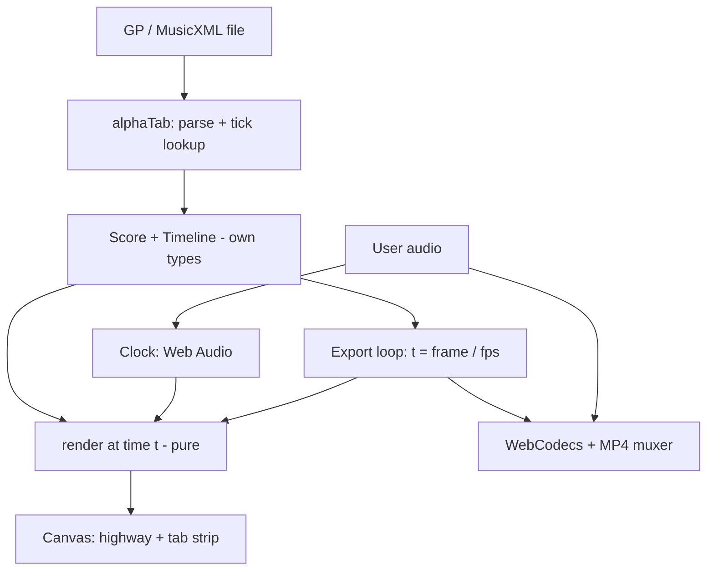

# Tab Highway Practice Site - Plan

## Goal Capsule

- **Objective:** A guitar learner opens a public web page, drops in a Guitar Pro or MusicXML tab, and practices it as a scrolling highway synced to a tab strip. They can slow it down, loop sections and sync it to their own recording. On desktop Chrome or Edge they can also export the highway as an MP4.
- **Means:** A static, client-only site hosted on GitHub Pages, with alphaTab for parsing and timing, our own Canvas highway renderer, and WebCodecs for export (KTD1, KTD2, KTD4).
- **Authority:** The Product Contract wins on behavior. KTDs win on mechanism within their cited Rs. Units override neither.
- **Stop conditions:** Stop and surface the issue if alphaTab cannot supply per-note timing, or its synth position cannot be tied to the Web Audio clock closely enough to hold the ±10 ms sync target (R7).
- **Execution profile:** Greenfield. The working directory is empty and is not a git repository.
- **Tail ownership:** The implementer finishes through deploying the Pages site and a smoke test of the live URL.

---

## Product Contract

### Summary

A browser-only practice tool on GitHub Pages. A learner loads a Guitar Pro or MusicXML file and sees a highway over a synced tab strip. Playback uses built-in synth sound, with tempo slowdown and section looping. They can load their own recording and align it with an offset slider. Desktop Chrome and Edge also export the highway as an MP4. Files never leave the user's machine.

### Problem Frame

Learners today follow static tab in Guitar Pro against an audio file. Keeping their place while playing is clumsy, and there is no moving view that shows what is coming. Highway-style games show it well but cannot load arbitrary tabs in a browser. The blueprint behind this work assumed an Electron/Tauri shell with a native FFmpeg process and a Python sidecar. None of that runs on GitHub Pages, so the product is rebuilt around what a browser can do.

### Key Decisions

- **In-browser app, not a desktop shell.** Governs R1, R12. (session-settled: user-directed — chosen over a marketing-only site and a demo-only site: the user wants the working tool on Pages.) The desktop shell, native FFmpeg and librosa sidecar are out of this site.
- **Learner-first.** Governs R3, R4, R5. (session-settled: user-directed — chosen over YouTuber-first and personal-tool-first: the primary user practices, so practice quality is judged first and export rides along.)
- **Export is in v1.** Governs R10, R11. (session-settled: user-directed — chosen over practice-only and practice-plus-audio-sync: the user wants video export in the first release.)
- **Guitar Pro and MusicXML only in v1.** Governs R2. (session-settled: user-approved — chosen over adding ASCII and MIDI: those inputs carry the riskiest parsing and come later.)
- **Layout C: highway over a synced tab strip.** Governs R3. (session-settled: user-directed — chosen over highway-only and highway-plus-sidebar: following notation is the part static tab does well.)
- **Desktop Chrome/Edge get everything; other browsers get practice only.** Governs R11, R13. (session-settled: user-approved — chosen over cross-browser export and mobile practice.)

### Requirements

**Loading and display**

- R1. The site is a static bundle that runs entirely in the browser with no server and no uploads, deployable to GitHub Pages.
- R2. The user can load a `.gp3`–`.gp7`, `.gpx` or MusicXML file by drag-and-drop or file picker. An unreadable file shows a clear error and leaves the current session intact.
- R3. The main screen shows the highway above a tab strip whose cursor stays in sync with the highway, with the transport controls below.
- R4. The user can pick which track to practice when a file has several.

**Practice**

- R5. The user can play, pause, seek, change tempo (percent of original, keeping pitch) and loop a bar range. Repeats and tempo changes in the score are honored in playback and on screen.
- R6. Built-in SoundFont playback is the default sound source.
- R7. The highway, tab cursor and audio stay within ±10 ms of each other across repeats and tempo changes.
- R8. The user can load their own audio file as the master clock and align it with an offset slider. Tempo and loop controls then act on that audio.
- R9. The highway shows sustains, a strikeline and hit effects for plucked notes. Bends, slides, hammer-ons/pull-offs, palm mutes and harmonics have a distinct on-screen treatment.

**Export**

- R10. On a browser that supports it, the user can export the current track and audio as an MP4 at 1080p60 or in a vertical preset. The export is frame-accurate to the same render the preview shows.
- R11. Where export is unsupported, the export control is replaced by a clear message and practice mode still works.

**Platform**

- R12. The site includes a visible licence notice page for all bundled third-party code.
- R13. Desktop Chrome and Edge are fully supported. Other desktop browsers support practice mode. Phones and tablets are unsupported in v1.

### Success Criteria

- A learner who has never seen the tool can load a real Guitar Pro file and practice a looped section at reduced tempo within a minute, with no install or account.
- A click-track fixture shows sound and highway aligned within ±10 ms.
- An exported MP4 of the same fixture plays back in a standard player with video and audio aligned.

### Scope Boundaries

**Deferred for later**

- ASCII tab and MIDI input, with a warnings UI for uncertain measures.
- WebGL2 perspective view, themes and a fretboard view.
- Automatic audio-to-tab alignment (librosa or any server-side analysis).
- Export in Firefox and Safari, and any phone or tablet support.

**Outside this product's identity**

- A hosted tab library, accounts or any upload of user files.
- A native desktop app with a native FFmpeg process.

### Dependencies / Assumptions

- Assumed: Chart Studio's renderer is MIT-licensed and can be adapted. The repository was not found during planning, so U3 verifies this first (KTD5).
- Assumed: alphaTab (MPL-2.0, confirmed from its repository) exposes per-beat timing through its tick lookup, and playback supports tempo scaling and looping. Its documentation lists `MidiTickLookup`, `MasterBarTickLookup` with tempo changes, and `tickCache`. U1 confirms this against a real file.
- Assumed: WebCodecs with an MP4 muxer library produces an acceptable file in Chrome and Edge. Support elsewhere is partial, which is why R11 exists.
- Unresolved, treated as non-blocking: if the export work slips, practice mode ships first as its own milestone (U1–U8) and the export units follow.
- Assumed: a user's recording keeps a steady tempo that matches the tab's tempo map, so one offset aligns it (R8). A recording that drifts will misalign loops. v1 states this limit in the UI; a second anchor point is deferred with automatic alignment.
- Assumed: exported audio is the whole song at original tempo, from the synth or, when loaded, the user's recording with its offset applied. Tempo slowdown and loops affect preview only.
- Tabs of copyrighted songs stay local to the user, so there is no hosted-content takedown surface.

---

## Planning Contract

### Key Technical Decisions

- KTD1. **TypeScript, Vite, React; build output is plain static files.** Deployed to GitHub Pages through a GitHub Actions workflow with the correct base path. (Governs R1.)
- KTD2. **alphaTab is an unmodified dependency for parsing, timing and synth.** Our own immutable `Score` and `Timeline` types wrap its output so no alphaTab types reach the renderer. This keeps MPL-2.0 obligations to "unmodified dependency". (Governs R2, R5, R6, R7.)
- KTD3. **`render(t)` is a pure function of a Timeline and a time.** Preview and export share it. The preview clock is Web Audio; export drives `t = frame / fps`. (Governs R7, R10.)
- KTD4. **Export uses WebCodecs `VideoEncoder` and `AudioEncoder` with an MP4 muxer library, running in a worker.** Feature-detected at load. No ffmpeg.wasm in v1. (Governs R10, R11.)
- KTD5. **Chart Studio code is reused only after its licence and coupling are checked.** If it cannot be located or is not MIT, the highway is written fresh from the same ideas. MIT notices are kept for anything copied. (Governs R9, R12.)
- KTD6. **Technique visuals are drawn in our own style.** Slopsmith (AGPL-3.0) is a visual reference only and no code is copied. (Governs R9.)
- KTD7. **Tempo slowdown uses alphaTab's playback speed for synth and a time-stretch method for user audio.** The exact stretch method is chosen in U6. (Governs R5, R8.)

### High-Level Technical Design



### Output Structure

```
index.html
vite.config.ts
package.json
.github/workflows/deploy.yml
src/
  main.tsx
  app/            React shell, transport, track picker
  model/          Score, Timeline, alphaTab adapter
  render/         highway, tab strip, technique drawing
  audio/          clock, synth bridge, user audio, offset
  export/         frame loop, encoder worker, capability check
tests/
  fixtures/       sample GP files, click track
THIRD_PARTY_NOTICES.md
```

### Risks

- alphaTab timing may not meet ±10 ms once repeats and user audio are combined. U1 and U2 prove this before any rendering is built.
- Chart Studio may be unavailable or too tightly coupled to its chart format. KTD5 allows writing the highway fresh, at some extra cost to U3.
- Time-stretching user audio in the browser can sound poor at large slowdowns. Limit the tempo range and judge by ear in U6.
- Browser export of long songs can be slow or hit memory limits. U9 sets a length cap or chunked encoding.

---

## Implementation Units

### U1. Project scaffold and alphaTab spike

- **Goal:** A deployable empty site that loads a Guitar Pro file with alphaTab and proves timing, repeats and playback.
- **Requirements:** R1, R2, R6.
- **Dependencies:** none.
- **Files:** `package.json`, `vite.config.ts`, `index.html`, `src/main.tsx`, `src/model/spike.ts`, `.github/workflows/deploy.yml`, `tests/fixtures/` (sample GP and MusicXML files), `tests/spike.test.ts`.
- **Approach:**
  - Scaffold Vite, React and TypeScript with the Pages base path.
  - Load a fixture with alphaTab and dump each beat's tick and absolute time.
  - Play it through alphaTab's synth and compare with the dump across a repeat and a tempo change.
  - Set up the Pages deploy workflow so each later unit ships to a live URL.
  - Confirm alphaTab can render its synth audio offline (its `exportAudio`) for U9, and note its SoundFont: choose a small, permissively licensed one, lazy-load it, and record its size and licence for the notices page.
  - Choose a browser-based test runner (Playwright with Chromium) for sync and snapshot tests, so canvas and audio checks run in a real browser.
- **Execution note:** If the timing findings change KTD2, update KTD2 in the Planning Contract with what was found.
- **Test scenarios:**
  - A fixture with a repeat dumps beats twice in playback order with increasing times.
  - A fixture with a mid-song tempo change shows a time gap consistent with the new tempo.
  - A corrupt file produces a catchable parse error, not a crash.
- **Verification:** The deployed URL loads, a fixture plays, and the dumped times match audible playback.

### U2. Score, Timeline and sync model

- **Goal:** Immutable `Score` and `Timeline` types and an adapter from alphaTab, with note events in seconds.
- **Requirements:** R2, R4, R5, R7.
- **Dependencies:** U1.
- **Files:** `src/model/score.ts`, `src/model/timeline.ts`, `src/model/alphatab-adapter.ts`, `tests/model/timeline.test.ts`.
- **Approach:**
  - Define note, beat, bar, tempo-change and technique fields the renderer needs, and nothing from alphaTab.
  - Build events in playback order, including repeats, from alphaTab's tick lookup.
  - Expose per-track events so the track picker can switch.
  - Give each event both its playback-order index and its score-order bar, so the tab strip can place the cursor across repeats and alternate endings.
  - For a track with no string/fret data (common in MusicXML from notation editors), use alphaTab's own fret assignment and flag the track so the UI shows a notice.
- **Test scenarios:**
  - A MusicXML fixture without string/fret data loads, assigns frets and sets the notice flag.
  - Event times equal alphaTab's own timing within 1 ms for every fixture.
  - Switching track returns that track's events only.
  - Repeats and alternate endings produce the same sequence alphaTab plays.
  - A score with no tempo marking uses the default tempo.
- **Verification:** The renderer can be written against `Timeline` alone; a search of `src/render` finds no alphaTab imports.

### U3. Highway renderer v1

- **Goal:** A pure `render(t)` that draws the highway: strings, scrolling notes, strikeline, sustains and hit effects.
- **Requirements:** R3, R9.
- **Dependencies:** U2.
- **Files:** `src/render/highway.ts`, `src/render/layout.ts`, `src/render/theme.ts`, `THIRD_PARTY_NOTICES.md`, `tests/render/highway.test.ts`.
- **Approach:**
  - First locate Chart Studio and check its licence and how tightly rendering is tied to its chart format (KTD5).
  - Reuse its strikeline, scroll and sustain ideas if licence and coupling allow, with notices kept. Otherwise write fresh.
  - Draw from a Timeline and a time only; no hidden state.
- **Test scenarios:**
  - The same Timeline and time render the same pixels twice (snapshot).
  - A note at the strikeline sits at the strikeline position at its start time.
  - A sustained note draws a tail of the right length.
  - An empty bar renders strings only.
- **Verification:** Scrubbing a fixture shows notes crossing the strikeline exactly at their times.

### U4. Tab strip and shared layout

- **Goal:** A synced tab strip under the highway and the layout C screen with a transport bar.
- **Requirements:** R3, R4.
- **Dependencies:** U2, U3.
- **Files:** `src/render/tab-strip.ts`, `src/app/App.tsx`, `src/app/Transport.tsx`, `src/app/TrackPicker.tsx`, `tests/render/tab-strip.test.ts`.
- **Approach:**
  - Draw the strip ourselves from the Timeline rather than reusing alphaTab's renderer, because its cursor must follow playback order through repeats and share `t` with the highway (KTD2, KTD3). Keep its content minimal: fret numbers per string, bar lines, repeat and ending marks, simple rhythm stems, and technique marks from U7.
  - Scroll continuously under a fixed-position cursor. Split height between highway and strip with a minimum window size below which the layout stops shrinking.
  - Lay out highway, strip and controls per layout C.
  - Define the empty state here: a central drop zone with a Browse button, a drag-over highlight, the supported formats, and a one-click bundled sample tab. The sample is a short original or public-domain piece written for the repo.
  - Make every transport control focusable with a visible focus ring and an accessible name. Add keyboard shortcuts: Space play/pause, Left/Right seek by bar, Up/Down tempo step, L loop toggle. Suspend them while a text or slider control has focus. Give each canvas a text alternative that announces the current bar and track.
- **Test scenarios:**
  - The cursor sits on the beat that the highway shows at the strikeline for several times in a repeat.
  - Across a repeat, the cursor jumps back to the repeated bar in score order while playback time keeps increasing.
  - Resizing the window keeps both canvases sharp and aligned.
  - A long score scrolls continuously and a seek or loop jump moves the strip without a stale frame.
  - Picking another track redraws both views.
  - Pressing Space with focus on the page toggles playback, and with focus on the tempo slider does not.
  - With no file loaded, the drop zone is shown and loading the bundled sample starts a normal session.
- **Verification:** Highway and strip move together by eye across a looped passage.

### U5. Clock, playback, tempo and looping

- **Goal:** One Web Audio clock drives synth playback, the views, tempo and A–B looping.
- **Requirements:** R5, R6, R7.
- **Dependencies:** U2, U4.
- **Files:** `src/audio/clock.ts`, `src/audio/synth-bridge.ts`, `src/app/LoopControls.tsx`, `tests/audio/clock.test.ts`.
- **Approach:**
  - Use alphaTab's synth as the sound source. Interpolate its coarse position events against the Web Audio clock, and compensate for output latency using `AudioContext.outputLatency` and `getOutputTimestamp`. R7 is measured at the audio output timestamp, not the logical clock.
  - Apply tempo percent to the clock and synth together.
  - Loop a bar range and keep the views on the looped time. The user sets the range by dragging across bars on the tab strip, with start and end bar number fields in `LoopControls` for precision. The looped region is highlighted on the strip, and a clear button removes it.
  - Show a progress indicator while the SoundFont and score load. Keep play and loop disabled until the synth reports ready, with a retry action if the SoundFont fetch fails.
- **Test scenarios:**
  - Pressing play before the synth is ready does nothing and the control shows a loading state.
  - A failed SoundFont fetch shows a retry action and leaves the page usable.
  - Dragging across bars 3 to 5 on the strip loops exactly those bars, and the clear button restores full playback.
  - At 50% tempo the highway advances at half speed and the cursor still lands on the audible note.
  - A loop restarts without a visible jump or double note.
  - Seeking while paused updates both views.
  - A click-track fixture, run in a real browser, records audio output times and highway frame draw times and shows an offset under 10 ms at 100% and 50%.
- **Verification:** The click-track fixture test passes (R7). Output latency on Bluetooth devices may exceed compensation accuracy, so the test targets the default output.

### U6. User audio sync

- **Goal:** Load a recording, make it the clock, and align it with an offset slider.
- **Requirements:** R8.
- **Dependencies:** U5.
- **Files:** `src/audio/user-audio.ts`, `src/app/OffsetSlider.tsx`, `tests/audio/user-audio.test.ts`.
- **Approach:**
  - Decode the file to an audio buffer; the clock follows it.
  - Apply the offset to the Timeline's start. Choose a time-stretch method for tempo changes and cap the tempo range if quality drops (KTD7).
- **Test scenarios:**
  - A positive and negative offset shift the highway relative to the audio by the slider amount.
  - A click-track audio file aligned at offset zero shows under 10 ms error.
  - An unsupported or huge file shows an error and keeps the previous session.
- **Verification:** Aligning a real recording by ear works and the loop stays on beat.

### U7. Technique drawing

- **Goal:** Distinct treatments for bends, slides, hammer-ons/pull-offs, palm mutes and harmonics.
- **Requirements:** R9.
- **Dependencies:** U3.
- **Files:** `src/render/techniques.ts`, `tests/render/techniques.test.ts`.
- **Approach:**
  - Draw each technique in our own style (KTD6).
  - Add only techniques present in the Score model from U2; extend the model where a field is missing.
- **Test scenarios:**
  - Each technique fixture note renders a mark that differs from a plain note.
  - A bend shows its target size.
  - A slide connects two frets across bars.
  - Unknown techniques fall back to a plain note.
- **Verification:** A fixture covering each technique looks correct next to its notation.

### U8. Practice-mode release

- **Goal:** Polish, error handling and a first live release of practice mode.
- **Requirements:** R1, R2, R12, R13.
- **Dependencies:** U1–U7.
- **Files:** `src/app/ErrorBoundary.tsx`, `src/app/BrowserSupport.tsx`, `THIRD_PARTY_NOTICES.md`, `README.md`, `tests/app/load.test.ts`.
- **Approach:**
  - Add clear errors, a browser-support notice and the licence notice page covering packages and bundled assets. The empty state itself is built in U4.
  - Deploy to Pages and smoke-test the live URL.
- **Test scenarios:**
  - Dropping a non-tab file shows an error and keeps the previous session.
  - An unsupported browser shows the practice-only notice.
  - The notices page lists every bundled third-party package and asset.
- **Verification:** The live URL works end to end for a fresh visitor.

### U9. Export loop and encoder

- **Goal:** Deterministic offline rendering of frames and audio into an MP4.
- **Requirements:** R10, R11.
- **Dependencies:** U3, U5, U8.
- **Files:** `src/export/capability.ts`, `src/export/frame-loop.ts`, `src/export/encoder.worker.ts`, `src/app/ExportDialog.tsx`, `tests/export/frame-loop.test.ts`.
- **Approach:**
  - Probe `VideoEncoder.isConfigSupported` for the chosen H.264 profile at each preset's size and frame rate, and `AudioEncoder.isConfigSupported` for the chosen audio codec. Show the R11 message when WebCodecs or any probe fails. Pick an audio codec the muxer and common players handle and record it in KTD4.
  - Get export audio from alphaTab's offline `exportAudio` as PCM, or from the decoded user recording with its offset applied, for the whole song at original tempo. Feed it to `AudioEncoder` and mux it with the video.
  - Render each frame at `t = frame / fps` with the same `render(t)`, encode in a worker, and mux with the audio.
  - Offer 1080p60 and vertical presets, a progress bar and cancel. Set a length cap or chunked encoding, and state the maximum length before encoding starts.
  - Dialog states: idle with preset choice and estimated duration, exporting with progress and cancel, done with automatic download and a save-again button, failed with the reason and retry, over-cap with the limit.
- **Test scenarios:**
  - WebCodecs exists but the H.264 config probe fails: the R11 message shows and no export control appears.
  - A failed encode shows the reason and a retry button.
  - A song over the cap shows the limit message before any encoding starts.
  - With user audio loaded and an offset set, the exported audio carries that offset.
  - Frame N renders the same image as a preview paused at N/fps.
  - The click-track fixture exports a file whose audio and video click within one video frame of each other (about 16.7 ms at 60 fps).
  - Cancelling mid-export frees memory and returns to the dialog.
  - A browser without WebCodecs shows the message and no export control.
- **Verification:** The exported MP4 plays correctly in a standard desktop player.

### U10. Export release and hardening

- **Goal:** Ship export, with limits and licence checks, to the live site.
- **Requirements:** R10, R11, R12.
- **Dependencies:** U9.
- **Files:** `THIRD_PARTY_NOTICES.md`, `README.md`, `tests/export/e2e.test.ts`.
- **Approach:**
  - Add the muxer library's licence to the notices.
  - Test a full-length song and an unusual aspect ratio.
  - Deploy and smoke-test export on the live URL.
- **Test scenarios:**
  - A full-length fixture exports without running out of memory or hits the cap with a clear message.
  - The vertical preset has the right dimensions and a centred highway.
- **Verification:** Live export succeeds in Chrome and Edge.

---

## Verification Contract

| Gate | Command / check | Applies to |
|---|---|---|
| Unit tests | `npm test` | all units |
| Type check | `npm run typecheck` | all units |
| Build | `npm run build` | all units |
| Browser tests | `npm run test:browser` (Playwright, Chromium) for canvas snapshots and sync | U3, U4, U5, U6, U9 |
| Sync fixture | Click-track test in a real browser: preview offset under 10 ms at the audio output timestamp; export audio and video within one frame | U5, U6, U9 |
| Live smoke | Open the deployed Pages URL, load a fixture, play, loop, export | U1, U8, U10 |

The scripts above are to be created in U1; they do not exist yet.

## Definition of Done

- All R1–R13 hold on the deployed site in desktop Chrome and Edge, and practice mode works in Firefox and Safari.
- Every unit's test scenarios pass and the Verification Contract gates are green.
- The click-track fixture meets ±10 ms for preview, and export audio and video align within one video frame.
- Licence notices cover packages and bundled assets (SoundFont, fonts, sample tab), and no code is copied from Slopsmith.
- Abandoned spike code and unused experiments are removed from the repository.
