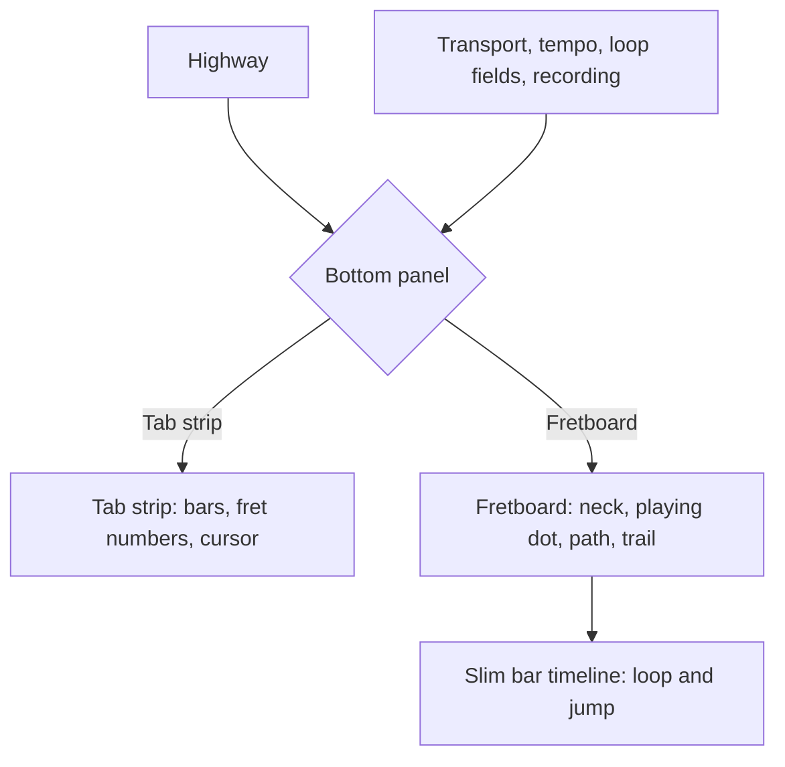
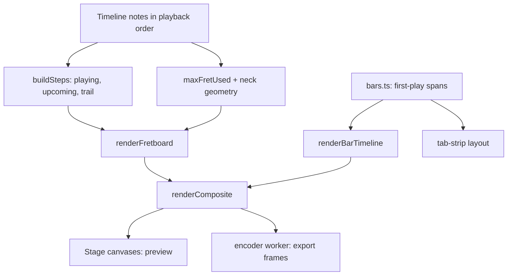

# Fretboard View - Plan

## Goal Capsule

- **Objective:** A learner can see which string and fret to play now, and which to play next, as dots on a guitar neck instead of reading a tab strip.
- **Product authority:** The Product Contract below. It extends the existing practice screen and leaves the tab strip, the highway and playback as they are.
- **Means:** Pure render functions over the existing Timeline, a shared bar-span helper for the strip and the slim timeline, and view state in the app shell (KTD1–KTD7).
- **Stop conditions:** Stop and surface the issue if the bar-span extraction changes how the tab strip draws or hit-tests (R1 requires it unchanged).
- **Execution profile:** Extends an existing TypeScript/React codebase; verification is `npm run typecheck`, `npm test`, `npm run build` plus a manual check in Chrome.
- **Tail ownership:** The implementer finishes through review and commit; pushing to `main` redeploys the live site, so it is left to the user.
- **Product Contract preservation:** Product Contract unchanged except that the resolved planning questions moved into the Planning Contract.

---

## Product Contract

### Summary

A switch in the practice screen changes the bottom panel between the existing tab strip and a new fretboard view. The fretboard is a horizontal neck showing the note playing now as a solid dot, a dashed path to the next few notes, and a fading trail of the last ones. A slim numbered bar timeline stays underneath so looping and jumping keep working. The exported video follows whichever view is selected.

### Problem Frame

The tab strip tells a learner the fret numbers but not where the hand is going on the neck. Learners who think in shapes and positions have to translate numbers into places. A fretboard view shows the place directly, and the path between notes shows the hand movement before it happens.



### Key Decisions

- **Replace the tab strip, not add a third panel.** Governs R1, R10. (session-settled: user-directed — chosen over showing both at once: the request was for a mode "instead of" the tabular view.)
- **Hand path with trail.** Governs R5, R6, R7. (session-settled: user-directed — chosen over ghost dots with order numbers and approaching rings, after seeing sketches of all three: the path shows where the hand moves.)
- **Fixed neck range per track, up to the highest fret used.** Governs R4. (session-settled: user-directed — chosen over a whole 24-fret neck and over auto-zoom: low-position songs get bigger dots and the view never shifts.)
- **Adjustable look-ahead.** Governs R6. (session-settled: user-directed — chosen over a fixed four notes and over the highway's time window.)
- **Keep a slim bar timeline under the fretboard.** Governs R10, R11. (session-settled: user-approved — chosen over number fields only and over showing the full tab strip as well: looping and jumping must not regress.)
- **Export follows the selected view.** Governs R12. (session-settled: user-approved — chosen over always using the tab strip and over a picker in the export dialog.)

### Requirements

**View switching**

- R1. A control on the practice screen switches the bottom panel between Tab strip and Fretboard. Tab strip is the default and is unchanged.
- R2. Switching views never interrupts playback, tempo, the loop or the loaded recording.
- R3. The chosen view and the look-ahead setting are remembered while the page stays open, and reset when a different file is loaded.

**Fretboard drawing**

- R4. The neck runs horizontally from the nut to the highest fret the selected track uses, with a minimum span so a low-position song still looks like a neck.
- R5. The notes sounding now show as solid dots at their string and fret, each with its fret number, and a chord shows every note. A dead note shows an x.
- R6. The next notes appear as small outlined dots with fret numbers, joined to the playing note by a dashed path, in playback order including across repeats. A chord counts as one step. The look-ahead is adjustable from 1 to 8 steps, with 4 as the starting value.
- R7. The last few played notes remain behind the playing note, fading out.
- R8. The string count and tuning follow the selected track, so a bass track shows four strings. The highest-pitched string is on top, as in the tab strip.
- R9. Open strings show beside the nut, and technique marks are not shown in this view.

**Navigation**

- R10. A slim bar timeline below the neck shows numbered bars and the playhead. Dragging across bars sets the loop and clicking a bar jumps to it, as on the tab strip.
- R11. The loop range is highlighted on the timeline.

**Export**

- R12. The exported video draws the highway plus whichever bottom view is selected when export starts, using the current look-ahead.

**Accessibility**

- R13. The fretboard has a text alternative that names the current bar and track, as the tab strip does.

### Acceptance Examples

- AE1. **Covers R5, R6.** When a chord with notes on three strings is playing, all three show as solid dots, and the path continues from the chord to the next step as one move.
- AE2. **Covers R6.** When the next bar after a repeat end is the repeated bar, the path continues to the first notes of the repeated bar, not the bar after it in the score.
- AE3. **Covers R1, R2.** When a learner switches from Tab strip to Fretboard while a loop is playing, the sound, the loop and the tempo carry on without a gap.
- AE4. **Covers R9.** When an open-string note plays, a dot appears beside the nut on that string.
- AE5. **Covers R12.** When the Fretboard view is selected and export starts, every frame of the video shows the fretboard under the highway.

### Success Criteria

- A learner can say which string and fret comes next without reading the tab strip.
- Switching between the two views is instant and leaves playback untouched.
- A fretboard video exported from a sample song shows the same dots at the same times as the preview.

### Scope Boundaries

**Deferred for later**

- Technique marks (bends, slides, hammer-ons, palm mutes) on the fretboard.
- Remembering the view and look-ahead between visits.
- Auto-zoom or scrolling the neck, and a vertical or left-handed neck.
- Showing both bottom views at once.

### Dependencies / Assumptions

- Assumed: the existing per-note data (string, fret, start and end time, playback order) is enough to draw the view; no new file parsing is needed.
- Assumed: the slim timeline can reuse the tab strip's bar layout, since it only needs bar positions and the playhead.

---

## Planning Contract

### Key Technical Decisions

- KTD1. **Pure functions over the Timeline, no alphaTab.** The step builder and both new renderers take a `Timeline`, a track index and a time, draw only through the existing `DrawContext`, and import nothing from alphaTab. This matches the highway and strip and keeps the library-isolation test valid. (Governs R5–R9.)
- KTD2. **Steps are built from the track's notes in playback order.** The Timeline already lists notes in playback order with repeats played again, so a "step" is the group of notes sharing one `tick`, and upcoming steps are simply the next groups after the playing one. No model change is needed. (Governs R5, R6; Covers AE1, AE2.)
- KTD3. **Neck geometry.** The neck runs from the nut to the highest fret the track uses, never fewer than 7 frets and never more than 24. Fret positions use the real fret-spacing ratio so the neck looks like a neck; open strings sit left of the nut. The neck is computed once per track, so it never moves. (Governs R4, R9.)
- KTD4. **Path anchor and trail.** The path starts at the playing step and passes through each upcoming step, anchored on the step's lowest-pitched note. A zero-length segment (same string and fret) is skipped and the marker shows as a ring around the playing dot. Three earlier steps fade behind the playing note. When markers coincide, the playing dot is drawn over upcoming dots and those over the trail, and no dot is smaller than a radius that keeps its fret number legible. (Governs R6, R7.)
- KTD5. **Shared bar spans.** The first-playback bar list and repeat flags now built inside `buildStripLayout` move into one helper in `src/render/bars.ts`, used by the strip and the new slim timeline. The timeline lays all bars out across its width with no scrolling, so its hit test is a plain x-to-bar lookup. Bar numbers are drawn only when the bar is at least 28 px wide and are thinned to every Nth bar otherwise, while every bar stays clickable; on a very long score the loop number fields give the precise route. (Governs R10, R11.)
- KTD6. **View state lives in the app shell.** `bottomView` and `lookahead` are React state in `src/app/App.tsx`, reset when a file is opened and not persisted. The view switch and the look-ahead field sit in the top bar beside the track picker, so the transport row is untouched. (Governs R1–R3.)
- KTD7. **Export carries the view in the start message.** `renderComposite` takes a `bottom` option (`view` and `lookahead`); the export dialog passes the values selected when it opens, through `startExport` into the worker's start message. (Governs R12.)

### High-Level Technical Design



### Assumptions

- The Timeline's notes are sorted by start time and a chord's notes share one `tick` (true of `buildTimeline` in `src/model/alphatab-adapter.ts`).
- 7 minimum frets, 3 trail steps and a default look-ahead of 4 are starting values, held as named constants so they can be tuned.

### Output Structure

```
src/render/bars.ts                 shared bar spans
src/render/fretboard-steps.ts      steps: playing, upcoming, trail; max fret
src/render/fretboard.ts            neck geometry and renderer
src/render/bar-timeline.ts         slim timeline renderer and hit test
src/app/ViewControls.tsx           view switch and look-ahead field
tests/render/bars.test.ts
tests/render/fretboard-steps.test.ts
tests/render/fretboard.test.ts
tests/render/bar-timeline.test.ts
```

---

## Implementation Units

### U1. Shared bar spans

- **Goal:** One helper that lists each score bar's first playback occurrence and repeat flags, used by the tab strip and later the slim timeline, with the strip's behavior unchanged.
- **Requirements:** R1, R10.
- **Dependencies:** none.
- **Files:** `src/render/bars.ts`, `src/render/tab-strip.ts`, `tests/render/bars.test.ts`, `tests/render/tab-strip.test.ts`.
- **Approach:**
  - Extract the first-playback map and the repeat start and end detection from `buildStripLayout` into `barSpans(timeline)`.
  - `buildStripLayout` calls it and keeps its current output exactly.
- **Execution note:** Characterize first: the existing `tests/render/tab-strip.test.ts` must pass unchanged before and after.
- **Patterns to follow:** `buildStripLayout` and `stripBarFor` in `src/render/tab-strip.ts`.
- **Test scenarios:**
  - A repeated score returns one span per score bar, with repeat start and end flags on the right bars.
  - A score with no repeats returns no repeat flags.
  - Spans carry the first playback bar's start and end seconds and ticks.
  - The strip layout built through the helper equals the previous layout for the repeat fixture.
- **Verification:** The existing tab strip tests pass unchanged and the new helper tests pass.

### U2. Fretboard steps

- **Goal:** Pure functions that turn the track's notes and a time into the playing step, the next steps and the trail, plus the highest fret used.
- **Requirements:** R4, R5, R6, R7; Covers AE1, AE2.
- **Dependencies:** none.
- **Files:** `src/render/fretboard-steps.ts`, `tests/render/fretboard-steps.test.ts`.
- **Approach:**
  - Group the track's notes by `tick` into steps. The playing step is the latest step whose start is at or before `t`, drawn solid; earlier steps whose notes are still sustaining count as trail.
  - Upcoming steps are the next `count` groups; trail is the previous three. Cache the grouped steps per notes array in a `WeakMap`, as `visibleNotes` caches durations.
  - `maxFretUsed(notes)` returns the largest fret.
- **Patterns to follow:** `visibleNotes` and its `WeakMap` cache in `src/render/highway.ts`.
- **Test scenarios:**
  - A chord on three strings is one step with three notes (AE1).
  - After a repeat end, the next step is the first step of the repeated bar, not the next score bar (AE2).
  - A look-ahead of 1 returns one upcoming step and 8 returns up to eight, fewer at the end of the song.
  - Before the first note, nothing is playing and the upcoming steps start at the first note.
  - While an earlier note still sustains under a newer step, the newer step is the playing step and the earlier one is trail.
  - After the last note, there are no upcoming steps and the trail still shows the last notes.
  - Look-ahead values below 1 or above 8 are clamped.
  - `maxFretUsed` of an empty track is 0.
- **Verification:** The tests pass and the module imports nothing from alphaTab.

### U3. Fretboard renderer

- **Goal:** Draw the neck, the playing dots, the dashed path with outlined upcoming dots, and the fading trail.
- **Requirements:** R4, R5, R6, R7, R8, R9, R13.
- **Dependencies:** U2.
- **Files:** `src/render/fretboard.ts`, `tests/render/fretboard.test.ts`.
- **Approach:**
  - Compute the neck once per track from `maxFretUsed` (KTD3) and the track's string count, with string 1 on top.
  - Draw strings, frets, nut and position markers; then the trail, the path, the upcoming outlined dots with fret numbers, and the solid playing dots with fret numbers on top (KTD4). Dead notes draw an x; open strings draw beside the nut.
  - Reuse `stringColor` from `src/render/theme.ts` so colors match the highway.
- **Patterns to follow:** `renderHighway` in `src/render/highway.ts` and the recording-context tests in `tests/render/highway.test.ts`.
- **Test scenarios:**
  - The playing note's dot sits at the fret and string position for its fret number and string (happy path).
  - A chord draws one solid dot per note (AE1).
  - An open-string note draws a dot left of the nut (AE4).
  - A dead note draws an x instead of its number.
  - A bass track with four strings draws four string lines.
  - The path has one segment per upcoming step, and a same-position step adds no segment.
  - With look-ahead 1, only one upcoming marker is drawn.
  - The same inputs produce identical drawing calls twice.
  - A track using fret 3 as its highest still draws at least 7 frets, and one using fret 17 draws 17.
  - A track with no notes draws the bare neck and no markers.
  - When a trail dot and the playing dot sit on the same string and fret, the playing dot is drawn last.
  - Dots at 24 frets are no smaller than the minimum radius.
- **Verification:** The tests pass and the library-isolation test still passes.

### U4. Slim bar timeline

- **Goal:** A thin numbered bar strip with the playhead and loop highlight, with click-to-jump and drag-to-loop hit testing.
- **Requirements:** R10, R11.
- **Dependencies:** U1.
- **Files:** `src/render/bar-timeline.ts`, `tests/render/bar-timeline.test.ts`.
- **Approach:**
  - Lay the bars from `barSpans` across the width in proportion to their duration (KTD5), draw bar numbers, repeat marks, the loop tint and the playhead.
  - Export `barAtX(layout, x)` and the bar start time lookup, mirroring `scoreBarAtX` and `scoreBarStartSeconds`.
  - Draw bar numbers only on bars at least 28 px wide, thinned to every Nth bar when bars are narrower, with every bar still hit-testable (KTD5).
- **Patterns to follow:** `renderTabStrip`, `scoreBarAtX` in `src/render/tab-strip.ts`.
- **Test scenarios:**
  - Bars fill the width and an x position maps to the bar under it, including the first and last pixels.
  - The playhead x follows the playback time and jumps back across a repeat.
  - A loop range tints exactly the chosen bars (R11).
  - A position outside the bars returns no bar.
  - With 120 bars across a narrow width, only some bar numbers are drawn and a click on any bar still maps to it.
  - Rendering the same time twice gives identical calls.
- **Verification:** The tests pass.

### U5. View controls and Stage integration

- **Goal:** The switch, the look-ahead field and the Stage showing the fretboard and slim timeline in place of the tab strip.
- **Requirements:** R1, R2, R3, R10, R11, R13.
- **Dependencies:** U3, U4.
- **Files:** `src/app/ViewControls.tsx`, `src/app/Stage.tsx`, `src/app/App.tsx`, `src/app/app.css`, `tests/app/view-controls.test.ts`.
- **Approach:**
  - Add `bottomView` and `lookahead` state to `App`, reset in `startSession` (KTD6); show `ViewControls` in the top bar, with the look-ahead field only in fretboard mode.
  - `Stage` takes `bottomView` and `lookahead`; in fretboard mode it renders the fretboard canvas and the slim timeline canvas, with the existing pointer drag and click handlers pointed at `barAtX`.
  - Update the canvases' `aria-label` text to name the view, bar and track (R13). Switching views changes only what is drawn, so the clock, tempo, loop and recording are untouched (R2).
  - Export two small pure helpers from `src/app/ViewControls.tsx`: `clampLookahead(value)` and `initialViewState()` (Tab strip view, look-ahead 4). `App` uses `initialViewState()` for its first state and in `startSession` to reset.
  - Render the switch as a labelled two-option segmented control (`aria-pressed` buttons) and the look-ahead as a labelled number field bounded 1 to 8 that commits a clamped value on change and keeps the previous value when emptied, as `LoopControls` does. Both are reachable by keyboard. The slim timeline's drag and click are pointer routes; the keyboard route is the existing bar left and right shortcuts and the loop number fields.
- **Patterns to follow:** `Stage.tsx` pointer handling and `LoopControls.tsx` number fields.
- **Test scenarios:**
  - `clampLookahead` returns 1 to 8 for any input, rounds fractions and falls back to 4 for non-numbers.
  - `initialViewState()` returns the Tab strip view with a look-ahead of 4.
  - Manual check in Chrome: switch views during a playing loop and confirm the sound, loop and tempo carry on (AE3), drag a loop and click a bar on the slim timeline, open a new file and confirm the view resets, and tab through the new controls.
- **Verification:** `npm test` passes and the manual check shows playback continuing across a switch.

### U6. Export follows the view

- **Goal:** Exported frames show the selected bottom view.
- **Requirements:** R12; Covers AE5.
- **Dependencies:** U3, U4, U5.
- **Files:** `src/render/composite.ts`, `src/export/exporter.ts`, `src/export/encoder.worker.ts`, `src/app/ExportDialog.tsx`, `src/app/App.tsx`, `tests/export/export.test.ts`.
- **Approach:**
  - Add a `bottom` option (`view`, `lookahead`) to `renderComposite`; in fretboard mode it draws the fretboard and slim timeline in the bottom region (KTD7).
  - Carry the two values through `ExportDialog` props, `startExport` and the worker's `StartMessage`; `App` passes the current values when the dialog opens.
- **Patterns to follow:** The existing `renderComposite` tests and `StartMessage` shape in `src/export/encoder.worker.ts`.
- **Test scenarios:**
  - With the fretboard view, the composite bottom region draws fretboard calls and no tab strip fret numbers (AE5).
  - With the tab strip view, the composite output is identical to before this change.
  - The fretboard note dots in a composite frame equal the live fretboard's dots for the same time and size.
  - The look-ahead value reaches the renderer: look-ahead 1 and 6 produce different numbers of upcoming markers.
  - The worker start message type includes the view and look-ahead fields.
- **Verification:** Export tests pass; on a secure page (localhost or the deployed site), an exported fretboard video shows the fretboard under the highway.

### U7. Docs and final checks

- **Goal:** Document the view and run the full gate.
- **Requirements:** R1.
- **Dependencies:** U1–U6.
- **Files:** `README.md`.
- **Approach:** Add a bullet describing the Fretboard view to the README feature list, then run the Verification Contract.
- **Test expectation:** none -- documentation only.
- **Verification:** The README describes the view and all gates are green.

---

## Verification Contract

| Gate | Command / check | Applies to |
|---|---|---|
| Type check | `npm run typecheck` | all units |
| Unit tests | `npm test` | all units |
| Build | `npm run build` | all units |
| Strip unchanged | `tests/render/tab-strip.test.ts` passes without edits | U1 |
| Library isolation | The isolation test in `tests/model/timeline.test.ts` passes (no alphaTab under `src/render`) | U2, U3, U4 |
| Browser check | In Chrome: switch views during a loop, drag a loop on the slim timeline, play a bass track, export a short song in each view on `localhost` | U5, U6 |

## Definition of Done

- R1–R13 hold in the running site, with the Tab strip default unchanged.
- Every unit's test scenarios pass and the gates above are green.
- The browser check passes, including an export in each view.
- Abandoned experiments are removed from the diff, and no code was copied from outside the repository.
