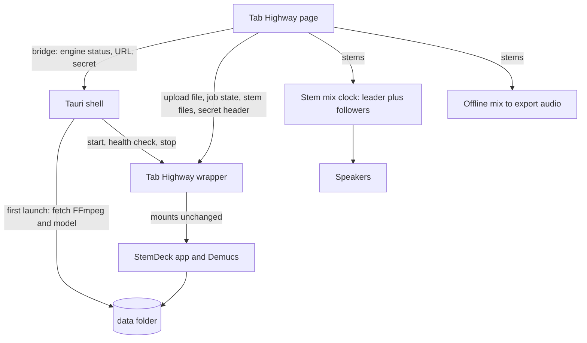
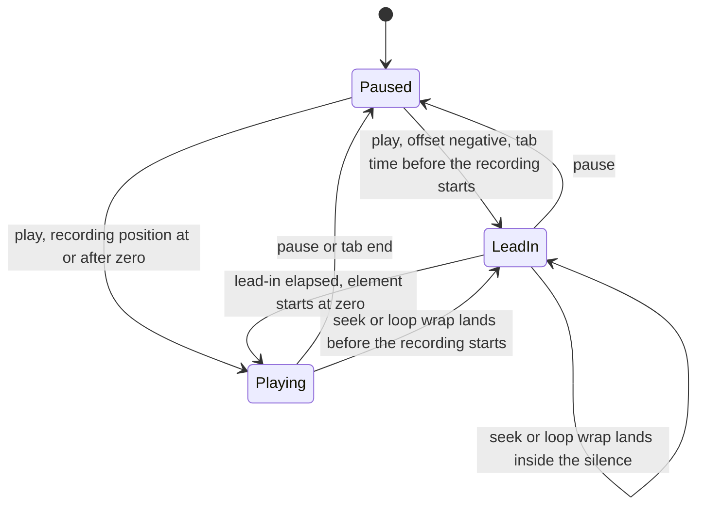
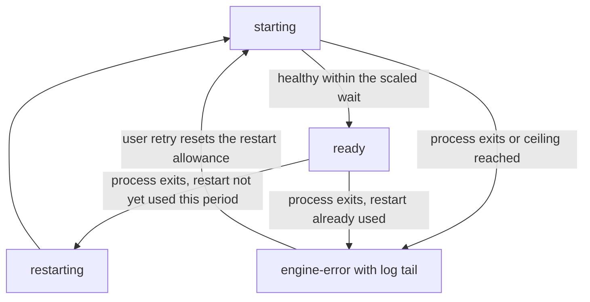

# Desktop Stem Separation - Plan

## Goal Capsule

- **Objective:** Someone practicing a tab can line their backing recording up with the tab in seconds and not redo it next visit, and on Windows can split that recording into stems on their own machine and play along over a custom mix of those stems, including in exported video.
- **Means:** Tab Highway also ships as a desktop app that carries a pinned StemDeck engine (`C:\Users\ericm\stemdeck`, Apache-2.0) inside its package (KTD1).
- **Product authority:** This plan owns the desktop shell, separation of a local file, saved stems, the stem mixer, stems in video export, the two-way recording offset on web and desktop, per-recording memory, and recovery from setup and engine failures. YouTube search and import is built but hidden for this release. Multi-point anchors, a downbeat-marking or waveform alignment aid, a song library and BPM auto-alignment are not active scope. The Product Contract wins on product behavior; Key Technical Decisions win on mechanism.
- **Execution profile:** Code. Web build and Windows desktop build; stems and recovery are Windows only. Tail: `ce-work` implements, `ce-code-review` reviews, the user runs the manual Windows pass in the Verification Contract.
- **Stop conditions:** Stop and ask if the pinned StemDeck engine cannot be started without modifying its code, or if stems cannot be kept in sync under tempo change (see Risks).
- **Open blockers:** None.

## Product Contract

**Product Contract preservation:** changed: R3, AE1, the engine-delivery Key Decision, and the Goal Capsule Means; later added R11 and AE6, widened R7's volume range, and moved YouTube from deferred to in scope (the audio-source Key Decision). Then rescoped: YouTube search and import (R11, AE6) is deferred for this release; its code stays in the repo but is hidden from users. The user chose to ship the engine inside the package after research showed StemDeck's Windows build bundles its Python runtime and downloads only FFmpeg and the model on first launch. Then merged the alignment, memory and recovery work from a separate requirements-only brainstorm plan (since removed): added R12 to R29, F4 to F6 and AE7 to AE12; changed R2 from "the web site is unchanged" to "no stem features on the web site"; and revised the "Alignment stays on the manual offset" Key Decision to a two-way, remembered offset. No other requirement changed. A Windows-only first-run engine download would have required building a runtime-pack pipeline StemDeck has only for macOS.

### Summary

Tab Highway also ships as a Windows desktop app that separates a local audio file into StemDeck's six stems (vocals, drums, bass, guitar, piano, other) on the user's machine. The user mixes the stems per stem, mutes the guitar to play along, or solos it to compare against the tab. The same mix feeds the exported video, and separated songs are saved so they reopen without re-processing. The static web site gains no stem features. On both builds the recording offset works in both directions with nudge buttons and is remembered per recording, and on the desktop first-run setup and the engine recover from failure.

### Problem Frame

Tab Highway today plays one user recording against the tab. A full-band recording always contains the guitar part the player is trying to learn, so they cannot hear the band without it, and cannot isolate the guitar to check phrasing. StemDeck already solves separation locally and for free, but as a separate app: the user separates there, then has to carry files across by hand.

The most frequent pain is a backing track that loads out of step with the tab by a constant amount. The only control is an offset slider that moves the recording one way, to skip into it, and cannot delay it, so a recording that must start later cannot be aligned at all. The control carries no hint of which way it moves, and the user did not know it existed. Nothing is remembered, so every load starts at zero and the work is redone each session. On the desktop, the first run is a ~700 MB install plus a model download that shows no progress and cannot resume, and a transient engine failure leaves the user at a dead end.

### How This Work Fits Together

<!-- ce-section: work-relationships -->

This plan covers the desktop app with separation, saved stems, the stem mixer, and stems in export. The areas below are the current understanding, not a committed roadmap.

- Song library (folders, search over saved songs)
  - Depends on: saved stems from this plan.
- BPM and beat analysis for automatic alignment of the recording to the tab
  - Can proceed independently of: this plan, which keeps the manual offset slider.
- macOS and Linux desktop builds
  - Depends on: this plan's engine packaging and shell.
- NVIDIA (GPU) Windows build
  - Depends on: this plan's engine packaging.
- Multi-point anchors (a drift-aware tab clock)
  - Can proceed independently of: this plan, which fixes a constant shift only.
  - Still to decide: whether drift ever shows up in real recordings.
- Drift and alignment visuals (waveform or onset lane, marking the downbeat)
  - Depends on: the two-way offset in this plan.

### Key Decisions

- **Desktop app, web site kept, one codebase.** Stem features appear only in the desktop build; the web site gains no stem features. (session-settled: user-directed — chosen over replacing the web site: keeps the zero-install practice and export path.) Governs R1, R2.
- **Engine ships inside the package, CPU build first.** The package carries StemDeck's Python runtime; first launch fetches only FFmpeg and the Demucs model. (session-settled: user-directed — chosen over a Windows first-launch runtime download: StemDeck's Windows build already works this way, and the download path exists only on macOS.) Governs R3.
- **Windows only for v1.** (session-settled: user-approved — macOS and Linux deferred: Windows is the platform that can be tested now.) Governs R1.
- **One audio source for this release: a local file. YouTube is built but hidden.** (session-settled: user-directed — YouTube search and import was brought into scope, then pulled back out of this release; the code stays dormant rather than deleted so it can return.) Governs R4, R11.
- **Alignment stays manual and single-offset, now two-way and remembered.** One offset applies to the whole stem set, as it does to a recording today. Governs R8, R12.
- **A two-way slider with nudge buttons is the alignment aid.** (session-settled: user-directed — chosen over marking the downbeat and a waveform view: smallest change that fixes the constant shift the user hits.) Governs R12, R13, R14.
- **The alignment fix reaches the web site as well as the desktop.** (session-settled: user-directed — chosen over desktop-only: the offset is not a stem feature and the web slider has the same defect.) Governs R16, R17.
- **Must-ship is alignment, per-recording memory and recovery; the rest is stretch.** (session-settled: user-directed — chosen over treating all seven ideas as equal: sync is the pain actually felt.) Governs R26, R27, R28, R29.
- **Multi-point anchors are deferred.** The user sees a constant shift, not drift.
- **Reopen restores a narrow slice of state.** A forgotten slow tempo should not surprise the user. Governs R18, R19. Not confirmed by the user; see Dependencies / Assumptions.
- **Recovery stays inside the pinned engine.** The shell does not take over the model download. Governs R21 to R25.

### Requirements

**Desktop app**

- R1. Tab Highway is available as a Windows desktop app that runs the same practice, tab, fretboard and export experience as the web site.
- R2. The web site shows no stem features.
- R3. On first launch the desktop app downloads FFmpeg and the separation model with visible progress, and afterwards separates with no internet connection.

**Separation**

- R4. The user can separate their loaded local recording into vocals, drums, bass, guitar, piano and other stems.
- R5. Separation shows progress and can be cancelled, leaving no partial result.
- R11. **(Deferred for this release; built, hidden from users, not required for done.)** The user can search YouTube from the app and import a result's audio, which is separated into stems. Over-length results are shown but cannot be imported. Stems from an import play with the tab, use the same offset control, appear in the export, and are saved by link like a file's are by content.
- R6. A separated song is saved on disk and reopens with its stems without re-separating. Saved stems are matched by the audio file, so the same song loaded from a different file separates again.

**Stem mixer**

- R7. The user can set volume (0 to 200%, with 100% the original level), mute and solo for each stem during playback, and the mix responds immediately.
- R8. The stems play together in sync with the tab, follow tempo changes and bar loops, and share one alignment offset with the same slider the recording uses today.
- R9. With the guitar stem muted or lowered, the user hears the rest of the band as a backing track; with only the guitar soloed, they hear the original guitar against the tab.

**Export**

- R10. Exported video uses the current stem mix as its audio, at the tab's original tempo, and keeps the existing export limits.

**Alignment (web and desktop)**

- R12. The recording offset can be set in either direction, so a recording that starts earlier or later than the tab can be aligned for the whole song.
- R13. The offset has fine and coarse nudge buttons beside the slider, so a near-miss is corrected without dragging.
- R14. The offset control states which way it moves ("recording starts earlier" / "recording starts later") and is shown whenever a recording is loaded.
- R15. Playback, the stem mix and exported video all apply the same offset, including a later start, which plays as silence before the recording begins.
- R16. The two-way offset and nudge buttons work on the web site and the desktop app alike.

**Per-recording memory**

- R17. A recording's offset is remembered by the file's content and restored when the same file is reopened, on the web site (in the browser) and on the desktop.
- R18. On the desktop, a recording's stem mix (per-stem volume, mute and solo) is restored with its offset.
- R19. Loop range and tempo are not restored on reopen.
- R20. A recording with no saved state starts at zero offset, and a failure to read or write saved state never blocks loading or playing a recording.

**Recovery (desktop)**

- R21. First-run setup shows real progress through the model download, not a stall between the FFmpeg step and the warm-up.
- R22. A slow machine is not reported as a failed start while the engine is still coming up.
- R23. A transient engine failure after setup restarts the engine once, automatically, without re-running setup, and shows the log tail if it fails again.
- R24. An interrupted setup download offers a clear retry that reuses what is already in place; true resume is out of scope while the engine stays unmodified.
- R25. Tab and synth practice stay usable while setup runs or has failed.

**Stretch (droppable; not required for done)**

- R26. A guitar-amount control replaces the guitar hard mute, from full guitar through a faint ghost to none, and the exported mix matches it.
- R27. A loop can change the mix on each pass, for example fading the guitar out over successive passes or alternating a guitar-solo pass with a guitar-muted pass.
- R28. The current mix can be saved as an audio file, and a loop or bar range can be exported instead of the whole song.
- R29. Only if the 50% tempo manual check in the Verification Contract fails: stems are prepared at the chosen practice tempo so playback stays together without audible drift. No unit is planned unless that check fails.

### Key Flows

- F1. First launch
  - **Trigger:** The user opens the desktop app for the first time.
  - **Steps:** The app offers the FFmpeg and model download with progress and size, completes it, and returns to the normal start screen.
  - **Outcome:** Separation is available offline from then on.
  - **Covered by:** R3
- F2. Separate and practice
  - **Trigger:** The user loads a tab and a recording, then chooses to separate.
  - **Steps:** Progress is shown and the user can cancel. When finished, the stem mixer appears. The user mutes the guitar and plays along.
  - **Outcome:** The band plays in sync with the tab without the guitar.
  - **Covered by:** R4, R5, R7, R8, R9
- F3. Reopen a saved song
  - **Trigger:** The user loads a recording that was separated before.
  - **Steps:** The app recognizes the file and offers its saved stems instead of separating again.
  - **Outcome:** The stem mixer is ready without waiting.
  - **Covered by:** R6
- F4. Align a loaded recording
  - **Trigger:** The user loads a recording and it is out of step with the tab.
  - **Steps:** The user moves the offset slider either way, or taps a nudge button, until the recording lines up, while the tab plays.
  - **Outcome:** The recording is aligned for the whole song and the offset is saved.
  - **Covered by:** R12, R13, R14, R15, R17
- F5. Reopen a known recording
  - **Trigger:** The user loads a recording they aligned before.
  - **Steps:** The app recognises the file by its content and restores its offset, and on the desktop its stem mix.
  - **Outcome:** The recording plays aligned with no setup.
  - **Covered by:** R17, R18, R19
- F6. Recover from a failed first run
  - **Trigger:** First-run setup is interrupted or the engine does not start.
  - **Steps:** The app shows progress and the failure, keeps tab practice usable, retries what can be retried, and offers a clear retry for the rest.
  - **Outcome:** The user reaches separation, or knows exactly what to retry.
  - **Covered by:** R21, R22, R23, R24, R25

### Acceptance Examples

- AE1. **Covers R3.** Given a fresh install with no network, when the user opens the app, setup does not complete and stem features say setup is unfinished; the practice features still work.
- AE2. **Covers R5.** Given separation in progress, when the user cancels, no stems for that file are saved and the recording plays as before.
- AE3. **Covers R6.** Given a song separated earlier, when the user loads the identical file again, saved stems are offered. When they load a different file of the same song, it separates again.
- AE4. **Covers R8.** Given a stem mix playing, when the user slows the tempo or loops a bar range, all stems follow together and the pitch is preserved.
- AE5. **Covers R10.** Given a stem mix with the guitar muted, when the user exports a video, the video's audio has no guitar.
- AE6. **Covers R11 (deferred; not required for done).** Given a search result longer than the engine's limit, when results appear, it is listed as too long to import and cannot be used; a shorter result imports and opens in the mixer.
- AE7. **Covers R12, R15.** Given a recording whose first note falls 1.5 seconds after the tab's first note, when the user sets the offset to delay the recording by 1.5 seconds, playback, the stem mix and an exported video all line up with the tab, with silence before the recording starts.
- AE8. **Covers R17, R18.** Given a recording aligned earlier, when the user loads the identical file, its offset (and on the desktop its stem mix) is restored. A different file of the same song starts at zero offset.
- AE9. **Covers R19, R20.** Given saved state exists, when the user reopens the file, loop range and tempo are at their defaults. Given the saved state cannot be read, the recording still loads at zero offset.
- AE10. **Covers R16.** Given the web site, when the user loads a recording, the offset works in both directions with nudge buttons, and no stem control appears.
- AE11. **Covers R22, R23.** Given a slow machine, when the engine takes longer than before to answer, setup does not report a failure while the engine is still starting. Given the engine stops after setup, it restarts once without re-running setup.
- AE12. **Covers R21.** Given the model download is running, when time passes, progress advances through the download rather than holding at one value.

### Scope Boundaries

**Deferred for later**

- YouTube search and import (R11): the code stays in the repo, hidden from users behind a build-time flag (U19).
- A song library, and BPM or beat analysis for automatic alignment.
- Multi-point anchors and a tab clock that follows a drifting recording.
- A drift or waveform view under the tab, and a mark-the-downbeat aid.
- Saved-stems storage view, FLAC compaction and eviction; separating the practised loop first; a streamed export that lifts the 360-second cap.
- Recording the player's own take; sharing a saved profile as a file; resurfacing shaky bars.
- True resume of an interrupted model download, which needs changes inside the pinned engine.
- macOS and Linux builds, and an NVIDIA (GPU) Windows build.
- A Python-free native separation engine and a first-launch runtime download.

**Not in this plan**

- Any stem feature on the web site, including a pointer to the desktop app.
- Separating audio on the web site.

#### Deferred to Follow-Up Work

- A release workflow that builds and publishes the Windows package in CI. This plan produces the package with a local script.
- Surfacing StemDeck's own library, analysis or YouTube features, which stay inside the engine unused.

### Dependencies / Assumptions

- StemDeck is Apache-2.0 and Demucs is its open-source model. The desktop package needs third-party notices for StemDeck, its Python runtime, Demucs, FFmpeg and the model weights alongside `THIRD_PARTY_NOTICES.md`.
- Verified: the app plays one recording through one audio element with one offset (`src/audio/user-audio.ts`), and export decodes one recording (`src/export/audio.ts`, `src/app/App.tsx`). No desktop shell exists in the repo today.
- Verified: StemDeck's Windows build is a portable folder with the Python runtime inside; only FFmpeg and the model are fetched on first launch (`desktop/src-tauri/src/main.rs`, `packaging/windows/README-WINDOWS.txt` in the StemDeck repo).
- Verified: the StemDeck backend serves no cross-origin headers, so a page served from another origin cannot call it directly (KTD3).
- Verified: the pinned release's pruned yt-dlp leaves out the YouTube search extractor, so its search fails; the wrapper restores it (`engine/wrapper/ytdlp_fix.py`). A later release may fix this, and the restore then does nothing.
- Assumption: the desktop webview supports the WebCodecs video export the web build uses. Unverified; U1 checks it first.
- Assumption: a CPU-only machine separates a song in a tolerable time. StemDeck documents speed as hardware-dependent.
- Verified: the offset is clamped to zero or more in the recording clock, the slider range is 0 to 10 seconds, and export applies the same non-negative offset (`src/audio/user-audio.ts`, `src/app/OffsetSlider.tsx`, `src/export/audio.ts`); the stem mix inherits the rule through its leader clock (`src/audio/stem-mix.ts`).
- Verified: the offset slider is rendered without stems, so the web site has the same defect, and the offset resets to zero on every load (`src/app/App.tsx`).
- Verified: nothing persists the offset or any per-recording state, on web or desktop; the only hashing is the desktop stem path, which reads the whole file into memory (`src/stems/file-hash.ts`).
- Verified: the engine health wait is a fixed 90 seconds and the log file is truncated on every engine start (`src-tauri/src/engine.rs`); the model warm-up runs as one blocking child process with no progress after the FFmpeg step (`src-tauri/src/setup.rs`); the Rust shell has no tests.
- Verified: a media element cannot be positioned before zero, so a later-starting recording needs a clock-owned lead-in rather than a clamp change (KTD9).
- Unverified: the torch hub cache layout the model progress estimate reads (KTD14); the plan falls back to an indeterminate bar.
- Assumption, not confirmed by the user: reopening restores offset and stem mix but not loop range or tempo (R19).

## Planning Contract

### Key Technical Decisions

- KTD1. **Reuse a pinned, unmodified StemDeck engine.** The package contains StemDeck's Windows Python runtime and `app/` backend from a pinned release, started by a small Tab Highway shell. Updating StemDeck is a version bump, at the cost of shipping its whole backend. Alternatives were forking its backend or rewriting separation, both far larger. (session-settled: user-directed — chosen over a rewritten engine: reuse of what works; see the Product Contract Key Decisions.) Governs R3, R4.
- KTD2. **Tab Highway gets its own small Tauri v2 shell, not StemDeck's.** StemDeck's `main.rs` is about 6,900 lines, mostly macOS packaging, self-update and drag-out. The new shell does only four jobs: locate the runtime, run first-launch setup, start and stop the engine, and expose that state to the page. It copies the proven approach, not the code volume.
- KTD3. **A thin wrapper in Tab Highway, not a change to StemDeck, makes the engine reachable.** The engine is started through a Tab Highway wrapper module that mounts StemDeck's app unchanged and adds two things: a cross-origin allowance for the shell's own page origin only, and a per-launch secret header required on every request. The engine binds to loopback only. Without the secret, any website open in the user's browser could post jobs to a loopback port. Governs R4, R5.
- KTD4. **The page reaches the shell through a small bridge module that tolerates its absence.** The bridge reads the Tauri global when present and otherwise reports "web". No Tauri package is imported by the page, so the web build, its bundle and its deploy do not change (R2).
- KTD5. **Stems play as one audio element per stem routed through a shared gain graph, with one stem leading.** Web Audio's buffer playback cannot preserve pitch when tempo changes, and AE4 requires pitch to hold; media elements can. A follower is nudged back when it drifts from the leader beyond a small tolerance, on the same timer the existing clock uses for loops. This is a change from the "mix everything in the app's audio engine" framing in the scoping call-out; the reason is the pitch constraint. Governs R7, R8, R9.
- KTD6. **Export renders the mix offline from the stems.** Export is at original tempo, so pitch is not a concern: stems are decoded one at a time, scaled by their mix gains, and summed into one buffer, which keeps peak memory near one stem plus the sum. Governs R10.
- KTD7. **Saved stems live in a Tab Highway data folder and are keyed by a hash of the audio file's bytes.** The engine's jobs folder is pointed at that location; Tab Highway keeps its own small index from file hash to engine job. Matching by content satisfies R6's "same file, not same song" rule. Governs R6.
- KTD8. **Progress is read from the engine's job state stream; cancel uses its cancel call.** Both are existing StemDeck behavior; Tab Highway adds no engine endpoints. Governs R5.
- KTD9. **The recording clock counts its own lead-in when the offset is negative.** A media element cannot be positioned before zero, so a recording that starts after the tab is held at zero while the clock advances tab time from an injected monotonic source, scaled by the playback rate, and starts the element when the lead-in ends. Stem followers wait for the leader. Alternatives were padding the audio with silence, which means re-encoding a file of up to 400 MB or losing the pitch-preserving rate, and shifting the tab clock instead, which would move every visual and the export. Governs R12, R15.
- KTD10. **One shared offset range of -30 s to +30 s, with 10 ms and 100 ms nudges.** The range replaces the slider's local 10 s constant and the clock's unbounded positive limit, and lives in one module the clock, slider and saved state all clamp to. The values are tunable. Governs R12, R13.
- KTD11. **Per-recording state is its own store, keyed by a hash of the file's bytes, separate from the saved-stems index.** Web: versioned JSON in browser storage, capped, every read and write guarded. Desktop: new shell commands writing a separate file atomically. The hash is computed once per loaded file and shared with the stem panel. Widening the saved-stems index was rejected because that file reads as empty on an unreadable or newer format and the next write would wipe saved stems. (session-settled: user-approved — chosen over widening the saved-stems index: a profile bug cannot lose saved stems.) Governs R17, R18, R20.
- KTD12. **Restore runs after the asynchronous hash and yields to the user.** It applies only if the same recording is still the loaded one and the user has not moved the offset since the load; otherwise it is discarded. The stem mix is applied through the same activation path stems already use. Governs R17, R18, R19, R20.
- KTD13. **Recovery decisions are small pure Rust functions with their own tests.** The health wait continues while the engine process is alive, up to a ceiling of 5 minutes and never below the old 90 seconds; log growth is not required, because the engine imports its Python stack silently before it logs anything. One automatic restart is allowed per healthy period. The engine log appends so the first failure's tail survives. These are the first Rust tests in the repo (`cargo test` in `src-tauri`); the rest of the shell stays in the manual pass. (session-settled: user-approved — chosen over a manual-only pass: the timing and restart rules are where recovery bugs hide.) Governs R22, R23.
- KTD14. **Model download progress is read from the cache folder; resume is not attempted.** The engine's library restarts a download from zero and the engine stays unmodified. Progress is estimated from the size of the largest file in the checkpoint folder against the known model size, because torch writes to a randomly named temporary file and renames it only when complete; it falls back to an indeterminate bar when the layout differs. Retry skips FFmpeg when it is already present. (session-settled: user-approved — chosen over taking over the model download: the pinned engine stays unmodified.) Governs R21, R24.

### High-Level Technical Design

The desktop app is the existing page plus a shell that owns one background process. The page talks to the engine only through the wrapper, so StemDeck code stays unmodified.



Mix clock shape, directional only:

```text
leader = first stem element (owns media time, offset, loop, rate)
for each follower: on timer tick, if |follower.time - (leader.time)| > tolerance: follower.time = leader.time
gain(stem) = 0 if muted, or if any stem is soloed and this one is not; otherwise its volume
```

Recording clock with a lead-in (KTD9). Tab time is continuous in every state; only the source of that time changes.



Engine lifecycle with one automatic restart (KTD13). The setup states are unchanged from U3.



### Assumptions

- The pinned StemDeck release supports running under a wrapper that mounts `app.main:app` (the shell in StemDeck starts it as `app.main:app` under uvicorn).
- Stems arrive as 44.1 kHz stereo WAV files from the engine's stem download call.

## Implementation Units

Unit index (navigation only; unit bodies are authoritative). U9 to U15 and U19 are must-ship; U16 to U18 are stretch.

| Unit | Title | Key files | Depends on |
|---|---|---|---|
| U1 | Desktop shell scaffold and bridge | `src-tauri/`, `src/app/desktop.ts` | none |
| U2 | Engine packaging | `scripts/package-windows.ps1`, `engine/` | U1 |
| U3 | Engine lifecycle and first-launch setup | `src-tauri/src/engine.rs`, `src-tauri/src/setup.rs` | U1, U2 |
| U4 | Separation client and saved stems | `src/stems/` | U3 |
| U5 | Stem mix clock | `src/audio/stem-mix.ts` | U4 |
| U6 | Stem mixer UI and app wiring | `src/app/StemPanel.tsx` | U3, U4, U5 |
| U7 | Stems in video export | `src/export/stem-audio.ts` | U5, U6 |
| U8 | Documentation | `README.md` | U2, U6 |
| U9 | Two-way recording clock with lead-in | `src/audio/user-audio.ts`, `src/audio/stem-mix.ts` | none |
| U10 | Export placement for a later start | `src/export/audio.ts` | U9 |
| U11 | Offset controls and web wiring | `src/app/OffsetSlider.tsx`, `src/app/offset-controls.ts` | U9 |
| U12 | Per-recording profile store | `src/audio/recording-profile.ts`, `src-tauri/src/profiles.rs` | none |
| U13 | Restore and save on load | `src/app/App.tsx`, `src/stems/file-hash.ts` | U11, U12 |
| U14 | Engine restart and scaled health wait | `src-tauri/src/recovery.rs`, `src-tauri/src/engine.rs` | U3 |
| U15 | Setup progress, retry and practice during setup | `src-tauri/src/setup.rs`, `src/app/engine-state.ts` | U14 |
| U16 | Guitar amount control (stretch) | `src/audio/mix-gains.ts`, `src/app/stem-controls.ts` | U6 |
| U17 | Per-pass mix on loop wrap (stretch) | `src/audio/pass-schedule.ts` | U9, U16 |
| U18 | Audio and loop export (stretch) | `src/export/audio-file.ts`, `src/app/ExportDialog.tsx` | U10, U7 |
| U19 | Hide YouTube search and import | `src/app/feature-flags.ts`, `src/app/StemPanel.tsx` | U6 |

### U1. Desktop shell scaffold and bridge

- **Goal:** A Tauri v2 Windows shell that loads the built page, with a bridge the page uses to tell desktop from web.
- **Requirements:** R1, R2.
- **Dependencies:** none.
- **Files:** `src-tauri/Cargo.toml`, `src-tauri/tauri.conf.json`, `src-tauri/src/main.rs`, `src-tauri/capabilities/default.json`, `src/app/desktop.ts`, `package.json`, `.gitignore`, `tests/app/desktop.test.ts`.
- **Approach:**
  - Add a shell project that serves `dist/` and runs the dev server in development. Add `tauri` scripts to `package.json` without changing `dev`, `build` or `test`.
  - Write the bridge to read `window.__TAURI__` when present; export an `isDesktop` check and typed wrappers for the shell commands later units add. Import no Tauri package (KTD4).
  - Set the page's security policy so it may call the loopback engine address and the shell's own channel, and nothing else new.
  - First task in this unit: run the existing video export inside the shell and confirm it works (the unverified assumption above).
- **Execution note:** Start with the export smoke check; if WebCodecs is unavailable in the webview, stop and report before building further.
- **Patterns to follow:** StemDeck's `desktop/src-tauri/tauri.conf.json` window and security settings; `src/export/capability.ts` for capability checks.
- **Test scenarios:**
  - Happy path: with no Tauri global present, `isDesktop` is false and every bridge call reports "web" without throwing.
  - Happy path: with a fake Tauri global, `isDesktop` is true and a wrapped command is called with its arguments.
  - Edge case: a Tauri global missing the expected command surface is treated as web.
  - Test expectation for the shell itself: none -- covered by the Verification Contract's manual pass.
- **Verification:** `npm run build` output is unchanged in behavior; the shell opens the page and an export completes inside it.

### U2. Engine packaging

- **Goal:** A repeatable local script that assembles the Windows package: shell, pinned StemDeck runtime and backend, and the Tab Highway wrapper.
- **Requirements:** R1, R3, R4.
- **Dependencies:** U1.
- **Files:** `scripts/package-windows.ps1`, `engine/stemdeck.version`, `engine/wrapper/tabhighway_engine.py`, `docs/desktop-packaging.md`, `THIRD_PARTY_NOTICES.md`, `packaging/windows/THIRD_PARTY_NOTICES.txt`.
- **Approach:**
  - Pin one StemDeck release in `engine/stemdeck.version`; the script downloads that release's CPU Windows package, verifies its published checksum, and copies its `python/` and `backend/` into the package next to the built shell.
  - Add the wrapper module from KTD3 (cross-origin allowance for the shell origin, secret-header check) and a marker that tells the shell where the runtime and backend are.
  - Extend the notices with the new components; StemDeck's own packaging notices file is the source list.
- **Patterns to follow:** `scripts/windows/make-portable.ps1` and `packaging/windows/` in the StemDeck repo.
- **Test scenarios:**
  - Happy path: wrapper test mounts a stub app; a request with the secret header and the shell origin passes, and the cross-origin headers name only that origin.
  - Error path: a request without the secret header is rejected before reaching the mounted app.
  - Error path: a request from a different origin gets no cross-origin allowance.
  - Edge case: a preflight request is answered without requiring the secret.
- **Verification:** The script produces a folder that starts on a clean Windows user account with no Python installed; the notices cover every shipped component.

### U3. Engine lifecycle and first-launch setup

- **Goal:** The shell completes first-launch setup, runs the engine, and reports state to the page.
- **Requirements:** R3, R4.
- **Dependencies:** U1, U2.
- **Files:** `src-tauri/src/engine.rs`, `src-tauri/src/setup.rs`, `src-tauri/src/main.rs`, `src/app/desktop.ts`, `src/app/engine-state.ts`, `src/app/EngineSetup.tsx`, `tests/app/engine-state.test.ts`.
- **Approach:**
  - Setup fetches FFmpeg and the Demucs model into the data folder with a verified checksum, reporting progress; a retry skips steps already completed and re-runs the model download from zero (R24, KTD14); it follows StemDeck's own FFmpeg and model setup (`ensure_external_assets`, `warmup_models`).
  - Start the engine through the wrapper on a free loopback port with a fresh per-launch secret, wait for its health response and its instance token, and stop it and its separation worker when the app closes. Give it the environment StemDeck's own shell gives it: data, jobs and cache folders (jobs pointed at Tab Highway's data folder, KTD7), the FFmpeg location, the model cache, the instance token, and the shell's process id so a separation worker exits if the shell is killed.
  - Keep the setup and engine state as a pure state machine in `src/app/engine-state.ts`, so the component only renders it and the tests need no browser.
  - Expose to the page: setup state and progress, engine URL, secret, and a retry action. Setup UI shows size and progress and a clear retry on failure; with setup unfinished, stem features say so (F1, AE1).
- **Patterns to follow:** `start_backend`, `wait_for_health` and `ensure_workspace` in StemDeck's `desktop/src-tauri/src/main.rs`; `src/app/Notices.tsx` for message placement.
- **Test scenarios:**
  - Covers AE1. With setup unfinished and no network, the setup state is "incomplete" with a retry action, and stem controls are disabled with an explanation.
  - Happy path: a fake bridge reporting progress 0 to 100 moves the setup view to "ready" and enables stem controls.
  - Error path: a failed download shows the failure and a retry, and retry skips FFmpeg when it is present and re-runs the model download from zero.
  - Edge case: the engine reports not ready after setup; the page shows "engine not running" with a restart action instead of a stuck spinner.
  - Integration: closing the app leaves no engine or worker process running (manual, Verification Contract).
- **Verification:** A first launch on a clean account reaches "ready" and a second launch with the network off starts the engine.

### U4. Separation client and saved stems

- **Goal:** The page can separate the loaded recording, report progress, cancel, and reopen saved stems.
- **Requirements:** R4, R5, R6.
- **Dependencies:** U3.
- **Files:** `src/stems/engine-client.ts`, `src/stems/saved-stems.ts`, `src/stems/file-hash.ts`, `tests/stems/engine-client.test.ts`, `tests/stems/saved-stems.test.ts`.
- **Approach:**
  - Client: submit the file as an upload, follow job state until done, error or cancelled (KTD8), cancel on request, and download the six stem files. Send the secret header on every call.
  - Saved stems: hash the file's bytes (read whole into memory today, for files of up to 400 MB; see U13 for the failure rule), look the hash up in a small index kept in the data folder, and return the stems if the job's files still exist (KTD7). An index entry whose files are gone counts as unseparated.
  - On cancel or error, the engine deletes the partial job; the index is only written after a job reports done (R5).
- **Patterns to follow:** `src/audio/user-audio.ts` for the 400 MB limit and error wording style.
- **Test scenarios:**
  - Covers AE2. Cancel mid-job: the client reports cancelled, the index has no entry for the file, and the recording is untouched.
  - Covers AE3. The same bytes under a different file name resolve to the saved stems; different bytes of the same song do not.
  - Happy path: job state events 0, 40, 100 then done produce progress callbacks in order and then six downloaded stems.
  - Error path: an engine error state surfaces the engine's message and writes no index entry.
  - Edge case: an index entry pointing at a deleted job folder is treated as not separated and removed.
  - Edge case: a file over the size limit is refused before any upload.
  - Error path: a missing or wrong secret response (rejected) is reported as "engine unavailable".
- **Verification:** Separating a short file produces six stems; loading the same file again returns them without a new job.

### U5. Stem mix clock

- **Goal:** Play the six stems together as one clock the app already knows how to drive.
- **Requirements:** R7, R8, R9.
- **Dependencies:** U4.
- **Files:** `src/audio/stem-mix.ts`, `src/audio/mix-gains.ts`, `tests/audio/stem-mix.test.ts`, `tests/audio/mix-gains.test.ts`.
- **Approach:**
  - Implement the existing clock contract (`src/audio/clock.ts`) as in KTD5: a leader element owns time, offset, loop and rate; follower elements are resynced beyond a tolerance on the 20 ms timer.
  - Offset, loop wrap and the stop at the tab's end behave exactly as in `UserAudioClock`; share the offset arithmetic rather than copying it where practical.
  - Route each element through a gain stage behind a small interface, so tests can pass fakes (the Node test environment has no audio context).
  - Gains come from one pure function of per-stem volume, mute and solo (solo wins over mute of others; muting a soloed stem silences it). Gain changes apply immediately and never restart playback.
  - Dispose releases every element and object URL.
- **Execution note:** Implement the gain function and drift resync test-first; they are pure and carry the product rules.
- **Patterns to follow:** `src/audio/user-audio.ts` and its fake audio element in `tests/audio/user-audio.test.ts`.
- **Test scenarios:**
  - Covers AE4. With rate 0.5 and a loop set, every stem element gets the same rate and the same loop wrap time; pitch preservation is enabled on each.
  - Happy path: soloing the guitar gives gain 0 to every other stem and its volume to the guitar.
  - Happy path: muting the guitar leaves the other five at their volumes (the backing-track case).
  - Edge case: two stems soloed play together; clearing one solo restores the single solo.
  - Edge case: a stem both muted and soloed is silent.
  - Edge case: a follower 120 ms behind is pulled to the leader; one within tolerance is left alone.
  - Edge case: offset changes shift every stem's position by the same amount.
  - Error path: a stem that fails to load surfaces an error and does not leave the others playing out of step.
  - Integration: seek during playback moves all stems to the same media time.
- **Verification:** Playing a real song's stems at 50%, 100% and with a bar loop shows no audible phasing between stems.

### U6. Stem mixer UI and app wiring

- **Goal:** The user separates, sees progress, and mixes, inside the existing screen.
- **Requirements:** R2, R4, R5, R6, R7, R8, R9.
- **Dependencies:** U3, U4, U5.
- **Files:** `src/app/App.tsx`, `src/app/StemMixer.tsx`, `src/app/SeparateControl.tsx`, `src/app/stem-controls.ts`, `src/app/OffsetSlider.tsx`, `src/app/styles.css`, `tests/app/stem-controls.test.ts`.
- **Approach:**
  - Put what the controls show and do (visibility, button choice, mixer state changes) in pure functions in `src/app/stem-controls.ts`; the components render them. Tests run in a Node environment with no DOM, as the existing app tests do (`tests/app/view-controls.test.ts`).
  - Show the separate control and mixer only when the bridge says desktop and setup is ready; the web build renders exactly what it does today (R2).
  - After a recording loads, offer "Separate" or, when saved stems exist, "Use saved stems" (F3). While separating, show progress and a cancel action; on success the stem clock replaces the recording clock and the offset slider drives it.
  - The mixer lists the six stems with volume, mute and solo, and a one-click "Mute guitar" for the backing-track case.
  - Removing the recording or loading another file disposes the stem clock and returns to the plain recording behavior.
- **Patterns to follow:** `src/app/OffsetSlider.tsx` and `src/app/LoopControls.tsx` for control layout; the `userClock` handling in `src/app/App.tsx`.
- **Test scenarios:**
  - Covers R2. With the bridge reporting web, no stem control or mixer renders.
  - Happy path: desktop and ready with a loaded recording shows "Separate"; saved stems show "Use saved stems" instead.
  - Happy path: toggling mute on a stem changes only that stem's gain.
  - Edge case: replacing the recording while stems play disposes the old clock and shows the new file's state.
  - Error path: a separation error shows the engine's message and leaves the plain recording playable.
  - Edge case: setup unfinished disables the control with the setup message from U3.
- **Verification:** The manual pass in the Verification Contract completes flows F2 and F3.

### U7. Stems in video export

- **Goal:** Exported video audio is the current stem mix.
- **Requirements:** R10.
- **Dependencies:** U5, U6.
- **Files:** `src/export/audio.ts`, `src/app/App.tsx`, `tests/export/stem-audio.test.ts`.
- **Approach:**
  - Add a function beside `decodeUserRecording` that renders the stem mix to the export's audio form (KTD6), applying the current per-stem gains and the shared offset.
  - In the export dialog's audio source, use it when a stem set is active; otherwise behave as today. Export limits (`MAX_EXPORT_SECONDS`) are unchanged.
- **Patterns to follow:** `decodeUserRecording` and `fitPcm` in `src/export/audio.ts`; the recording-context helper in `tests/helpers/recording-context.ts`.
- **Test scenarios:**
  - Covers AE5. With the guitar muted, the rendered audio equals the sum of the other five stems and contains none of the guitar signal.
  - Happy path: soloing one stem renders only that stem.
  - Edge case: a positive offset skips that much of every stem's start.
  - Edge case: stems of slightly different lengths render to the tab's duration without error.
  - Error path: a stem that cannot be decoded fails the export with a message rather than rendering a partial mix.
  - Edge case: with no stem set, behavior is identical to today (existing export tests keep passing).
- **Verification:** An exported video of a muted-guitar mix plays with no guitar in an ordinary player.

### U8. Documentation

- **Goal:** The README and packaging notes tell a user what the desktop app is and how to build it.
- **Requirements:** R1, R2.
- **Dependencies:** U2, U6.
- **Files:** `README.md`, `docs/desktop-packaging.md`.
- **Approach:** Add a short "Desktop app" section (what stems add, Windows only, first-launch setup, that the web site has no stems) and link the packaging notes. State that the in-app Licences page covers web components and the package notices cover the desktop ones.
- **Test expectation: none -- documentation only.**
- **Verification:** A reader can build and run the package from the docs alone.

### U9. Two-way recording clock with lead-in

- **Goal:** The recording clock and the stem mix honor a negative offset, so a recording that starts after the tab plays silence first and then joins.
- **Requirements:** R12, R15 (KTD9, KTD10; AE7).
- **Dependencies:** none.
- **Files:** `src/audio/offset-range.ts` (new), `src/audio/user-audio.ts`, `src/audio/stem-mix.ts`, `tests/audio/user-audio.test.ts`, `tests/audio/stem-mix.test.ts`, `tests/audio/offset-range.test.ts` (new).
- **Approach:**
  - Add one module holding the offset range and clamp (KTD10); the clock, slider and saved state all import it.
  - Give `UserAudioClock` an injected monotonic time source, following the injected-time pattern in `src/audio/clock.ts`.
  - When the recording position is below zero, hold the element at zero and advance tab time from the time source scaled by the playback rate (KTD9); start the element when the lead-in ends.
  - Report playback as active during the lead-in and keep `time()` continuous across it, so the tab and highway keep moving.
  - Start the element at the overshoot position (time elapsed past the end of the lead-in), not at zero, so the handover from virtual time to the element does not jump tab time by the timer interval or start-up delay.
  - Recompute the lead-in on seek, loop wrap, rate change, and pause or resume; a loop whose start falls inside the silence re-enters the lead-in instead of seeking the element to a negative position.
  - Keep the existing rule that changing the offset while playing leaves the recording where it is.
  - In `StemMixClock`, hold followers until the leader's element starts, and skip resync during the lead-in.
- **Execution note:** Test-first with a fake time source. This is the riskiest unit in the plan; do it before the UI work.
- **Patterns to follow:** the injected time source in `src/audio/clock.ts`; the fake audio element and the six-channel helper in `tests/audio/stem-mix.test.ts`.
- **Test scenarios:**
  - Covers AE7. With offset -1.5 s and play from tab time 0, `time()` advances from 0 using the time source while the element stays at 0, and the element starts when tab time reaches 1.5 s.
  - Edge case: when the 20 ms timer fires 15 ms after the lead-in ends, the element starts at 15 ms and `time()` does not step backwards or jump forward at the handover.
  - Edge case: at rate 0.5 the lead-in lasts twice as long in wall time and tab time still advances at the playback rate.
  - Edge case: pausing during the lead-in freezes tab time and resuming continues it, with no element start.
  - Edge case: seeking to tab time 0.5 s with offset -1.5 s lands in the lead-in; seeking to 2 s starts the element at 0.5 s.
  - Edge case: a loop starting at tab time 0 with offset -1.5 s re-enters the lead-in on every wrap and never sets a negative element position.
  - Edge case: offset +2 s behaves as today (element skips 2 s in), including a loop wrap and a seek near the start.
  - Edge case: the offset clamps at the range limits (KTD10) in both directions.
  - Error path: a recording shorter than the tab still stops with the tab and does not restart the lead-in.
  - Integration: with six stems and offset -1 s, no follower starts before the leader, and none is resynced during the lead-in; after it, a follower 120 ms behind is pulled to the leader.
  - Existing tests that assert a negative offset is rejected or clamped to zero are rewritten for the new rule.
- **Verification:** The unit tests pass and a muted-guitar stem mix with a negative offset plays in step with the tab by ear at 100% and 50% tempo.

### U10. Export placement for a later start

- **Goal:** Exported video and the offline stem mix apply a negative offset as silence before the recording begins.
- **Requirements:** R15 (AE7).
- **Dependencies:** U9.
- **Files:** `src/export/audio.ts`, `src/export/stem-audio.ts`, `tests/export/audio-placement.test.ts` (new), `tests/export/stem-audio.test.ts`.
- **Approach:**
  - Extract a pure placement function that turns a signed offset into the delay before the recording starts and the position it starts from; `decodeUserRecording` uses it, because `renderStemMix` already passes the offset through the same decode.
  - Keep the render length at the tab's duration and the existing export limits.
- **Patterns to follow:** `fitPcm` and the injected `decode` in `src/export/stem-audio.ts`.
- **Test scenarios:**
  - Covers AE7. Offset -1.5 s places the recording 1.5 s into the output, and the first 1.5 s are silent.
  - Happy path: offset +2 s skips the first 2 s of the recording, as today.
  - Edge case: a recording longer than the remaining tab length is truncated to the tab's duration.
  - Edge case: offset -30 s with a 20 s tab renders silence for the whole output without error.
  - Integration: `renderStemMix` with a fake decode receives the signed offset unchanged, and the guitar-muted sum still has no guitar signal (AE5).
- **Verification:** An exported video of a recording aligned with a later start plays in step in an ordinary player.

### U11. Offset controls and web wiring

- **Goal:** The slider works in both directions with nudge buttons and a direction label, on the web site and the desktop.
- **Requirements:** R12, R13, R14, R16 (KTD10; AE10).
- **Dependencies:** U9.
- **Files:** `src/app/offset-controls.ts` (new), `src/app/OffsetSlider.tsx`, `src/app/App.tsx`, `src/app/styles.css`, `tests/app/offset-controls.test.ts` (new), `README.md`.
- **Approach:**
  - Put the nudge step, clamping and direction wording in `src/app/offset-controls.ts` as pure functions; the slider renders them.
  - Read the range from the shared module (KTD10) and add fine and coarse nudge buttons.
  - Show the control whenever a recording is loaded; do not gate it on the desktop bridge or on stems.
  - Add one line to the README describing the two-way offset.
- **Patterns to follow:** pure controls plus Node tests in `src/app/stem-controls.ts` and `tests/app/stem-controls.test.ts`; the slider layout in `src/app/OffsetSlider.tsx`.
- **Test scenarios:**
  - Happy path: a fine nudge changes the offset by 10 ms and a coarse nudge by 100 ms, in either direction.
  - Edge case: nudging at a range limit stays at the limit.
  - Happy path: the label reads "recording starts later" for a negative offset, "recording starts earlier" for a positive one, and states zero distinctly.
  - Edge case: floating-point drift after many nudges is rounded to the 10 ms step.
  - Covers AE10. With the bridge reporting web, the offset controls render and no stem control does.
- **Verification:** On the web build, a recording can be delayed and advanced and the label matches what is heard.

### U12. Per-recording profile store

- **Goal:** A store that saves and returns a recording's offset and stem mix by content hash, on web and desktop, without ever blocking the app.
- **Requirements:** R17, R18, R19, R20 (KTD11).
- **Dependencies:** none.
- **Files:** `src/audio/recording-profile.ts` (new), `src/audio/profile-store-web.ts` (new), `src/stems/profile-store-shell.ts` (new), `src-tauri/src/profiles.rs` (new), `src-tauri/src/main.rs`, `tests/audio/recording-profile.test.ts` (new), `tests/audio/profile-store-web.test.ts` (new).
- **Approach:**
  - Define the profile record (offset, optional stem mix, schema version) with no loop or tempo field, so R19 holds by construction.
  - Web store: versioned JSON in browser storage, capped in entry count with oldest-first eviction, every access in a guard that returns "no profile" on any failure.
  - Desktop store: two new shell commands to read and write a separate profile file in the data folder, written atomically through a temporary file and rename, and tolerant of an unreadable file.
  - A small interface sits in front of both so the app and tests use fakes.
- **Patterns to follow:** `SavedStems` and the `StemIndexStore` interface in `src/stems/saved-stems.ts` with the in-memory store in `tests/stems/saved-stems.test.ts`; the atomic index write in `src-tauri/src/main.rs`.
- **Test scenarios:**
  - Happy path: a saved offset and mix come back for the same hash and not for another.
  - Edge case: saving past the entry cap evicts the oldest entry and keeps the newest.
  - Edge case: an entry written with an unknown schema version is ignored and the next save replaces it.
  - Error path: storage that throws on read or write yields "no profile" and no exception reaches the caller (R20).
  - Error path: an unreadable shell profile file is treated as empty and the saved-stems index file is untouched.
  - Edge case: a stored offset outside the range is clamped on read (KTD10).
  - Test expectation for the Rust commands: a pure parse function is covered by `cargo test`; the commands themselves are covered in the manual Windows pass.
- **Verification:** The store unit tests pass, and on the desktop a saved profile survives an app restart.

### U13. Restore and save on load

- **Goal:** Loading a known recording restores its offset (and on the desktop its stem mix); changes are saved without slowing the app.
- **Requirements:** R17, R18, R19, R20 (KTD11, KTD12; AE8, AE9).
- **Dependencies:** U11, U12.
- **Files:** `src/app/App.tsx`, `src/stems/file-hash.ts`, `src/app/StemPanel.tsx`, `src/app/restore-profile.ts` (new), `tests/app/restore-profile.test.ts` (new), `tests/stems/file-hash.test.ts`.
- **Approach:**
  - Hash each loaded file once and share the result with the stem panel, which hashes the same file today. A hash that rejects or is unavailable means no restore and no save, and the recording loads at zero offset (R20).
  - Decide in a pure function whether a restore applies: only when the same recording is still loaded and the offset has not been moved since load (KTD12); otherwise discard.
  - Replace the three places that reset the offset to zero with the restore flow, and reset the stem mix for an unknown recording so the previous song's mix does not carry over.
  - Apply a restored mix through the existing stem activation path.
  - Save offset and mix changes on a debounce, and never save loop range or tempo.
  - Recordings without a file (a hidden YouTube import) keep today's behavior.
- **Patterns to follow:** the session-token guard in `src/app/App.tsx` and the run guard in `src/stems/run-guard.ts`.
- **Test scenarios:**
  - Covers AE8. Loading a file with a saved profile applies its offset; loading different bytes starts at zero.
  - Covers AE9. A saved profile restores the offset but loop range and tempo are at their defaults.
  - Edge case: the user moves the slider before the hash resolves; the restore is discarded.
  - Edge case: another recording loads before the hash resolves; the first restore is discarded.
  - Error path: the store rejects on read; the recording loads at zero offset and plays.
  - Error path: the hash rejects; the recording loads at zero offset and plays, and nothing is saved for it.
  - Edge case: ten slider movements within the debounce window produce one save with the last value.
  - Edge case: loading an unknown recording resets the stem mix to its initial state.
  - Integration: on the desktop, a restored mix is applied when stems activate, and a restore with the engine not ready still restores the offset.
- **Verification:** The manual Windows pass shows an aligned recording reopening aligned, on the web build and the desktop build.

### U14. Engine restart and scaled health wait

- **Goal:** The engine tolerates a slow start and recovers once from a transient failure, with the failure visible.
- **Requirements:** R22, R23 (KTD13; AE11).
- **Dependencies:** U3.
- **Files:** `src-tauri/src/recovery.rs` (new), `src-tauri/src/engine.rs`, `src-tauri/src/main.rs`, `src/app/engine-state.ts`, `tests/app/engine-state.test.ts`.
- **Approach:**
  - Put the health-wait extension rule and the restart-allowance rule in pure functions in `src-tauri/src/recovery.rs` with `cargo test` tests (KTD13).
  - Replace the fixed wait with the rule in KTD13: keep waiting while the process is alive, up to the ceiling, and end early when the process exits or the engine reports healthy.
  - On an unexpected exit after the engine was ready, restart once without re-running setup; a user retry resets the allowance, and a user-initiated stop never triggers a restart.
  - Append to the engine log instead of truncating it, with simple rotation, and read its tail into the error message when the engine fails.
  - Extend the page's engine status with the restart and log-tail information; `describeEngine(null)` must still return the existing web value.
- **Patterns to follow:** `start_backend`, `wait_for_health` and the watch loop in `src-tauri/src/engine.rs` and `src-tauri/src/main.rs`; the pure state mapping in `src/app/engine-state.ts`.
- **Test scenarios:**
  - Covers AE11. An engine process that is alive but silent keeps the wait going past the old 90 seconds, up to the ceiling.
  - Covers AE11. The first unexpected exit after ready allows a restart; a second within the same healthy period does not.
  - Edge case: the allowance resets after a healthy period and on a user retry.
  - Edge case: the ceiling ends the wait for a process that is alive but never becomes healthy.
  - Edge case: a process that exits ends the wait immediately, with the log tail in the error.
  - Error path: an engine that fails twice reports `engine-error` with the log tail in the message.
  - Edge case: the page maps a restarting status to a "restarting" view, not a stuck spinner and not a failure.
  - Integration: closing the app during a restart leaves no engine process running (manual, Verification Contract).
- **Verification:** `cargo test` passes in `src-tauri`, and on a Windows machine, killing the engine process once leaves practice and separation working without user action.

### U15. Setup progress, retry and practice during setup

- **Goal:** Setup shows real progress through the model download, fails with a clear retry, and never blocks tab or synth practice.
- **Requirements:** R21, R24, R25 (KTD14; AE12).
- **Dependencies:** U14.
- **Files:** `src-tauri/src/setup.rs`, `src-tauri/src/model_progress.rs` (new), `src-tauri/src/main.rs`, `src/app/engine-state.ts`, `src/app/StemPanel.tsx`, `tests/app/engine-state.test.ts`, `tests/app/stem-controls.test.ts`.
- **Approach:**
  - Map the size of the largest file in the model checkpoint folder, which holds the in-progress temporary download, to progress between the FFmpeg step and completion, in a pure function with `cargo test` tests; fall back to an indeterminate bar when the cache layout does not match (KTD14).
  - Run the progress observer beside the blocking warm-up so the page's one-second status poll sees movement.
  - On failure show the message and a retry that skips FFmpeg when it is already installed; do not attempt resume (R24).
  - Keep the setup surface limited to the stem panel so tab and synth practice remain reachable throughout (R25), and add a regression check that nothing in setup blocks the page.
- **Patterns to follow:** the FFmpeg progress mapping in `src-tauri/src/setup.rs` and `describeEngine` in `src/app/engine-state.ts`; the inline setup UI in `src/app/StemPanel.tsx`.
- **Test scenarios:**
  - Covers AE12. Partial-file sizes of 0, 40% and 100% of the known model size map to rising progress between the FFmpeg end and completion.
  - Edge case: a missing or mismatched cache folder yields an indeterminate state, not a stuck value or a failure.
  - Edge case: a partial file larger than the known size is capped, not shown above 100%.
  - Error path: a failed warm-up shows the message with a retry action, and retry does not re-download FFmpeg when it is present.
  - Edge case: with setup unfinished or failed, the page's stem controls are disabled with an explanation while the synth, tab and fretboard controls remain enabled.
- **Verification:** On a clean Windows account, interrupting the network during the model download shows the failure and a retry that completes setup.

### U16. Guitar amount control (stretch)

- **Goal:** The guitar can be set anywhere from full to a faint ghost to none, and the exported mix matches.
- **Requirements:** R26.
- **Dependencies:** U6.
- **Files:** `src/audio/mix-gains.ts`, `src/app/stem-controls.ts`, `src/app/StemPanel.tsx`, `tests/audio/mix-gains.test.ts`, `tests/app/stem-controls.test.ts`.
- **Approach:**
  - Express the amount through the guitar stem's existing volume so playback and the offline export keep sharing one gain function; the "Mute guitar" button becomes the zero end of the control.
  - Keep mute and solo semantics unchanged; the control only drives the guitar's volume.
- **Patterns to follow:** `stemGains` and `initialMix` in `src/audio/mix-gains.ts`; pure controls in `src/app/stem-controls.ts`.
- **Test scenarios:**
  - Happy path: setting the amount to 20% gives the guitar gain 0.2 and leaves the other stems unchanged.
  - Edge case: amount 0 equals the existing muted-guitar mix, so AE5 still holds.
  - Integration: the exported mix at amount 20% contains the guitar at 0.2 of its level.
- **Verification:** A ghost-level backing track plays in the app and exports with the same blend.

### U17. Per-pass mix on loop wrap (stretch)

- **Goal:** A loop can change the mix on each pass.
- **Requirements:** R27.
- **Dependencies:** U9, U16.
- **Files:** `src/audio/pass-schedule.ts` (new), `src/audio/user-audio.ts`, `src/audio/stem-mix.ts`, `src/app/stem-controls.ts`, `src/app/StemPanel.tsx`, `tests/audio/pass-schedule.test.ts` (new).
- **Approach:**
  - Add a loop-wrap notification on the recording clock; the stem mix counts passes and applies the schedule's guitar amount for the current pass.
  - Keep the schedule a pure function of the pass number, with two shapes: stepping the guitar down per pass, and alternating a solo-guitar pass with a guitar-muted pass.
  - A clean-pass counter and an automatic speed ramp are out of scope; the user taps to advance if wanted.
- **Patterns to follow:** the pure gain function in `src/audio/mix-gains.ts`; the loop wrap in `src/audio/user-audio.ts`.
- **Test scenarios:**
  - Happy path: a step-down schedule of 100, 60, 25, 0 gives those guitar amounts on passes 1 to 4 and holds 0 afterwards.
  - Happy path: the alternating schedule gives solo on odd passes and muted on even passes.
  - Edge case: changing the loop range resets the pass count.
  - Edge case: a loop wrap during the lead-in (U9) still counts as one pass.
- **Verification:** Looping a hard bar fades the guitar out over successive passes without a manual control change.

### U18. Audio and loop export (stretch)

- **Goal:** The current mix can be saved as an audio file, and a loop or bar range can be exported instead of the whole song.
- **Requirements:** R28.
- **Dependencies:** U10, U7.
- **Files:** `src/export/audio-file.ts` (new), `src/export/stem-audio.ts`, `src/export/presets.ts`, `src/app/ExportDialog.tsx`, `tests/export/audio-file.test.ts` (new), `tests/export/stem-audio.test.ts`.
- **Approach:**
  - Add an audio-only path that encodes the rendered mix to a WAV file without the video pipeline, so it does not depend on the unverified webview video support (U1).
  - Add a range option that renders only the selected bar range; the existing duration cap applies to the range, not the whole song.
  - The audio file keeps the existing 360-second cap unless the range is shorter.
- **Patterns to follow:** `renderStemMix` and `fitPcm` in `src/export/stem-audio.ts`; the duration limits in `src/export/presets.ts`.
- **Test scenarios:**
  - Happy path: the rendered mix encodes to a WAV whose length and sample rate match the render.
  - Edge case: a bar range renders only that span and applies the offset as playback does.
  - Edge case: a 9-minute song with a 30-second range exports without hitting the cap.
  - Error path: a range that is empty or outside the song is refused with a message.
- **Verification:** A guitar-less backing track saved as audio plays in an ordinary player and matches the in-app mix.

### U19. Hide YouTube search and import

- **Goal:** The built YouTube search and import UI is not reachable in this release, and its code stays in the repo.
- **Requirements:** R11 (deferred; see the "One audio source for this release" Key Decision).
- **Dependencies:** U6.
- **Files:** `src/app/feature-flags.ts` (new), `src/app/StemPanel.tsx`, `vite.config.ts`, `tests/app/feature-flags.test.ts` (new).
- **Approach:**
  - Add one build-time flag, off by default, that gates the YouTube search input, results and import control in the stem panel; a build-time flag keeps the dormant UI out of the shipped bundle's reachable paths. The flag is the only switch; no runtime setting is added.
  - Keep the engine-side search extractor restore and the import code in place so the feature can return by flipping the flag.
  - Put the show-or-hide decision in a pure function so the Node tests need no DOM.
- **Patterns to follow:** the pure view-state functions in `src/app/stem-controls.ts` and `tests/app/stem-controls.test.ts`.
- **Test scenarios:**
  - Happy path: with the flag off, the stem panel's view state contains no YouTube search or import control, and the local-file separation controls are unchanged.
  - Happy path: with the flag on, the view state includes them, so the dormant code path is still exercised.
  - Edge case: the flag defaults to off when the build defines nothing.
  - Edge case: a saved-stems entry keyed by a link (from an earlier build) does not surface a YouTube control when the flag is off.
- **Verification:** The desktop build shows no YouTube search; building with the flag on shows it.

## Verification Contract

| Gate | Command or step | Applies to |
|---|---|---|
| Unit tests | `npm test` | U1, U2 (wrapper test runs under the engine's own Python test command noted in `docs/desktop-packaging.md`), U3 to U7, U9 to U13, U15 to U19 |
| Shell tests | `cargo test` in `src-tauri` (first Rust tests in the repo; pure recovery and progress functions only) | U12, U14, U15 |
| Types | `npm run typecheck` | All units |
| Web build has no stem code | `npm run build`, then confirm `dist/` contains no Tauri code and the page runs in a plain browser with the two-way offset and no stem controls | U1, U4, U6, U11, U13 |
| Package build | `scripts/package-windows.ps1` completes and starts on a clean Windows account with no Python | U2, U3 |
| Manual Windows pass | First launch (with and without network), separate a short file, cancel one, mix and mute guitar, change tempo and loop a bar range, reload the same file for saved stems, export a video, close the app and confirm no leftover engine process; align a recording that starts later than the tab and one that starts earlier, reopen each and confirm the offset and mix return; check the 50% tempo case for stem drift; interrupt the network during the model download and retry; kill the engine process once and confirm it restarts | U3 to U7, U9 to U15 |

## Definition of Done

- U1 to U15 and U19 meet their Verification, and every Acceptance Example (AE1 to AE5 and AE7 to AE12; AE6 is deferred with R11) is covered by a test or the manual pass. U16 to U18 are stretch and do not block done.
- `npm test`, `npm run typecheck`, `npm run build` and `cargo test` in `src-tauri` pass, and the web build contains no stem or Tauri code.
- The manual Windows pass is done and recorded in the pull request description.
- The notices cover every component shipped in the package.
- No experimental or abandoned-attempt code remains in the diff.

## Risks and Open Questions

### Risks

- **Stem drift under tempo change.** Several media elements may drift or click when resynced at slow tempos. Mitigation: tolerance tuning in U5 and a manual check at 50%; if unacceptable, the fallback is a pitch-preserving stretch in an audio worklet, which is a larger change and would stop the plan for confirmation.
- **Memory.** Six decoded stems for a six-minute song are large; U5 streams through elements and U7 decodes one stem at a time to avoid holding them all.
- **Package size.** The CPU package is roughly StemDeck's Windows CPU zip (about 700 MB) plus the shell; first launch adds the model download.
- **Pinned engine under churn.** StemDeck dependencies are pinned for known breakages; bumping the pinned release needs a smoke run of U4's flow.
- **The lead-in clock is the most intricate change.** It adds a virtual-time segment to a clock the tab, loops, the stem followers and export all depend on. Mitigation: U9 is test-first with a fake time source and lands before any UI.
- **Model progress depends on an unverified cache layout.** Mitigation: the indeterminate fallback in KTD14; the percentage is a nicety, the retry is the requirement.
- **Hashing a file of up to 400 MB reads it all into memory.** U13 hashes once and shares the result; a chunked scheme is a later optimization if load time hurts.
- **Saved state can be unwritable.** Browser storage can be disabled or full, and the desktop data folder can sit somewhere unwritable; R20 makes both non-blocking.
- **Engine restart loops.** The restart allowance is bounded and resets only after a healthy period or a user retry (KTD13), and the log now appends so the first failure is not lost.
- **Tempo bake (R29) is contingent.** If the 50% manual check fails, planning for R29 starts then; no unit exists now.

### Deferred to Planning (resolved at implementation)

- Whether the shell can pass the picked file to the engine by path or must stream it from the page; choose the cheaper that keeps files under the existing 400 MB limit.
- Exact drift tolerance and resync interval for the stem clock.
- Where in the data folder saved stems live by default and whether the user can relocate it.
- Whether the engine's own first-use model download can replace the shell's model fetch, if its progress is observable.
- The exact torch hub cache layout and model file size that the progress estimate reads (KTD14).
- Entry cap and eviction order for the web profile store, and the debounce interval for saves (U12, U13).
- Fine-tuning of the lead-in at the very start of a loop and of a seek that lands on the lead-in boundary (U9).

## Sources / Research

- StemDeck Windows packaging: `scripts/windows/make-portable.ps1`, `packaging/windows/README-WINDOWS.txt` (bundled Python runtime; FFmpeg and model fetched on first launch).
- StemDeck shell start-up and environment: `desktop/src-tauri/src/main.rs` (`start_backend`, `wait_for_health`, `ensure_workspace`, `ensure_external_assets`).
- StemDeck API used: job create (file upload), job state stream, cancel, and per-stem WAV download in `app/api/jobs.py`, `app/api/events.py`, `app/api/stems.py`.
- Tab Highway audio and export: `src/audio/clock.ts`, `src/audio/user-audio.ts`, `src/export/audio.ts`, `src/export/exporter.ts`, `src/app/App.tsx`.
- Alignment, memory and recovery: The requirements-only brainstorm plan merged here (now removed from the repo) and `docs/ideation/2026-10-04-desktop-stem-separation-ideation.html`.
- Repo research for U9 to U15: the offset is applied in `src/audio/user-audio.ts`, `src/audio/stem-mix.ts`, `src/export/audio.ts` and `src/app/App.tsx`; the saved-stems index is `src/stems/saved-stems.ts` with `stem_index_read` and `stem_index_write` in `src-tauri/src/main.rs`; engine health and logging are in `src-tauri/src/engine.rs`; setup and the model warm-up are in `src-tauri/src/setup.rs`; the page's setup UI is inline in `src/app/StemPanel.tsx` with state in `src/app/engine-state.ts`.
- Prior art: Guitar Pro 8 Audio Track Sync Points align a recording to a score with user-placed points (the deferred multi-point direction).
