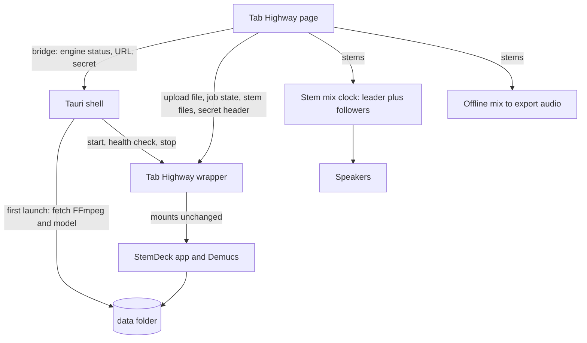

# Desktop Stem Separation - Plan

## Goal Capsule

- **Objective:** Someone practicing a tab on Windows can split their own recording of the song into stems on their own machine, then play along with the tab over a custom mix of those stems, including in exported video.
- **Means:** Tab Highway also ships as a desktop app that carries a pinned StemDeck engine (`C:\Users\ericm\stemdeck`, Apache-2.0) inside its package (KTD1).
- **Product authority:** This plan owns the desktop shell, separation of a local file or a YouTube search result, saved stems, the stem mixer, and stems in video export. A song library and BPM auto-alignment are not active scope. The Product Contract wins on product behavior; Key Technical Decisions win on mechanism.
- **Execution profile:** Code. Windows only. Tail: `ce-work` implements, `ce-code-review` reviews, the user runs the manual Windows pass in the Verification Contract.
- **Stop conditions:** Stop and ask if the pinned StemDeck engine cannot be started without modifying its code, or if stems cannot be kept in sync under tempo change (see Risks).
- **Open blockers:** None.

## Product Contract

**Product Contract preservation:** changed: R3, AE1, the engine-delivery Key Decision, and the Goal Capsule Means; later added R11 and AE6, widened R7's volume range, and moved YouTube from deferred to in scope (the audio-source Key Decision). The user chose to ship the engine inside the package after research showed StemDeck's Windows build bundles its Python runtime and downloads only FFmpeg and the model on first launch. No other requirement changed. A Windows-only first-run engine download would have required building a runtime-pack pipeline StemDeck has only for macOS.

### Summary

Tab Highway also ships as a Windows desktop app that separates a local audio file into StemDeck's six stems (vocals, drums, bass, guitar, piano, other) on the user's machine. The user mixes the stems per stem, mutes the guitar to play along, or solos it to compare against the tab. The same mix feeds the exported video, and separated songs are saved so they reopen without re-processing. The static web site stays as it is.

### Problem Frame

Tab Highway today plays one user recording against the tab. A full-band recording always contains the guitar part the player is trying to learn, so they cannot hear the band without it, and cannot isolate the guitar to check phrasing. StemDeck already solves separation locally and for free, but as a separate app: the user separates there, then has to carry files across by hand.

### How This Work Fits Together

<!-- ce-section: work-relationships -->

This plan covers the desktop app with separation, saved stems, the stem mixer, and stems in export. The areas below are the current understanding, not a committed roadmap.

- Song library (folders, search over saved songs)
  - Depends on: saved stems from this plan.
- BPM and beat analysis for automatic alignment of the recording to the tab
  - Can proceed independently of: this plan, which keeps the manual offset slider.
- macOS and Linux desktop builds
  - Depends on: this plan's engine packaging and shell.
- NVIDIA (GPU) Windows build
  - Depends on: this plan's engine packaging.

### Key Decisions

- **Desktop app, web site kept, one codebase.** Stem features appear only in the desktop build; the web site is unchanged. (session-settled: user-directed — chosen over replacing the web site: keeps the zero-install practice and export path.) Governs R1, R2.
- **Engine ships inside the package, CPU build first.** The package carries StemDeck's Python runtime; first launch fetches only FFmpeg and the Demucs model. (session-settled: user-directed — chosen over a Windows first-launch runtime download: StemDeck's Windows build already works this way, and the download path exists only on macOS.) Governs R3.
- **Windows only for v1.** (session-settled: user-approved — macOS and Linux deferred: Windows is the platform that can be tested now.) Governs R1.
- **Two audio sources: a local file, or a YouTube search result.** (session-settled: user-directed — YouTube moved into scope after first being deferred: finding a song without leaving the app is wanted.) Governs R4, R11.
- **Alignment stays on the manual offset.** One offset applies to the whole stem set, as it does to a recording today. Governs R8.

### Requirements

**Desktop app**

- R1. Tab Highway is available as a Windows desktop app that runs the same practice, tab, fretboard and export experience as the web site.
- R2. The web site is unchanged and shows no stem features.
- R3. On first launch the desktop app downloads FFmpeg and the separation model with visible progress, and afterwards separates with no internet connection.

**Separation**

- R4. The user can separate their loaded local recording into vocals, drums, bass, guitar, piano and other stems.
- R5. Separation shows progress and can be cancelled, leaving no partial result.
- R11. The user can search YouTube from the app and import a result's audio, which is separated into stems. Over-length results are shown but cannot be imported. Stems from an import play with the tab, use the same offset control, appear in the export, and are saved by link like a file's are by content.
- R6. A separated song is saved on disk and reopens with its stems without re-separating. Saved stems are matched by the audio file, so the same song loaded from a different file separates again.

**Stem mixer**

- R7. The user can set volume (0 to 200%, with 100% the original level), mute and solo for each stem during playback, and the mix responds immediately.
- R8. The stems play together in sync with the tab, follow tempo changes and bar loops, and share one alignment offset with the same slider the recording uses today.
- R9. With the guitar stem muted or lowered, the user hears the rest of the band as a backing track; with only the guitar soloed, they hear the original guitar against the tab.

**Export**

- R10. Exported video uses the current stem mix as its audio, at the tab's original tempo, and keeps the existing export limits.

### Key Flows

- F1. First launch
  - **Trigger:** The user opens the desktop app for the first time.
  - **Steps:** The app offers the FFmpeg and model download with progress and size, completes it, and returns to the normal start screen.
  - **Outcome:** Separation is available offline from then on.
  - **Covered by:** R3
- F2. Separate and practice
  - **Trigger:** The user loads a tab and a recording, then chooses to separate.
  - **Steps:** Progress is shown and the user can cancel. When finished, the stem mixer appears. The user mutes the guitar and plays along.
  - **Outcome:** The band plays in sync with the tab without the guitar.
  - **Covered by:** R4, R5, R7, R8, R9
- F3. Reopen a saved song
  - **Trigger:** The user loads a recording that was separated before.
  - **Steps:** The app recognizes the file and offers its saved stems instead of separating again.
  - **Outcome:** The stem mixer is ready without waiting.
  - **Covered by:** R6

### Acceptance Examples

- AE1. **Covers R3.** Given a fresh install with no network, when the user opens the app, setup does not complete and stem features say setup is unfinished; the practice features still work.
- AE2. **Covers R5.** Given separation in progress, when the user cancels, no stems for that file are saved and the recording plays as before.
- AE3. **Covers R6.** Given a song separated earlier, when the user loads the identical file again, saved stems are offered. When they load a different file of the same song, it separates again.
- AE4. **Covers R8.** Given a stem mix playing, when the user slows the tempo or loops a bar range, all stems follow together and the pitch is preserved.
- AE6. **Covers R11.** Given a search result longer than the engine's limit, when results appear, it is listed as too long to import and cannot be used; a shorter result imports and opens in the mixer.
- AE5. **Covers R10.** Given a stem mix with the guitar muted, when the user exports a video, the video's audio has no guitar.

### Scope Boundaries

**Deferred for later**

- A song library, and BPM or beat analysis for automatic alignment.
- macOS and Linux builds, and an NVIDIA (GPU) Windows build.
- A Python-free native separation engine and a first-launch runtime download.

**Not in this plan**

- Any stem feature on the web site, including a pointer to the desktop app.
- Separating audio on the web site.

#### Deferred to Follow-Up Work

- A release workflow that builds and publishes the Windows package in CI. This plan produces the package with a local script.
- Surfacing StemDeck's own library, analysis or YouTube features, which stay inside the engine unused.

### Dependencies / Assumptions

- StemDeck is Apache-2.0 and Demucs is its open-source model. The desktop package needs third-party notices for StemDeck, its Python runtime, Demucs, FFmpeg and the model weights alongside `THIRD_PARTY_NOTICES.md`.
- Verified: the app plays one recording through one audio element with one offset (`src/audio/user-audio.ts`), and export decodes one recording (`src/export/audio.ts`, `src/app/App.tsx`). No desktop shell exists in the repo today.
- Verified: StemDeck's Windows build is a portable folder with the Python runtime inside; only FFmpeg and the model are fetched on first launch (`desktop/src-tauri/src/main.rs`, `packaging/windows/README-WINDOWS.txt` in the StemDeck repo).
- Verified: the StemDeck backend serves no cross-origin headers, so a page served from another origin cannot call it directly (KTD3).
- Verified: the pinned release's pruned yt-dlp leaves out the YouTube search extractor, so its search fails; the wrapper restores it (`engine/wrapper/ytdlp_fix.py`). A later release may fix this, and the restore then does nothing.
- Assumption: the desktop webview supports the WebCodecs video export the web build uses. Unverified; U1 checks it first.
- Assumption: a CPU-only machine separates a song in a tolerable time. StemDeck documents speed as hardware-dependent.

## Planning Contract

### Key Technical Decisions

- KTD1. **Reuse a pinned, unmodified StemDeck engine.** The package contains StemDeck's Windows Python runtime and `app/` backend from a pinned release, started by a small Tab Highway shell. Updating StemDeck is a version bump, at the cost of shipping its whole backend. Alternatives were forking its backend or rewriting separation, both far larger. (session-settled: user-directed — chosen over a rewritten engine: reuse of what works; see the Product Contract Key Decisions.) Governs R3, R4.
- KTD2. **Tab Highway gets its own small Tauri v2 shell, not StemDeck's.** StemDeck's `main.rs` is about 6,900 lines, mostly macOS packaging, self-update and drag-out. The new shell does only four jobs: locate the runtime, run first-launch setup, start and stop the engine, and expose that state to the page. It copies the proven approach, not the code volume.
- KTD3. **A thin wrapper in Tab Highway, not a change to StemDeck, makes the engine reachable.** The engine is started through a Tab Highway wrapper module that mounts StemDeck's app unchanged and adds two things: a cross-origin allowance for the shell's own page origin only, and a per-launch secret header required on every request. The engine binds to loopback only. Without the secret, any website open in the user's browser could post jobs to a loopback port. Governs R4, R5.
- KTD4. **The page reaches the shell through a small bridge module that tolerates its absence.** The bridge reads the Tauri global when present and otherwise reports "web". No Tauri package is imported by the page, so the web build, its bundle and its deploy do not change (R2).
- KTD5. **Stems play as one audio element per stem routed through a shared gain graph, with one stem leading.** Web Audio's buffer playback cannot preserve pitch when tempo changes, and AE4 requires pitch to hold; media elements can. A follower is nudged back when it drifts from the leader beyond a small tolerance, on the same timer the existing clock uses for loops. This is a change from the "mix everything in the app's audio engine" framing in the scoping call-out; the reason is the pitch constraint. Governs R7, R8, R9.
- KTD6. **Export renders the mix offline from the stems.** Export is at original tempo, so pitch is not a concern: stems are decoded one at a time, scaled by their mix gains, and summed into one buffer, which keeps peak memory near one stem plus the sum. Governs R10.
- KTD7. **Saved stems live in a Tab Highway data folder and are keyed by a hash of the audio file's bytes.** The engine's jobs folder is pointed at that location; Tab Highway keeps its own small index from file hash to engine job. Matching by content satisfies R6's "same file, not same song" rule. Governs R6.
- KTD8. **Progress is read from the engine's job state stream; cancel uses its cancel call.** Both are existing StemDeck behavior; Tab Highway adds no engine endpoints. Governs R5.

### High-Level Technical Design

The desktop app is the existing page plus a shell that owns one background process. The page talks to the engine only through the wrapper, so StemDeck code stays unmodified.



Mix clock shape, directional only:

```text
leader = first stem element (owns media time, offset, loop, rate)
for each follower: on timer tick, if |follower.time - (leader.time)| > tolerance: follower.time = leader.time
gain(stem) = 0 if muted, or if any stem is soloed and this one is not; otherwise its volume
```

### Assumptions

- The pinned StemDeck release supports running under a wrapper that mounts `app.main:app` (the shell in StemDeck starts it as `app.main:app` under uvicorn).
- Stems arrive as 44.1 kHz stereo WAV files from the engine's stem download call.

## Implementation Units

### U1. Desktop shell scaffold and bridge

- **Goal:** A Tauri v2 Windows shell that loads the built page, with a bridge the page uses to tell desktop from web.
- **Requirements:** R1, R2.
- **Dependencies:** none.
- **Files:** `src-tauri/Cargo.toml`, `src-tauri/tauri.conf.json`, `src-tauri/src/main.rs`, `src-tauri/capabilities/default.json`, `src/app/desktop.ts`, `package.json`, `.gitignore`, `tests/app/desktop.test.ts`.
- **Approach:**
  - Add a shell project that serves `dist/` and runs the dev server in development. Add `tauri` scripts to `package.json` without changing `dev`, `build` or `test`.
  - Write the bridge to read `window.__TAURI__` when present; export an `isDesktop` check and typed wrappers for the shell commands later units add. Import no Tauri package (KTD4).
  - Set the page's security policy so it may call the loopback engine address and the shell's own channel, and nothing else new.
  - First task in this unit: run the existing video export inside the shell and confirm it works (the unverified assumption above).
- **Execution note:** Start with the export smoke check; if WebCodecs is unavailable in the webview, stop and report before building further.
- **Patterns to follow:** StemDeck's `desktop/src-tauri/tauri.conf.json` window and security settings; `src/export/capability.ts` for capability checks.
- **Test scenarios:**
  - Happy path: with no Tauri global present, `isDesktop` is false and every bridge call reports "web" without throwing.
  - Happy path: with a fake Tauri global, `isDesktop` is true and a wrapped command is called with its arguments.
  - Edge case: a Tauri global missing the expected command surface is treated as web.
  - Test expectation for the shell itself: none -- covered by the Verification Contract's manual pass.
- **Verification:** `npm run build` output is unchanged in behavior; the shell opens the page and an export completes inside it.

### U2. Engine packaging

- **Goal:** A repeatable local script that assembles the Windows package: shell, pinned StemDeck runtime and backend, and the Tab Highway wrapper.
- **Requirements:** R1, R3, R4.
- **Dependencies:** U1.
- **Files:** `scripts/package-windows.ps1`, `engine/stemdeck.version`, `engine/wrapper/tabhighway_engine.py`, `docs/desktop-packaging.md`, `THIRD_PARTY_NOTICES.md`, `packaging/windows/THIRD_PARTY_NOTICES.txt`.
- **Approach:**
  - Pin one StemDeck release in `engine/stemdeck.version`; the script downloads that release's CPU Windows package, verifies its published checksum, and copies its `python/` and `backend/` into the package next to the built shell.
  - Add the wrapper module from KTD3 (cross-origin allowance for the shell origin, secret-header check) and a marker that tells the shell where the runtime and backend are.
  - Extend the notices with the new components; StemDeck's own packaging notices file is the source list.
- **Patterns to follow:** `scripts/windows/make-portable.ps1` and `packaging/windows/` in the StemDeck repo.
- **Test scenarios:**
  - Happy path: wrapper test mounts a stub app; a request with the secret header and the shell origin passes, and the cross-origin headers name only that origin.
  - Error path: a request without the secret header is rejected before reaching the mounted app.
  - Error path: a request from a different origin gets no cross-origin allowance.
  - Edge case: a preflight request is answered without requiring the secret.
- **Verification:** The script produces a folder that starts on a clean Windows user account with no Python installed; the notices cover every shipped component.

### U3. Engine lifecycle and first-launch setup

- **Goal:** The shell completes first-launch setup, runs the engine, and reports state to the page.
- **Requirements:** R3, R4.
- **Dependencies:** U1, U2.
- **Files:** `src-tauri/src/engine.rs`, `src-tauri/src/setup.rs`, `src-tauri/src/main.rs`, `src/app/desktop.ts`, `src/app/engine-state.ts`, `src/app/EngineSetup.tsx`, `tests/app/engine-state.test.ts`.
- **Approach:**
  - Setup fetches FFmpeg and the Demucs model into the data folder with a verified checksum, reporting progress, and can resume after interruption; it follows StemDeck's own FFmpeg and model setup (`ensure_external_assets`, `warmup_models`).
  - Start the engine through the wrapper on a free loopback port with a fresh per-launch secret, wait for its health response and its instance token, and stop it and its separation worker when the app closes. Give it the environment StemDeck's own shell gives it: data, jobs and cache folders (jobs pointed at Tab Highway's data folder, KTD7), the FFmpeg location, the model cache, the instance token, and the shell's process id so a separation worker exits if the shell is killed.
  - Keep the setup and engine state as a pure state machine in `src/app/engine-state.ts`, so the component only renders it and the tests need no browser.
  - Expose to the page: setup state and progress, engine URL, secret, and a retry action. Setup UI shows size and progress and a clear retry on failure; with setup unfinished, stem features say so (F1, AE1).
- **Patterns to follow:** `start_backend`, `wait_for_health` and `ensure_workspace` in StemDeck's `desktop/src-tauri/src/main.rs`; `src/app/Notices.tsx` for message placement.
- **Test scenarios:**
  - Covers AE1. With setup unfinished and no network, the setup state is "incomplete" with a retry action, and stem controls are disabled with an explanation.
  - Happy path: a fake bridge reporting progress 0 to 100 moves the setup view to "ready" and enables stem controls.
  - Error path: a failed download shows the failure and a retry, and retry restarts from where it stopped.
  - Edge case: the engine reports not ready after setup; the page shows "engine not running" with a restart action instead of a stuck spinner.
  - Integration: closing the app leaves no engine or worker process running (manual, Verification Contract).
- **Verification:** A first launch on a clean account reaches "ready" and a second launch with the network off starts the engine.

### U4. Separation client and saved stems

- **Goal:** The page can separate the loaded recording, report progress, cancel, and reopen saved stems.
- **Requirements:** R4, R5, R6.
- **Dependencies:** U3.
- **Files:** `src/stems/engine-client.ts`, `src/stems/saved-stems.ts`, `src/stems/file-hash.ts`, `tests/stems/engine-client.test.ts`, `tests/stems/saved-stems.test.ts`.
- **Approach:**
  - Client: submit the file as an upload, follow job state until done, error or cancelled (KTD8), cancel on request, and download the six stem files. Send the secret header on every call.
  - Saved stems: hash the file's bytes (streamed, since files can be up to 400 MB), look the hash up in a small index kept in the data folder, and return the stems if the job's files still exist (KTD7). An index entry whose files are gone counts as unseparated.
  - On cancel or error, the engine deletes the partial job; the index is only written after a job reports done (R5).
- **Patterns to follow:** `src/audio/user-audio.ts` for the 400 MB limit and error wording style.
- **Test scenarios:**
  - Covers AE2. Cancel mid-job: the client reports cancelled, the index has no entry for the file, and the recording is untouched.
  - Covers AE3. The same bytes under a different file name resolve to the saved stems; different bytes of the same song do not.
  - Happy path: job state events 0, 40, 100 then done produce progress callbacks in order and then six downloaded stems.
  - Error path: an engine error state surfaces the engine's message and writes no index entry.
  - Edge case: an index entry pointing at a deleted job folder is treated as not separated and removed.
  - Edge case: a file over the size limit is refused before any upload.
  - Error path: a missing or wrong secret response (rejected) is reported as "engine unavailable".
- **Verification:** Separating a short file produces six stems; loading the same file again returns them without a new job.

### U5. Stem mix clock

- **Goal:** Play the six stems together as one clock the app already knows how to drive.
- **Requirements:** R7, R8, R9.
- **Dependencies:** U4.
- **Files:** `src/audio/stem-mix.ts`, `src/audio/mix-gains.ts`, `tests/audio/stem-mix.test.ts`, `tests/audio/mix-gains.test.ts`.
- **Approach:**
  - Implement the existing clock contract (`src/audio/clock.ts`) as in KTD5: a leader element owns time, offset, loop and rate; follower elements are resynced beyond a tolerance on the 20 ms timer.
  - Offset, loop wrap and the stop at the tab's end behave exactly as in `UserAudioClock`; share the offset arithmetic rather than copying it where practical.
  - Route each element through a gain stage behind a small interface, so tests can pass fakes (the Node test environment has no audio context).
  - Gains come from one pure function of per-stem volume, mute and solo (solo wins over mute of others; muting a soloed stem silences it). Gain changes apply immediately and never restart playback.
  - Dispose releases every element and object URL.
- **Execution note:** Implement the gain function and drift resync test-first; they are pure and carry the product rules.
- **Patterns to follow:** `src/audio/user-audio.ts` and its fake audio element in `tests/audio/user-audio.test.ts`.
- **Test scenarios:**
  - Covers AE4. With rate 0.5 and a loop set, every stem element gets the same rate and the same loop wrap time; pitch preservation is enabled on each.
  - Happy path: soloing the guitar gives gain 0 to every other stem and its volume to the guitar.
  - Happy path: muting the guitar leaves the other five at their volumes (the backing-track case).
  - Edge case: two stems soloed play together; clearing one solo restores the single solo.
  - Edge case: a stem both muted and soloed is silent.
  - Edge case: a follower 120 ms behind is pulled to the leader; one within tolerance is left alone.
  - Edge case: offset changes shift every stem's position by the same amount.
  - Error path: a stem that fails to load surfaces an error and does not leave the others playing out of step.
  - Integration: seek during playback moves all stems to the same media time.
- **Verification:** Playing a real song's stems at 50%, 100% and with a bar loop shows no audible phasing between stems.

### U6. Stem mixer UI and app wiring

- **Goal:** The user separates, sees progress, and mixes, inside the existing screen.
- **Requirements:** R2, R4, R5, R6, R7, R8, R9.
- **Dependencies:** U3, U4, U5.
- **Files:** `src/app/App.tsx`, `src/app/StemMixer.tsx`, `src/app/SeparateControl.tsx`, `src/app/stem-controls.ts`, `src/app/OffsetSlider.tsx`, `src/app/styles.css`, `tests/app/stem-controls.test.ts`.
- **Approach:**
  - Put what the controls show and do (visibility, button choice, mixer state changes) in pure functions in `src/app/stem-controls.ts`; the components render them. Tests run in a Node environment with no DOM, as the existing app tests do (`tests/app/view-controls.test.ts`).
  - Show the separate control and mixer only when the bridge says desktop and setup is ready; the web build renders exactly what it does today (R2).
  - After a recording loads, offer "Separate" or, when saved stems exist, "Use saved stems" (F3). While separating, show progress and a cancel action; on success the stem clock replaces the recording clock and the offset slider drives it.
  - The mixer lists the six stems with volume, mute and solo, and a one-click "Mute guitar" for the backing-track case.
  - Removing the recording or loading another file disposes the stem clock and returns to the plain recording behavior.
- **Patterns to follow:** `src/app/OffsetSlider.tsx` and `src/app/LoopControls.tsx` for control layout; the `userClock` handling in `src/app/App.tsx`.
- **Test scenarios:**
  - Covers R2. With the bridge reporting web, no stem control or mixer renders.
  - Happy path: desktop and ready with a loaded recording shows "Separate"; saved stems show "Use saved stems" instead.
  - Happy path: toggling mute on a stem changes only that stem's gain.
  - Edge case: replacing the recording while stems play disposes the old clock and shows the new file's state.
  - Error path: a separation error shows the engine's message and leaves the plain recording playable.
  - Edge case: setup unfinished disables the control with the setup message from U3.
- **Verification:** The manual pass in the Verification Contract completes flows F2 and F3.

### U7. Stems in video export

- **Goal:** Exported video audio is the current stem mix.
- **Requirements:** R10.
- **Dependencies:** U5, U6.
- **Files:** `src/export/audio.ts`, `src/app/App.tsx`, `tests/export/stem-audio.test.ts`.
- **Approach:**
  - Add a function beside `decodeUserRecording` that renders the stem mix to the export's audio form (KTD6), applying the current per-stem gains and the shared offset.
  - In the export dialog's audio source, use it when a stem set is active; otherwise behave as today. Export limits (`MAX_EXPORT_SECONDS`) are unchanged.
- **Patterns to follow:** `decodeUserRecording` and `fitPcm` in `src/export/audio.ts`; the recording-context helper in `tests/helpers/recording-context.ts`.
- **Test scenarios:**
  - Covers AE5. With the guitar muted, the rendered audio equals the sum of the other five stems and contains none of the guitar signal.
  - Happy path: soloing one stem renders only that stem.
  - Edge case: a positive offset skips that much of every stem's start.
  - Edge case: stems of slightly different lengths render to the tab's duration without error.
  - Error path: a stem that cannot be decoded fails the export with a message rather than rendering a partial mix.
  - Edge case: with no stem set, behavior is identical to today (existing export tests keep passing).
- **Verification:** An exported video of a muted-guitar mix plays with no guitar in an ordinary player.

### U8. Documentation

- **Goal:** The README and packaging notes tell a user what the desktop app is and how to build it.
- **Requirements:** R1, R2.
- **Dependencies:** U2, U6.
- **Files:** `README.md`, `docs/desktop-packaging.md`.
- **Approach:** Add a short "Desktop app" section (what stems add, Windows only, first-launch setup, that the web site has no stems) and link the packaging notes. State that the in-app Licences page covers web components and the package notices cover the desktop ones.
- **Test expectation: none -- documentation only.**
- **Verification:** A reader can build and run the package from the docs alone.

## Verification Contract

| Gate | Command or step | Applies to |
|---|---|---|
| Unit tests | `npm test` | U1, U2 (wrapper test runs under the engine's own Python test command noted in `docs/desktop-packaging.md`), U3 to U7 |
| Types | `npm run typecheck` | All units |
| Web build unchanged | `npm run build`, then confirm `dist/` contains no Tauri code and the page runs in a plain browser with no stem controls | U1, U4, U6 |
| Package build | `scripts/package-windows.ps1` completes and starts on a clean Windows account with no Python | U2, U3 |
| Manual Windows pass | First launch (with and without network), separate a short file, cancel one, mix and mute guitar, change tempo and loop a bar range, reload the same file for saved stems, export a video, close the app and confirm no leftover engine process | U3 to U7 |

## Definition of Done

- All units meet their Verification, and every Acceptance Example (AE1 to AE5) is covered by a test or the manual pass.
- `npm test`, `npm run typecheck` and `npm run build` pass, and the web build is functionally unchanged.
- The manual Windows pass is done and recorded in the pull request description.
- The notices cover every component shipped in the package.
- No experimental or abandoned-attempt code remains in the diff.

## Risks and Open Questions

### Risks

- **Stem drift under tempo change.** Several media elements may drift or click when resynced at slow tempos. Mitigation: tolerance tuning in U5 and a manual check at 50%; if unacceptable, the fallback is a pitch-preserving stretch in an audio worklet, which is a larger change and would stop the plan for confirmation.
- **Memory.** Six decoded stems for a six-minute song are large; U5 streams through elements and U7 decodes one stem at a time to avoid holding them all.
- **Package size.** The CPU package is roughly StemDeck's Windows CPU zip (about 700 MB) plus the shell; first launch adds the model download.
- **Pinned engine under churn.** StemDeck dependencies are pinned for known breakages; bumping the pinned release needs a smoke run of U4's flow.

### Deferred to Planning (resolved at implementation)

- Whether the shell can pass the picked file to the engine by path or must stream it from the page; choose the cheaper that keeps files under the existing 400 MB limit.
- Exact drift tolerance and resync interval for the stem clock.
- Where in the data folder saved stems live by default and whether the user can relocate it.
- Whether the engine's own first-use model download can replace the shell's model fetch, if its progress is observable.

## Sources / Research

- StemDeck Windows packaging: `scripts/windows/make-portable.ps1`, `packaging/windows/README-WINDOWS.txt` (bundled Python runtime; FFmpeg and model fetched on first launch).
- StemDeck shell start-up and environment: `desktop/src-tauri/src/main.rs` (`start_backend`, `wait_for_health`, `ensure_workspace`, `ensure_external_assets`).
- StemDeck API used: job create (file upload), job state stream, cancel, and per-stem WAV download in `app/api/jobs.py`, `app/api/events.py`, `app/api/stems.py`.
- Tab Highway audio and export: `src/audio/clock.ts`, `src/audio/user-audio.ts`, `src/export/audio.ts`, `src/export/exporter.ts`, `src/app/App.tsx`.
