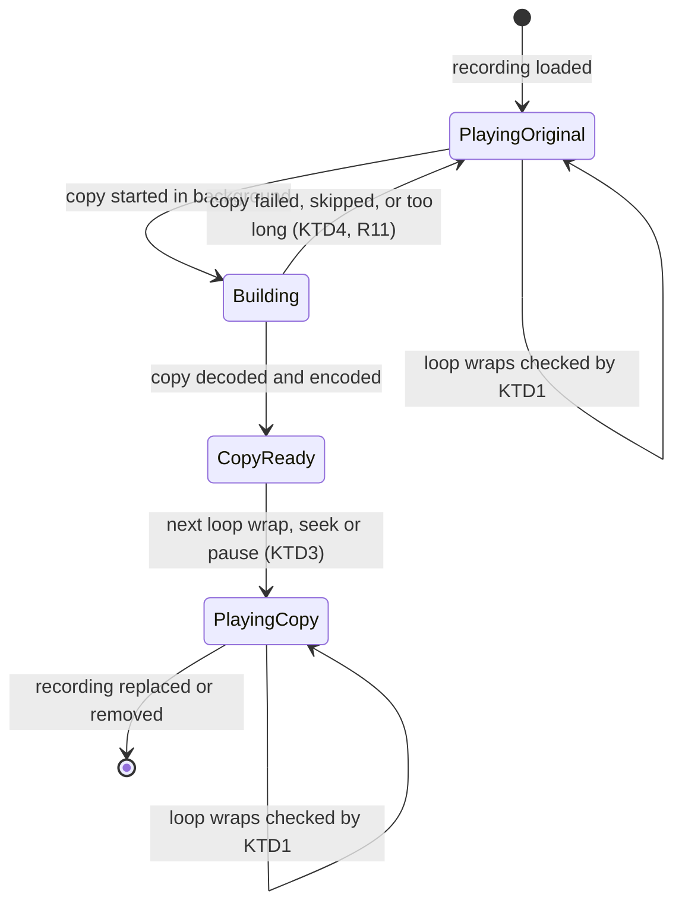

# Loop-Aligned Playback - Plan

## Goal Capsule

- **Objective:** A guitarist practising along with their own recording hears the recording restart on the same musical spot on every loop pass, at any speed, and finds the audio and tab still moving together after leaving the loop.
- **Means:** Play a seek-exact copy of the recording, and check where the audio lands on every loop pass (KTD1, KTD2).
- **Product authority:** This plan owns how aligned recording audio behaves under loops, tempo changes and leaving a loop, for a single recording and for stems, on web and desktop. The earlier two-way offset, nudge buttons and per-recording memory (`docs/plans/2026-10-04-0945-feat-desktop-stem-separation-plan.md`, R12 to R20) are unchanged. Per-loop offsets, anchors across the song and gapless looping are not active scope. The Product Contract wins on product behavior; Key Technical Decisions win on mechanism.
- **Execution profile:** Code, test-first on the clock changes. Product Contract preservation: unchanged.
- **Stop conditions:** Stop and ask if the landing check cannot meet R4 on a real MP3 after the exact copy is in place (KTD1 tolerance), since that would mean per-pass drift has a cause outside the audio element.
- **Tail ownership:** The implementer finishes the code and tests; the user runs the manual listening check (Verification Contract) and ships.
- **Open blockers:** None.

---

## Product Contract

### Summary

Playback gets a clear order of truth. The tab's time is the single source of truth, and the recording's position is always the tab time plus the one global offset. A loop is a range of tab time on top of that, and leaving the loop returns to the full song with audio and tab still together. The recording is played from a seek-exact copy and checked on each loop pass, so every pass restarts on the same spot.

### Problem Frame

A recording is aligned to the tab with one offset. Looping a section of that recording, changing the speed, or leaving the loop can then leave the audio out of step with the tab, and the loop restarts on a slightly different spot each pass until it has slid away. The most frequent symptom is the restart landing somewhere new on each pass. Today a loop restart is a seek on the audio element, and seeks on compressed files such as MP3 are not exact. The offset slider also notes that one offset cannot follow a recording that drifts against the tab, which is a limit this plan accepts.

### Key Decisions

- **One global offset, with loops and tempo honoring it.** Alignment stays a single offset for the whole recording, not per-loop offsets or anchors across the song. (session-settled: user-directed — chosen over per-loop offsets and multi-point anchors: the user wants loops, tempo and leaving a loop to honor the offset already set.) Governs R1, R2.
- **Seek-exact copy plus a per-pass landing check.** The root cause is inexact seeking in compressed files, so the app plays an exact copy and still checks each pass. (session-settled: user-directed — chosen over the per-pass check alone and over looping from a captured clip: it removes the cause of drift without the cost of gapless clip looping.) Governs R4, R5, R9.
- **Until the exact copy is ready, play the original.** Waiting before play is enabled was the alternative. (session-settled: user-approved — the agent proposed it with the wait-versus-switch tradeoff shown and the user confirmed the scope.) Governs R10.

### Requirements

**Order of truth**
- R1. The recording's position is always the tab time plus the single global offset, in a loop, out of a loop, and at every speed.
- R2. A loop is a range of tab time. Moving the offset while a loop is set keeps the loop on the same bars and moves the audio under it.
- R3. Turning the loop off continues from the current position with audio and tab still moving together, with no re-seek needed.

**Repeatable loop passes**
- R4. Each loop pass restarts the recording on the same spot as every other pass.
- R5. On each pass the player checks where the audio actually landed and corrects any error before it is heard as a different spot.
- R6. R4 holds at any playback speed.
- R7. Stems follow R4 to R6 together, and no stem restarts out of step with the others.
- R8. The loop pass counter advances only when a pass actually restarts, so a per-pass mix changes on the pass the user hears.

**Seek-exact copy**
- R9. When a recording is loaded, the app makes a seek-exact copy and uses it for alignment, loops and seeks. The file the user uploaded is never changed.
- R10. Until the copy is ready, playback uses the original recording. The switch to the copy changes neither the position nor the sound of what is playing.
- R11. If the copy cannot be made, the original keeps playing with the per-pass check of R5, and loading and playing are never blocked.
- R12. Reopening the same recording reuses its exact copy when one was kept, so the work is not repeated.

### Key Flows

- F1. Practising a loop on an aligned recording
  - **Trigger:** The user has aligned a recording with the offset and sets a bar range as a loop.
  - **Steps:** The user plays, optionally slows the speed, lets several passes run, then turns the loop off.
  - **Outcome:** Every pass restarts on the same spot at the chosen speed, and after the loop is off the audio and tab continue together.
  - **Covered by:** R1, R2, R3, R4, R6

### Acceptance Examples

- AE1. **Covers R4, R5.** Given a recording looped over a few bars, when twenty passes play, the recording restarts on the same beat on the twentieth pass as it did on the first.
- AE2. **Covers R2.** Given a loop is playing, when the user nudges the offset, the loop stays on the same bars in the tab and the audio under it moves with the new offset.
- AE3. **Covers R3.** Given a loop is playing, when the user turns the loop off, playback continues from where it was with audio and tab together.
- AE4. **Covers R6.** Given a loop at 60 percent speed, when passes repeat, each pass restarts on the same spot as at full speed.
- AE5. **Covers R9, R10.** Given a long MP3 has just loaded, when the user presses play before the copy is ready, it plays from the original and switches to the copy later with no jump in position or sound.
- AE6. **Covers R7, R8.** Given a stem mix whose guitar fades out over successive passes, when the loop wraps, all stems restart together and the pass number changes only on a real restart.

### Success Criteria

- Looping a section for a minute or more at full and at reduced speed leaves the restart point audibly unchanged from the first pass to the last. The tolerance is set in KTD1.
- Turning the loop off never leaves the audio and tab out of step.

### Scope Boundaries

**Deferred for later**
- Per-loop offsets and anchors across the song. A recording that drifts against the tab still cannot be fully aligned with one offset.
- Gapless, seamless looping from a captured clip of the loop.

### Dependencies / Assumptions

- Builds on the two-way, remembered offset in `docs/plans/2026-10-04-0945-feat-desktop-stem-separation-plan.md` (R12 to R20); loop range and tempo are still not restored on reopen.
- Assumption: the recording stays close to the tab's tempo, so one offset is good enough.
- Verified: a loop restart seeks the audio element and is detected by a 20 ms timer or a frame (`src/audio/user-audio.ts`); stems follow one leader (`src/audio/stem-mix.ts`); the desktop engine serves stems as WAV (`src/stems/engine-client.ts`). Not yet measured in a browser: how far real MP3 restarts drift.

### Outstanding Questions

**Deferred to Implementation**
- The final landing tolerance (KTD1 starts at 25 ms) is tuned during the manual listening check.

---

## Planning Contract

### Key Technical Decisions

- KTD1. **Landing check compares the element to where it should be.** After every loop wrap and every seek made while playing, the recording clock records the target recording position, the time and the rate; each 20 ms tick compares the element's `currentTime` to that target plus elapsed time at the current rate, and re-seeks when the error exceeds 25 ms. The comparison waits while the element reports it is still seeking and then measures from the moment the seek ends, since the element does not play while it seeks and a slow seek must not be mistaken for a bad landing. This reuses the existing timer and needs no new timing source. Governs R4, R5, R6.
- KTD2. **The exact copy is a decoded, re-encoded WAV played from a second audio element.** The recording is decoded with the same offline decode the video export already uses (`src/export/audio.ts`), written out with the existing `encodeWav` (`src/export/audio-file.ts`), and played from a blob URL. WAV is seek-exact because its time-to-byte mapping is linear, which is the property compressed MP3 lacks. The file the user uploaded is never modified. Governs R9, R11.
- KTD3. **The copy replaces the original only at a point where the player seeks anyway.** The copy is offered to the clock when ready, and the clock swaps elements at the next loop wrap, seek, or pause, so position and sound never jump. A long uninterrupted play-through keeps the original until one of those happens. The copy is kept in memory for the page session, keyed by file content, at most two at a time, and released when the recording is replaced or removed; it is not saved to disk. (session-settled: user-approved — chosen over waiting before play is enabled and over saving copies to disk: confirmed in the scoping synthesis.) Governs R10, R12.
- KTD4. **No copy is made when it would not help or would cost too much.** Files already WAV and stems (the engine serves WAV) are skipped, and so are recordings longer than 600 seconds, where a stereo float decode plus the WAV together approach 350 MB. Each of these falls back to the original with KTD1's check (R11).
- KTD5. **Stem followers are re-aimed the moment the leader wraps.** The leader's existing wrap listener in the stem mix also pulls every follower to the leader's new position at once, instead of waiting for the next 20 ms tick and its 40 ms tolerance. Governs R7.
- KTD6. **The pass counter already advances only on a real restart.** The wrap listener fires solely from the two wrap sites in the recording clock, so R8 needs a regression test rather than new code. Governs R8.

### High-Level Technical Design

Lifecycle of a loaded recording's audio source. The tab clock owns time throughout; only the element underneath changes.

### System-Wide Impact

- Export is untouched: it decodes the original file and applies the same offset itself (`src/export/audio.ts`, `src/export/stem-audio.ts`).
- Saved offsets and stem mixes are untouched; the copy is never stored.
- Web and desktop share the same code path; stems on desktop are unchanged apart from KTD5.

### Risks & Dependencies

- **Memory on long recordings.** Bounded by KTD4's 600 s ceiling and KTD3's two-copy cap.
- **Background tabs.** Browsers slow timers in a hidden tab, so the landing check and wrap detection run late there. This is accepted; practice happens in a visible tab.
- **Unmeasured real-world drift.** Unit tests use scripted elements, so the manual listening check in the Verification Contract is the only proof against real MP3 files.
- **Depends on** the existing recording clock, stem mix and export WAV encoder; no new packages.

---

## Implementation Units

### U1. Loop landing check in the recording clock

- **Goal:** Each loop pass restarts on the same recording position, and an inexact landing is corrected.
- **Requirements:** R1, R2, R3, R4, R5, R6; AE1, AE2, AE3, AE4
- **Dependencies:** None
- **Files:** `src/audio/user-audio.ts`, `tests/audio/user-audio.test.ts`
- **Approach:**
  - Add an optional `seeking` flag to the `AudioLike` slice so the check can wait for a seek to finish.
  - Record a landing target in the clock's seek and wrap placement (the one place that already writes `currentTime`).
  - Compare and re-seek from the existing 20 ms watcher, using the clock's current rate.
  - Clear the target when the loop is cleared, the clock pauses, or the offset changes.
- **Execution note:** Write the failing wrap-landing tests first, with a scripted element whose seek lands late.
- **Patterns to follow:** The fake `AudioLike` and fake-timer tests already in `tests/audio/user-audio.test.ts`.
- **Test scenarios:**
  - Covers AE1. A scripted element lands 60 ms late after a wrap on three of ten passes; after the check, `currentTime` is within 25 ms of the loop start plus the offset on every pass.
  - Covers AE4. At rate 0.6, a wrap that lands late is corrected to the expected position computed at 0.6, not at 1.0.
  - Covers AE2. With a loop playing, changing the offset leaves the loop range unchanged and the next wrap seeks to the loop start plus the new offset.
  - Covers AE3. Clearing the loop mid-pass leaves the element playing without a seek and the clock time continuous.
  - Edge: while `seeking` is true the check does nothing; after a 300 ms seek the audio is not skipped ahead, and a landing that is off once the seek ends is still corrected.
  - Edge: a negative offset (lead-in) loop still restarts through the lead-in and the check is not armed while counting silence.
  - Error path: an element that never reports `seeking` still gets checked after the first tick.
- **Verification:** The new tests pass and the existing clock tests still pass unchanged.

### U2. Stem followers restart with the leader; pass counter regression

- **Goal:** Stems restart together on a wrap and the pass number changes only on a real restart.
- **Requirements:** R7, R8; AE6
- **Dependencies:** U1
- **Files:** `src/audio/stem-mix.ts`, `tests/audio/stem-mix.test.ts`
- **Approach:**
  - Extend the leader's wrap listener (KTD5) to pull every follower to the leader's position immediately, in addition to the existing mix and pass handling.
  - Leave the lead-in rule alone: followers still wait while the leader counts silence.
- **Execution note:** Add the follower-lands-with-leader test first and watch it fail.
- **Patterns to follow:** The existing wrap and pass-schedule tests in `tests/audio/stem-mix.test.ts`.
- **Test scenarios:**
  - Covers AE6. On a wrap, every follower's `currentTime` equals the leader's immediately, with no timer tick between.
  - Covers AE6. Over five wraps, the pass number runs 1 through 5 and does not change on a seek, a pause or a tempo change.
  - Edge: a wrap during the lead-in leaves followers paused and still counts one pass.
  - Edge: turning the loop off mid-pass leaves followers within tolerance of the leader (R3).
- **Verification:** The new tests pass and the existing stem tests pass unchanged.

### U3. Exact-copy builder

- **Goal:** Build a seek-exact WAV copy of a recording, or report cleanly that none was made.
- **Requirements:** R9, R11, R12
- **Dependencies:** None
- **Files:** `src/audio/exact-copy.ts` (new), `tests/audio/exact-copy.test.ts` (new)
- **Approach:**
  - Decode with the offline context pattern in `src/export/audio.ts`, encode with `encodeWav` from `src/export/audio-file.ts`, and return a blob URL plus a release function.
  - Take the recording's duration as an input, read from the audio element that `loadUserAudio` already has, and apply KTD4's skips before any decoding: WAV by type or extension, and a duration over 600 s.
  - Keep a small in-memory cache keyed by the file hash from `src/stems/file-hash.ts`, capped at two (KTD3).
  - Return a result that says copy, skipped with a reason, or failed; never throw to the caller.
- **Technical design:** Directional only: `build(file)` returns one of `copy` (with a URL and a release function), `skipped` (with a reason) or `failed`.
- **Patterns to follow:** The injected-decoder shape in `src/export/stem-audio.ts`, so tests pass a fake decoder.
- **Test scenarios:**
  - Happy path: a fake decoder returning a short buffer produces a WAV blob URL and the original file object is untouched.
  - Covers R12. Building the same file twice decodes once and returns the cached copy; a third distinct file evicts the oldest.
  - Edge: a file whose type is `audio/wav` is skipped without decoding.
  - Edge: a known duration over 600 s is skipped without decoding anything.
  - Error path: a decoder that throws returns `failed` and nothing is cached.
  - Release: calling release revokes the URL and removes the cache entry.
- **Verification:** The new tests pass; no import of this module is added to the export path.

### U4. Swap the clock's element at a natural seek

- **Goal:** Let the recording clock move from the original element to the copy without a jump in position or sound.
- **Requirements:** R10; AE5
- **Dependencies:** U1
- **Files:** `src/audio/user-audio.ts`, `tests/audio/user-audio.test.ts`
- **Approach:**
  - Make the clock's audio element replaceable (it is a read-only constructor property today, and nothing outside `src/audio/` reads it), and add a way to offer a replacement; it is held until the next loop wrap, seek or pause (KTD3).
  - When applied, copy rate, playback state and the target position onto the new element, pause the old one, and leave tab time untouched.
  - If the clock is paused when the copy arrives, apply it immediately.
- **Test scenarios:**
  - Covers AE5. A copy offered while playing is not applied mid-play; at the next wrap the new element is positioned at the loop start plus the offset and the old one is paused.
  - Covers AE5. Tab time before and after the swap differs by no more than normal playback progress.
  - Edge: a copy offered while paused is applied at once and the next play starts from it.
  - Edge: a second copy offered before the first applies replaces the pending one.
  - Edge: rate and the loop are carried to the new element.
- **Verification:** The new tests pass and the rest of the clock suite is unchanged.

### U5. Start the copy when a recording loads

- **Goal:** Make the copy in the background after a recording loads and hand it to the clock when ready, without ever blocking loading or playing.
- **Requirements:** R9, R10, R11, R12
- **Dependencies:** U3, U4
- **Files:** `src/app/exact-copy-load.ts` (new), `tests/app/exact-copy-load.test.ts` (new), `src/app/App.tsx`
- **Approach:**
  - A small function takes the file, the clock and the builder, runs the build, and on `copy` offers a new audio element to the clock; on `skipped` or `failed` it does nothing.
  - It ignores a result that arrives after the recording was replaced or removed, and releases that copy.
  - `src/app/App.tsx` calls it once from the recording-load path, passing the element's duration, and releases the copy on replace or remove; stems are not given a copy.
- **Patterns to follow:** The stale-result guard in `restoreProfile` in `src/app/App.tsx`.
- **Test scenarios:**
  - Happy path: a ready copy is offered to the clock exactly once.
  - Error path: a `failed` build leaves the clock untouched and raises no error to the caller.
  - Edge: a copy that finishes after the recording was replaced is released and never offered.
  - Edge: loading the same file again offers the cached copy without a second build (R12).
  - Integration: activating stems after a recording loads offers nothing to the stem clock, and a copy that finishes while stems play is applied to the recording clock only.
- **Verification:** The new tests pass; loading a recording still plays immediately from the original.

---

## Verification Contract

| Check | Command or step | Applies to |
|---|---|---|
| Unit and integration tests | `npm test` | U1 to U5 |
| Types | `npm run typecheck` | all units |
| Production build | `npm run build` | all units |
| Manual listening check | Load a long VBR MP3, align it with the offset, loop four bars for 20 passes at 100% and at 60%, then turn the loop off | R4, R6, R3, AE1, AE3, AE4 |
| Manual swap check | Load a 6-minute MP3, press play at once, loop a section and confirm no jump when the copy takes over | R10, AE5 |

The manual checks are the only proof against real compressed files, and they set the final tolerance noted in Outstanding Questions.

---

## Definition of Done

- All units pass their scenarios, and `npm test`, `npm run typecheck` and `npm run build` pass.
- The manual listening check passes: pass 20 restarts on the same beat as pass 1 at both speeds, and turning the loop off leaves audio and tab together.
- Playback and loading are never blocked by a failed or skipped copy (R11).
- Abandoned-attempt code, debugging output and unused helpers are removed from the diff.
