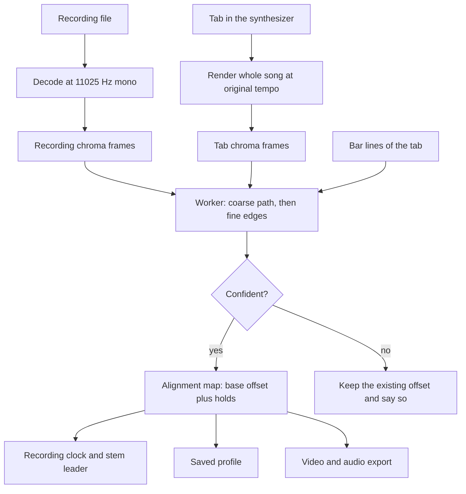
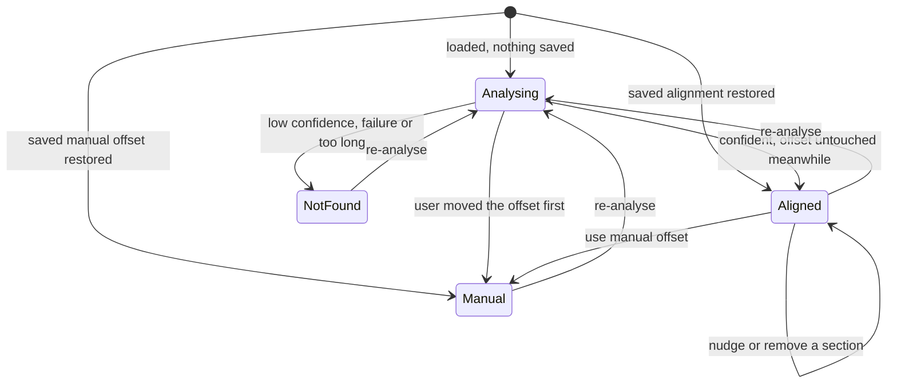

# Auto-Alignment of Recordings to the Tab - Plan

## Goal Capsule

- **Objective:** A guitarist who loads their own recording finds it already lined up with the tab, including after solos and sections where the recording plays longer than the tab, without hand-setting offsets.
- **Means:** Compare pitch-class features of the recording with those of the synthesizer's render of the tab, in a background worker, and play through an alignment map that the recording clock follows (KTD1, KTD2, KTD4).
- **Product authority:** This plan owns how a recording's start offset and its longer or extra sections are detected, applied, adjusted and remembered, on web and desktop. Syncing across devices or speakers and tempo-following are not active scope (see How This Work Fits Together). The Product Contract wins on product behavior; Key Technical Decisions win on mechanism.
- **Execution profile:** Code, test-first on the alignment map and the clock changes; the matcher is built against synthetic fixtures made from the tab's own render. Product Contract preservation: changed, no requirement or acceptance example altered. Scope Boundaries gained one deferred item the user confirmed (bars the recording skips), and the three planning questions were resolved into KTD5, KTD6 and KTD7.
- **Stop conditions:** Stop and ask if the matcher cannot recover a known start offset and a known extra section on the synthetic fixtures within KTD6's tolerance, since that would mean the approach, not tuning, is wrong. Stop and ask before building the note-derived reference if the render measurement in U5 triggers it (KTD2).
- **Tail ownership:** The implementer finishes the code and tests; the user runs the manual checks in the Verification Contract and ships.
- **Open blockers:** None.

---

## Product Contract

### Summary

When a recording loads, the app compares it with the synthesizer's render of the tab. It finds the recording's start offset and the sections where the recording plays longer than the tab or adds bars, and applies that alignment automatically. In those sections the tab waits on its last bar and rejoins at the next tab bar when the recording does. The alignment can be fine-tuned section by section, reverted to the manual offset, and is remembered per recording.

### Problem Frame

Alignment today is one manual offset set with a slider and nudge buttons. That fixes a different start time, but a recording is rarely the tab played note for note. Solos run longer and small sections have extra playing. After the first longer section, the recording is later than the tab for the rest of the song, and no single offset fixes both halves. The user has to re-nudge by ear, or give up on the later bars.

### Key Decisions

- **Offset and extra sections are one feature.** (session-settled: user-directed — chosen over auto-offset alone and over tempo-following: the user's recordings differ in start time and in longer or extra sections, not in steadily drifting tempo.) Governs R1, R2.
- **The recording leads and the tab waits.** (session-settled: user-directed — chosen over making the recording skip or repeat audio to stay with the tab, and over marking differences for hand-fixing: audio never jumps, and the tab rejoins after extra playing.) Governs R5, R6, R7.
- **The alignment applies right away, with undo and fine-tuning.** (session-settled: user-directed — chosen over propose-then-confirm and over automatic offset with manual sections: the result is usable in one step and any wrong guess is quickly fixable.) Governs R9, R10.
- **Web and desktop get the same feature.** (session-settled: user-directed — chosen over desktop-only and over web first: the offset slider already works on both, so auto-alignment does too.) Governs R1, R3.
- **The synthesizer's render of the tab is the reference.** The user asked for the recording to be compared against the app's own synthesizer rather than a separate beat-tracking tool. Comparing like with like gives one method for the offset and for the extra sections.

### Requirements

**Detection**
- R1. When a recording loads, the app compares it with the synthesizer's render of the tab and sets the recording's start offset from the result.
- R2. The same comparison finds the sections where the recording plays longer than the tab or adds bars the tab does not have.
- R3. Detection runs in the background and never blocks loading or playing; until it finishes, the saved or manual offset applies.
- R4. If detection fails or is not confident, the existing offset stays in place and the user is told alignment could not be found.

**Playback**
- R5. The recording's own timeline leads, and the tab position follows the recording through the detected alignment.
- R6. During an extra section the highway and fretboard hold on the last tab bar before it, and rejoin on the next tab bar when the recording does.
- R7. The recording always plays straight through; alignment never skips or repeats audio.
- R8. Loops set on tab bars, the stem mix and exported video all follow the same alignment, so a loop over bars that contain an extra section loops the recording including that extra playing.

**Review and control**
- R9. The detected alignment applies immediately, and the start offset and each detected section can be nudged or removed.
- R10. One control reverts to the manual single offset.
- R11. A recording's alignment, including the user's adjustments, is remembered by the file's content and restored on reopen without re-analysing.
- R12. The user can re-run detection on a loaded recording.

### Key Flows

- F1. Loading and practising a recording
  - **Trigger:** The user loads a recording for a tab that is open.
  - **Steps:** Playback is available at once. Detection finishes and the alignment applies. The user plays, watches the highway wait through a longer solo and rejoin, loops a section, and nudges one detected section that is slightly off.
  - **Outcome:** Audio and tab stay together through the whole song, and the adjustment is remembered on reopen.
  - **Covered by:** R1, R2, R3, R5, R6, R8, R9, R11

### Acceptance Examples

- AE1. **Covers R1, R3.** Given a recording that starts 1.5 seconds after the tab's first note, when it loads, playback is available immediately and the offset moves to match once detection finishes.
- AE2. **Covers R2, R5, R6, R7.** Given a recording whose solo runs eight bars longer than the tab, when it plays through the solo, the highway holds on the last bar before the extra playing and rejoins at the next tab bar, with no audio skipped or repeated.
- AE3. **Covers R4.** Given a recording detection cannot match, when it finishes, the previous offset stays and a message says alignment was not found.
- AE4. **Covers R9, R10.** Given a detected alignment, when the user removes one detected section and then reverts, the section is gone and then the manual single offset applies.
- AE5. **Covers R8.** Given a loop over bars that include an extra section, when the loop plays, each pass covers the recording including the extra playing.
- AE6. **Covers R11.** Given an adjusted alignment, when the same file is reopened, it is restored without re-analysing, and a different file of the same song is analysed fresh.

### Success Criteria

- A typical recording with a different start time and a longer solo lines up with the tab without the user touching the offset.
- A wrong detection is fixed or reverted in a few seconds, without reloading.

### Scope Boundaries

**Deferred for later**
- Syncing the app across devices or speakers.
- Following a recording whose tempo steadily speeds up or slows down.
- Beat matching between two different songs.
- Alignment of a recording that differs from the tab throughout (a different arrangement).
- Sections where the recording plays shorter than the tab (it skips bars); these are left unmatched.

**Deferred to Follow-Up Work**
- Repositioning a detected section to a different bar line by hand.
- A visible "waiting" cue on the highway during an extra section.

### Dependencies / Assumptions

- Supersedes, for recordings with an alignment, the rule in `docs/plans/2026-10-05-0740-feat-loop-aligned-playback-plan.md` that the tab is the single source of truth and the recording is the tab plus one offset. That plan's per-pass landing check and exact copy still apply. The offset, nudge and memory work in `docs/plans/2026-10-04-0945-feat-desktop-stem-separation-plan.md` (R12 to R20) is the fallback in R4 and R10.
- Verified: no audio-analysis code exists in `src/` or the desktop engine wrapper; the tab is played by alphaTab's synth (`src/audio/synth-bridge.ts`), and video export already collects synth audio (`src/export/exporter.ts`).
- Assumption: the user's recordings contain recognisable stretches of the tab's music, so a comparison can find matching regions. Not yet tried on real recordings.

---

<!-- ce-section: work-relationships -->
## How This Work Fits Together

This plan covers automatic alignment of a recording to the tab. The breakdown below is the current understanding, not a committed roadmap.

- Auto-alignment (this plan)
  - Depends on: the existing manual offset as its fallback.
  - Shares: the playback-clock rules with the loop-aligned playback plan, which this plan revises for aligned recordings.
- Syncing devices or speakers (Ableton Link, Snapcast)
  - Can proceed independently of: auto-alignment.
  - Still to decide: whether the app needs it at all.
- Tempo-following and beat matching between songs (Mixxx, pyCrossfade)
  - Still to decide: whether steady tempo drift appears in real recordings.

---

## Planning Contract

### Key Technical Decisions

- KTD1. **The recording clock follows an alignment map: one base offset plus ordered holds.** A hold is a tab time on a bar line and a length in seconds of recording that plays while the tab stays still. Recording to tab is a function. Tab to recording has two answers at a hold, so it takes an edge: `start` means the rejoin side and is used for seeks and loop starts, `end` means the arrival side and is used for loop ends. Loop wraps are decided in recording positions, from the loop's start (`start` edge) to its end (`end` edge), so a loop whose tab range contains a hold plays the extra playing, and a loop that starts right after or ends right before one does not (AE5). While a hold plays, the clock reports tab time 1 ms before the bar line, because the bar lookup (`playbackBarIndexAt`) treats a bar line as the start of the next bar and the bar just finished must stay current (R6). A map with no holds behaves exactly as today's single offset, which is also what R10 reverts to. The recording clock's tab time is derived from the element's position through the map; the landing check and the exact copy work in recording positions and are untouched. Governs R5, R6, R7, R8, R10.
- KTD2. **The reference is the synthesizer's render of the whole tab, compared by pitch-class features rather than waveforms.** The render comes from the existing `exportAudio` on the synth clock (`src/audio/synth-bridge.ts`) at original tempo. Timbre differs completely between a MIDI render and a real recording, so only the pitch content is compared. This was asked for directly and not examined, so it got one challenge here: research found no blocker, but the render time on a full song is unmeasured. If U5's measurement shows a render over about 60 seconds or one that blocks input, build the reference from the tab's notes instead (the notes already carry pitch and timing), after confirming with the user. Governs R1, R2.
- KTD3. **Features are 12-bin chroma at about 10 frames per second from mono audio at 11025 Hz, with a hand-written FFT.** The recording is decoded by an `OfflineAudioContext` created at that rate, so the browser resamples while decoding and no full-rate copy is held; the render is downsampled in code. A 100 Hz onset envelope is computed alongside for KTD4's fine stage. No new packages. Governs R1, R2.
- KTD4. **Matching is two stages: a banded path through chroma similarity finds the sections, then onset cross-correlation sharpens the edges.** The coarse stage estimates the start offset by cross-correlating the chroma sequences within the app's offset range (30 seconds either way), then runs a dynamic-time-warping style path in a band of 120 seconds either side of that offset line, so memory is frames times band width and total extra playing beyond about two minutes is not followed. Steps that advance the recording without the tab are penalised less than diagonal-breaking noise but more than diagonal steps, so only runs longer than KTD5's minimum become holds. The fine stage refines the start offset and each hold edge within 150 ms and rounds to the 10 ms nudge step. The BBC Audio Offset Finder and Audalign (the tools named in the request) both find a single offset by cross-correlation and neither models extra sections, so they inform the fine stage and the confidence score, not the section search. Governs R1, R2.
- KTD5. **Holds sit on bar lines, and short or backwards runs are ignored.** A hold's position is where the path leaves the diagonal, snapped to the nearest bar line in `Timeline.bars`; its length is the difference between the offsets after and before. Runs shorter than one second are absorbed as timing noise. A run where the recording plays shorter than the tab never becomes a hold (it is the deferred skipped-bars case). Resolves the product question of how an improvised solo is classed: if the tab matches on both sides and the later offset is larger, the span between is a hold. Governs R2, R6.
- KTD6. **A result is accepted only when it is confident, and the tolerance is set on fixtures.** Confidence combines the fraction of recording frames matched to a tab frame with the prominence of the correlation peak (the BBC tool's standard-score idea). Below the threshold the result is `not-found` and R4 applies. On the synthetic fixtures the start offset must come back within 30 ms and each hold length within 50 ms; the manual listening check then confirms or retunes it. Resolves how closely the offset must match. Governs R1, R2, R4.
- KTD7. **Analysis runs in a module worker and reports progress.** It follows the pattern of `src/export/encoder.worker.ts`, so it is the same on web and desktop. Feature extraction and matching run in the worker; the render and the decode stay on the main thread because they need the audio APIs. A status line shows progress from start to finish, which resolves how long detection may take before the user needs feedback. Recordings longer than 30 minutes are skipped with the R4 message so memory stays bounded. Governs R3, R4.
- KTD8. **Detection runs once per loaded recording, and anything the user already decided wins.** It starts after the recording, the synth and the profile lookup have all finished, unless a saved profile exists for the file. A saved alignment is restored. A saved offset from before this feature has no alignment record and counts as set by hand, so it is not re-analysed unless the user presses Re-analyse. If the user moves the offset before detection finishes, the result is discarded and the status line says it can be applied with Re-analyse. This extends the profile-restore precedence of the earlier plan (its KTD12). Governs R3, R11, R12.
- KTD9. **The saved profile gains an optional alignment record and keeps its version.** `RecordingProfile` stays version 1; an optional record holds the source (`auto` or `manual`) and the holds, while `offset` keeps meaning the base offset. Older entries have no record and stay valid, and a malformed record is dropped without losing the offset. Governs R11.
- KTD10. **Export passes the map through and leaves the audio unedited.** The recording is placed straight from the base offset, so the exported audio is the recording itself. The video length becomes the tab's length plus the holds, and each video frame at output time `v` shows tab time from the map at recording position `v` plus the base offset. The map goes to the encoder worker as plain data. A loop-only audio export uses KTD1's two edges. Governs R8.

### High-Level Technical Design

How a loaded recording becomes an alignment. The worker owns the middle; everything outside it is existing code or the clock change.

The alignment's life for one recording:

An example map. With a base offset of 1.5 s and one hold of 8.2 s at the bar line at tab 40.0 s:

| Tab time | Recording position | What plays |
|---|---|---|
| 0.0 s | 1.5 s | The recording from its first note, 1.5 s in |
| 40.0 s, arrival (`end`) | 41.5 s | The tab reaches the bar line and starts to wait, reading 39.999 s |
| 40.0 s, rejoin (`start`) | 49.7 s | Extra playing is over; the next bar starts |
| 45.0 s | 54.7 s | Straight play again, offset now 9.7 s |

### Assumptions

- A MIDI render and a real recording share enough pitch-class content for chroma to match. Not measured; the manual listening check is the first real test.
- `decodeAudioData` on an `OfflineAudioContext` at 11025 Hz resamples to that rate in the browsers and the desktop webview. Not verified; U5 checks it first.
- The synth's `exportAudio` can run while a recording plays without freezing the page. Not verified; U5's measurement covers it.

### Deferred to Implementation

- The chroma window and hop sizes, step penalties, the minimum hold length, band width and confidence thresholds, tuned on the fixtures and recorded in code comments with the reason.
- The exact wording of status and failure messages.

### Alternative Approaches Considered

- **Note-derived reference instead of a render.** Exact timing, no render cost, and no dependency on the synth being ready. It ignores everything the other tracks sound like and was not what the user asked for, so it is the fallback in KTD2.
- **Windowed cross-correlation only, in the style of Audalign's fine alignment.** Simpler, but it finds offset changes only at window granularity and cannot say where an extra section starts. Kept for the fine stage only.
- **Run Audalign or the BBC finder through the desktop engine.** Strong single-offset accuracy, but the desktop-only reach contradicts the decision to give web and desktop the same feature, and neither models extra sections.

### System-Wide Impact

- **Clock:** `UserAudioClock` and the stem leader derive tab time through the map; the stem followers and the landing check are unchanged apart from reading the leader's position.
- **Saved data:** profiles gain an optional record; old files and the desktop shell's profile file stay readable (`src/audio/recording-profile.ts`, `src/stems/profile-store-shell.ts`).
- **Export:** the video becomes longer than the tab when a recording has holds, and the duration cap applies to that longer length.
- **Loop-aligned playback plan:** its loop restart, landing check and exact copy keep working because they act on recording positions.
- **Web and desktop:** one code path, no engine change.

### Risks & Dependencies

- **Real recordings may not match the render well** (distortion, effects, bends, a different arrangement). Mitigated by the confidence gate, the visible fallback to the manual offset, and the manual check.
- **Render time and CPU.** The whole song is rendered through the synth before matching; see KTD2's trigger and fallback.
- **Matching memory and reach.** A full path matrix on a long song is large, so KTD4 bands it around the estimated offset and KTD7 caps the length; the band means more than about two minutes of total extra playing is not followed, and the later sections then fail the confidence gate (R4).
- **A wrong hold is audible as a shifted tab, not as a jump,** since the audio plays straight; the cost of a bad guess is a tab that is early or late until the user fixes it.
- **Depends on** the existing recording clock, stem mix, profile store and export pipeline; no new packages.

---

## Implementation Units

### U1. Alignment map

- **Goal:** Convert between recording position and tab position through a base offset and ordered holds, and keep the data trustworthy.
- **Requirements:** R5, R6, R7, R8, R10; AE2, AE4, AE5
- **Dependencies:** None
- **Files:** `src/audio/alignment-map.ts` (new), `tests/audio/alignment-map.test.ts` (new)
- **Approach:**
  - Hold the base offset (clamped by `clampOffset`) and holds sorted by tab time with non-negative lengths (KTD1).
  - Provide recording-to-tab and tab-to-recording with the `start` and `end` edges.
  - Provide edits that return a new map: add, remove, resize a hold, and change the base offset.
  - Provide a normaliser for untrusted data: sort, drop non-finite or non-positive holds, merge holds at the same tab time, and fold a hold at tab zero into the base offset.
- **Execution note:** Test-first; the no-hold map must equal today's `tab + offset` arithmetic.
- **Patterns to follow:** `src/audio/offset-range.ts` for clamping; `normalizeProfile` in `src/audio/recording-profile.ts` for untrusted-data handling.
- **Test scenarios:**
  - Happy path: with base 1.5 and one hold of 8.2 s at tab 40, recording-to-tab gives 0 at 1.5, holds at 39.999 across 41.5 to 49.7, and 45 at 54.7.
  - Covers AE5. Tab-to-recording at tab 40 returns 41.5 for `end` and 49.7 for `start`.
  - Edge: a map with no holds returns `tab + offset` in both directions and for both edges.
  - Edge: a hold at tab 0 is folded into the base offset; two holds at the same tab time merge.
  - Edge: negative recording positions (a negative base offset) convert the same way as positive ones.
  - Error path: normalising drops NaN, negative and unsorted holds without throwing, and clamps the base offset.
  - Covers AE4. Removing a hold shifts later positions back by its length; reverting to the plain offset equals the map with all holds removed.
- **Verification:** The new tests pass.

### U2. The clock follows the map

- **Goal:** The recording clock and the stem leader derive tab time through the map, so the tab waits during a hold and the audio plays straight.
- **Requirements:** R5, R6, R7, R8; AE2, AE5
- **Dependencies:** U1
- **Files:** `src/audio/user-audio.ts`, `src/audio/stem-mix.ts`, `tests/audio/user-audio.test.ts`, `tests/audio/stem-mix.test.ts`
- **Approach:**
  - Replace the scalar offset in `UserAudioClock` with the map; `setOffset` changes the base offset and a new `setAlignment` swaps the whole map, with an `alignment` getter beside the existing `offset` getter.
  - Read tab time through recording-to-tab (1 ms before the bar line during a hold); position the element through tab-to-recording with the `start` edge; wrap a loop when the element reaches the loop's recording end (the `end` edge of its end), restarting at the `start` edge of its start (KTD1).
  - Applying a new map while playing does not seek the element: the recording keeps playing and tab time follows the new map, as `setOffset` does today.
  - Keep the lead-in, the landing check and the pending-copy swap as they are, working in recording positions.
  - `StemMixClock` forwards `setAlignment` and the `alignment` getter to its leader.
- **Execution note:** Add the hold-wait and loop-edge tests first and watch them fail; the existing offset tests must pass unchanged.
- **Patterns to follow:** The scripted `fakeAudio` and fake timers already in `tests/audio/user-audio.test.ts`; the wrap tests in `tests/audio/stem-mix.test.ts`.
- **Test scenarios:**
  - Covers AE2. With a hold of 8 s at tab 40, playing the element through the hold leaves `time()` at 39.999 (so the bar lookup still returns the bar that ends at 40) and then continues from 40 after the hold, with the element never seeked.
  - Covers AE5. A loop from tab 35 to 45 across the hold wraps only after the extra playing, and each pass restarts at the recording position for tab 35.
  - Edge: a loop ending exactly at the hold's tab time wraps on arrival and excludes the extra playing; a loop starting there restarts after the hold.
  - Edge: `seek` to a tab time after the hold puts the element past the extra playing; `seek` to the hold's own time puts it on the rejoin side.
  - Edge: a rate of 0.6 changes nothing about where the tab waits or rejoins.
  - Edge: `setAlignment` while playing leaves the element position alone and moves tab time; a map with a negative base offset still counts the lead-in silence.
  - Integration: the stem leader exposes the same map, followers resync to the leader across a hold, and the pass number advances only on wraps.
- **Verification:** The new tests pass and the existing clock and stem tests pass unchanged.

### U3. Chroma and onset features

- **Goal:** Turn audio into the pitch-class and onset features the matcher compares.
- **Requirements:** R1, R2
- **Dependencies:** None
- **Files:** `src/alignment/features.ts` (new), `tests/alignment/features.test.ts` (new), `tests/helpers/synthetic-audio.ts` (new)
- **Approach:**
  - Write a radix-2 FFT with a Hann window, fold bins from about 65 to 2000 Hz into 12 pitch classes, and normalise each frame, leaving silent frames as zero vectors (KTD3).
  - Compute a spectral-flux onset envelope at about 100 Hz.
  - Provide downsampling from the render's rate to the feature rate.
  - The test helper builds PCM from note lists with selectable timbre (plain sine or added harmonics and noise), tempo, lead-in silence and inserted unrelated sections, for U3 to U5.
- **Patterns to follow:** The `PcmAudio` shape in `src/export/audio.ts`; `tests/helpers/make-timeline.ts` for building timelines in tests.
- **Test scenarios:**
  - Happy path: a 440 Hz tone gives its peak in the A pitch class; the same note an octave up gives the same class.
  - Happy path: the same chord in two timbres gives frames with cosine similarity above 0.9; different chords give clearly lower similarity.
  - Edge: silence gives zero vectors and no NaN; a signal shorter than one window gives no frames.
  - Edge: a 10 s signal gives about 100 chroma frames and about 1000 onset values.
  - Happy path: the onset envelope peaks within 20 ms of each note start.
  - Edge: downsampling from 48000 Hz keeps the length ratio and does not alias a 6 kHz tone into the chroma range.
- **Verification:** The new tests pass.

### U4. Matcher

- **Goal:** From the two feature sets and the bar lines, produce a base offset and holds with a confidence, or a `not-found` result.
- **Requirements:** R1, R2, R4; AE1, AE2, AE3
- **Dependencies:** U1, U3
- **Files:** `src/alignment/match.ts` (new), `tests/alignment/match.test.ts` (new)
- **Approach:**
  1. Estimate the start offset by cross-correlating the chroma sequences within the offset range (KTD4).
  2. Run the banded path around that estimate and read diagonal runs and recording-only runs from it.
  3. Turn recording-only runs longer than the minimum into holds, snapped to bar lines, with lengths from the offset difference (KTD5).
  4. Refine the base offset and each hold length with onset cross-correlation within 150 ms, rounded to 10 ms.
  5. Gate on confidence and return `aligned` with the map and score, or `not-found` with a reason (KTD6).
- **Execution note:** Build the synthetic fixtures first, then tune the constants against them and record each constant's reason in a comment.
- **Test scenarios:**
  - Covers AE1. A recording that is the tab render shifted by 1.5 s in another timbre gives a base offset within 30 ms and no holds.
  - Edge: a recording that starts 2 s late gives a base offset near minus 2 s.
  - Covers AE2. Eight bars of unrelated material inserted at a bar line give one hold at that bar line, with a length within 50 ms and the right offset after it.
  - Happy path: two separate inserted sections give two holds in order.
  - Edge: an inserted run shorter than one second is absorbed and gives no hold.
  - Edge: a section where the recording skips bars gives no negative hold and the offset after it is left unchanged.
  - Edge: an insertion that starts mid-bar is placed on the nearest bar line.
  - Edge: a tab with a tempo change still matches a recording that follows it.
  - Covers AE3. Unrelated audio, silence, and noise each return `not-found`.
- **Verification:** The new tests pass on the fixtures within KTD6's tolerance.

### U5. Analysis runner and worker

- **Goal:** Run the whole analysis for a recording and tab in the background and return a result or a clean failure.
- **Requirements:** R1, R2, R3, R4; AE1, AE3
- **Dependencies:** U3, U4
- **Files:** `src/alignment/analyze.ts` (new), `src/alignment/alignment.worker.ts` (new), `tests/alignment/analyze.test.ts` (new)
- **Approach:**
  - `analyze` takes the recording file, its duration, the timeline, a function that renders the tab (the app passes the synth clock's `exportAudio`), and injectable decode and match steps, and returns `aligned`, `not-found` or `failed`; it never throws.
  - Skip with `not-found` when the recording is over 30 minutes, before decoding anything (KTD7).
  - Decode the recording at the feature rate, render the tab, send both to the worker as transferable data, and report progress across the three stages.
  - Support cancelling, which terminates the worker and drops any late result.
- **Execution note:** First measure the synth render of a roughly four-minute tab and confirm `decodeAudioData` resamples at 11025 Hz; if the render passes KTD2's trigger, stop and ask before building the note-derived reference.
- **Patterns to follow:** `src/export/exporter.ts` and `src/export/encoder.worker.ts` for the worker; the injected-dependency shape in `src/audio/exact-copy.ts`.
- **Test scenarios:**
  - Happy path: fake decode, render and match steps produce `aligned` and progress that only increases.
  - Edge: a recording over 30 minutes returns `not-found` without calling decode.
  - Error path: a decode failure and a render failure each return `failed` and leave no worker running.
  - Edge: cancelling mid-run returns no result, even if the worker answers afterwards.
  - Integration: the real matcher and features run on a synthetic recording and tab through the worker boundary data shapes and return the expected offset.
- **Verification:** The new tests pass and the measurement result is noted in the PR.

### U6. Run it on load, apply it, and remember it

- **Goal:** Start detection when a recording loads, apply the result to the clocks, and save and restore it with the profile.
- **Requirements:** R1, R3, R4, R9, R11, R12; F1; AE3, AE6
- **Dependencies:** U1, U2, U5
- **Files:** `src/app/auto-align.ts` (new), `src/app/App.tsx`, `src/app/restore-profile.ts`, `src/audio/recording-profile.ts`, `tests/app/auto-align.test.ts` (new), `tests/app/restore-profile.test.ts`, `tests/audio/recording-profile.test.ts`
- **Approach:**
  1. In `src/audio/recording-profile.ts`, add the optional alignment record and its normaliser (KTD9).
  2. In `src/app/restore-profile.ts`, make the restore decision return the saved holds and source, and tell the caller when a profile exists so detection is skipped (KTD8).
  3. In `src/app/auto-align.ts`, hold the decision of whether to run and the controller for one recording: waits for the recording, the profile lookup and a ready synth, runs `analyze`, ignores stale or user-overridden results, applies the map to the recording clock and the stem clock, and exposes status for the panel.
  4. In `src/app/App.tsx`, start it from the recording-load path, cancel it when the recording or the tab is replaced or removed, pass the live map into stem activation, include the alignment in the debounced profile save, and add the re-analyse and revert handlers.
- **Execution note:** Write the decision table tests first.
- **Patterns to follow:** `restoreProfile` and the run guard in `src/app/App.tsx` and `src/stems/run-guard.ts`; the stale-result guard in `src/app/exact-copy-load.ts`.
- **Test scenarios:**
  - Happy path: a recording with no saved profile starts detection once the synth is ready, and a confident result sets the clock's map and the saved profile.
  - Covers AE6. A saved alignment is restored without starting detection; a different file of the same song starts detection.
  - Edge: an old profile with an offset and no alignment record is treated as manual and does not start detection (KTD8); Re-analyse starts it.
  - Edge: the user moves the offset before detection finishes, and the result is discarded with a status that says so.
  - Covers AE3. A `not-found` or `failed` result leaves the offset and map untouched and sets a status message; loading and playing continue.
  - Edge: replacing the recording, opening another tab, or rebuilding the synth session mid-run makes the late result ignored.
  - Edge: the synth failed to load, so no reference exists, and the status says alignment needs the tab's sound.
  - Error path: a profile with a malformed alignment record loads with its offset and no holds; saving never throws.
  - Integration: activating stems after an alignment applies the same map to the stem clock; the saved profile after a nudge contains the edited holds.
- **Verification:** The new tests pass and the existing restore and profile tests pass unchanged.

### U7. Alignment panel

- **Goal:** Show the detection status and the detected sections, and give the user nudge, remove, revert and re-analyse.
- **Requirements:** R9, R10, R12; AE4
- **Dependencies:** U6
- **Files:** `src/app/AlignmentPanel.tsx` (new), `src/app/alignment-controls.ts` (new), `src/app/OffsetSlider.tsx`, `src/app/App.tsx`, `src/app/app.css`, `tests/app/alignment-controls.test.ts` (new)
- **Approach:**
  - Put the status, the section list and the buttons in a panel that shows whenever a recording or stem mix is loaded; the start offset keeps its existing slider and nudges.
  - Keep the labels and edits as plain functions in `src/app/alignment-controls.ts` so they are testable: a section reads "Extra playing after bar N, 8.2 s", with the same 10 ms and 100 ms nudges as the offset, and a remove button.
  - Revert replaces the map with the base offset alone and marks the source manual; Re-analyse restarts detection.
  - Update the sentence in `src/app/OffsetSlider.tsx` that says one offset cannot follow a recording that drifts, since it is no longer the whole story.
- **Patterns to follow:** `nudgeOffset` and `offsetDirectionLabel` in `src/app/offset-controls.ts`; the layout of `src/app/OffsetSlider.tsx`.
- **Test scenarios:**
  - Happy path: a hold at the bar line that ends score bar 16 is labelled "after bar 16" with its length to one decimal.
  - Happy path: nudging a hold by the fine and coarse steps changes its length by exactly those steps.
  - Edge: a nudge that would take a hold below 0.1 s stops at 0.1 s; removing is the only way to delete one.
  - Covers AE4. Removing a hold and then reverting gives a map with no holds, the base offset kept, and the source manual.
  - Edge: the status text differs for analysing with a percentage, found with a count, not found, and discarded.
- **Verification:** The new tests pass; the panel renders and works in the manual check.

### U8. Export through the map

- **Goal:** Exported video and audio follow the alignment, with the tab waiting during extra playing.
- **Requirements:** R8
- **Dependencies:** U1, U2
- **Files:** `src/export/audio.ts`, `src/export/stem-audio.ts`, `src/export/encoder.worker.ts`, `src/export/exporter.ts`, `src/export/presets.ts`, `src/app/ExportDialog.tsx`, `src/app/App.tsx`, `tests/export/audio-placement.test.ts`, `tests/export/export.test.ts`
- **Approach:**
  - Compute the output length as the tab's length plus the holds and use it for the duration cap, the audio fit and the frame count (KTD10).
  - Send the map to the encoder worker and have the frame loop map each output time to tab time through it.
  - Keep the audio placement as it is (the recording straight from the base offset), but ask it for the longer length.
  - For a loop-only audio export, take the window from the `start` edge of the loop start to the `end` edge of the loop end.
- **Patterns to follow:** `placeRecording`, `windowPlacement` and `planAudioExport`; the plain-data message shape in `src/export/encoder.worker.ts`.
- **Test scenarios:**
  - Happy path: a map with a hold of 8 s at tab 40 gives an output 8 s longer, and the frame at output time 41 to 48 shows tab time 40.
  - Happy path: a map with no holds gives the same length, placement and frame times as today.
  - Edge: the 600 s cap applies to the lengthened output, with the same message.
  - Edge: a loop-only audio export across a hold includes the extra playing; one ending at the hold's tab time does not.
  - Integration: the stem mix export uses the same map and offsets as the plain recording export.
- **Verification:** The new tests pass and the existing export tests pass unchanged.

---

## Verification Contract

| Check | Command or step | Applies to |
|---|---|---|
| Unit and integration tests | `npm test` | U1 to U8 |
| Types | `npm run typecheck` | all units |
| Production build | `npm run build` | all units |
| Render and decode measurement | Time the synth render of a roughly four-minute tab, and confirm decoding at 11025 Hz resamples; note both in the PR | U5, KTD2 |
| Manual alignment check | Load a real recording that starts late and has a longer solo; confirm the offset and one hold are found, the highway waits and rejoins, and no audio jumps | R1, R2, R5, R6, R7, AE1, AE2 |
| Manual failure check | Load an unrelated recording; confirm the old offset stays and the message appears | R4, AE3 |
| Manual loop and reopen check | Loop across the extra section at 100% and 60%, then reopen the file after nudging a section | R8, R11, AE5, AE6 |
| Manual export check | Export a short video of a recording with a hold; confirm the tab freezes during the extra playing | R8 |

The manual checks are the only proof against real recordings, and they set the final detection thresholds.

---

## Definition of Done

- All units pass their scenarios, and `npm test`, `npm run typecheck` and `npm run build` pass.
- The manual checks pass: a real recording with a late start and a longer solo lines up without touching the slider, and a wrong detection is fixed or reverted in seconds.
- Loading and playing are never blocked by a running, failed or not-found detection (R3, R4).
- Abandoned-attempt code, debugging output and unused helpers are removed from the diff.
