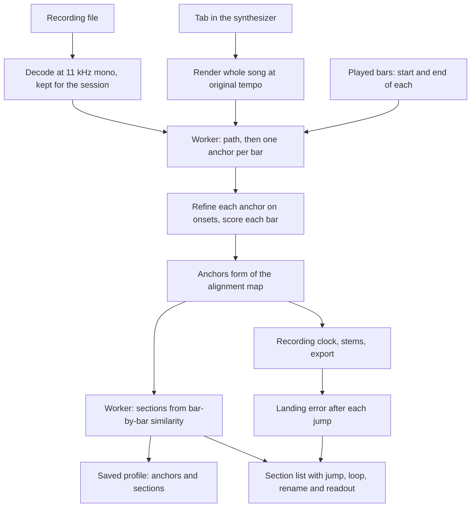

# Bar-Level Alignment and Section Jumping - Plan

## Goal Capsule

- **Objective:** A guitarist can jump to any part of their song, or loop it, and the recording and the tab land together on that spot and stay together as the band's timing wanders.
- **Means:** Read one anchor per tab bar off the path between the recording and the synthesizer's render, sharpen each anchor against the recording's onsets, and let the recording clock place every seek and loop restart through those anchors (KTD1, KTD2, KTD3).
- **Product authority:** This plan owns bar-level alignment, the recording's sections, and jumping and looping by section, on web and desktop. It revises the alignment map of `docs/plans/2026-10-05-1518-feat-auto-alignment-plan.md` from one offset plus extra-playing holds to one anchor per bar, and keeps that plan's behavior: the recording leads, the tab waits through extra playing, results apply right away with undo, and the alignment is remembered per recording. Syncing across devices, smooth tempo-following and running the Python tools themselves are not active scope. The Product Contract wins on product behavior; Key Technical Decisions win on mechanism.
- **Execution profile:** Code, test-first on the map and the clock; the matcher and the section finder are built against generated "drifting band" audio whose true anchors are known. Product Contract preservation: unchanged; the three planning questions were resolved into KTD2, KTD3 and KTD4 and removed from the contract.
- **Stop conditions:** Stop and ask if the matcher cannot place every bar within 50 ms on the generated drifting-band fixtures (KTD9), since that would mean the approach, not tuning, is wrong.
- **Tail ownership:** The implementer finishes the code and tests; the user runs the manual checks in the Verification Contract and ships.
- **Open blockers:** None.

---

## Product Contract

### Summary

After a recording loads, a warm-up pass compares it with the synthesizer's render of the tab and builds a saved baseline for that recording: one alignment anchor per tab bar, sharpened against the waveform, and the recording's own sections. The recording leads. The tab runs steadily within a bar and re-syncs to the recording at each bar line. Sections appear as a list the user can jump to or loop, and every seek, jump and loop restart lands on a saved anchor instead of on a single global offset.

### Problem Frame

Auto-alignment gave each recording one start offset and a list of extra-playing sections. That describes a whole performance with a handful of numbers, but a live band's timing wanders from bar to bar. A seek or a loop restart lands where the single map says, which can be off by however far the band had drifted by then, so the recording and the tab still do not line up, most noticeably after jumping around and when loops restart. There is also no way to jump by part of the song: the user can only click a bar or drag a range. The exact size of the miss has not been measured; the user reports it by sound and by sight.

### Key Decisions

- **Sections are detected from the recording.** (session-settled: user-directed — chosen over using the tab's own section markers and over marking sections by hand: the sections should follow what the band actually played.) Governs R8, R9.
- **The tab stays steady within a bar and re-syncs at bar lines.** (session-settled: user-directed — chosen over bending the highway smoothly to follow the audio and over re-syncing only at section starts: the scroll stays smooth, and the audio is checked every bar.) Governs R4.
- **The existing path through the recording and the tab's render is densified into one anchor per bar.** (session-settled: user-directed — chosen over matching sections first and over building from a beat grid of the recording: it keeps what already handles extra playing.) Governs R1, R2, R5, R6.
- **The tools' techniques are rebuilt inside the app.** (session-settled: user-directed — chosen over running the real Audalign and BBC offset finder on desktop, with or without a web fallback: web and desktop behave the same and nothing extra is installed.) Governs R1, R2. The techniques are waveform and spectrogram correlation and offset finding (Audalign, BBC Audio Offset Finder) and beat phase and bar-level matching (Mixxx, pyCrossfade).

### Requirements

**Baseline**
- R1. After a recording loads, a warm-up pass compares it with the synthesizer's render of the tab and builds, for that recording, a baseline of one anchor per tab bar, each pairing the bar's start with a moment in the recording, plus the recording's sections.
- R2. Each anchor is sharpened against the waveform, so a bar start lands within 50 ms of where the recording really plays it, at any bar of the song.
- R3. The warm-up runs in the background and never blocks loading or playing; until it finishes, the earlier alignment applies, and a failed or unconfident warm-up leaves what is in place and says so.

**Playback**
- R4. The recording leads. Within a bar the tab runs at a steady speed with the recording, and at each bar line it re-syncs to that bar's anchor with a small step forward or back.
- R5. While the recording plays extra material, the tab waits on its last bar line and rejoins at the next bar, as in the earlier alignment.
- R6. Where the recording skips bars the tab has, the tab jumps past those bars.
- R7. The recording always plays straight through; alignment never skips or repeats audio.

**Sections and jumping**
- R8. The recording's sections are found by repetition and change in the recording, each is mapped to a run of tab bars, and repeats share a letter: Section A, Section B and so on. The user can rename a section, and the name is remembered.
- R9. A section list lets the user jump to a section, with the tab and the recording moving together, and loop it; a loop can still be set on bars.
- R10. Every seek, bar jump, section jump and loop restart puts the recording on the moment of the bar's anchor, so the same spot is reached every time and at any speed.
- R11. Stems and exported video and audio follow the same anchors.

**Control, memory and visibility**
- R12. The baseline applies right away, and the user can nudge or remove a found extra section, revert to a single manual offset, or re-analyse.
- R13. A recording's baseline, including the user's adjustments and section names, is remembered by the file's content and restored on reopen without re-analysing.
- R14. For each section the app shows how confident its match is and how far the landing is from its anchor, so a miss can be seen and not only heard.

### Key Flows

- F1. Warm-up and jumping
  - **Trigger:** The user loads a recording for a tab that is open.
  - **Steps:** Playback is available at once. The warm-up finishes and the section list appears with a confidence readout. The user jumps to the second chorus, plays, and the recording and the tab stay together bar by bar.
  - **Outcome:** The recording and the tab land together on every jump and stay together through the section.
  - **Covered by:** R1, R2, R3, R4, R8, R9, R10, R14
- F2. Practising a section on a loop
  - **Trigger:** The user picks a section and turns on its loop, at a reduced speed.
  - **Steps:** Each pass restarts the recording on the section's first anchor, and the user sets the section free again after several passes.
  - **Outcome:** Every pass starts on the same beat, and the recording and the tab continue together after the loop is off.
  - **Covered by:** R9, R10

### Acceptance Examples

- AE1. **Covers R2, R10.** Given a recording where the band rushes through a section, when the user jumps to a bar in the middle of it, the recording lands within 50 ms of that bar's start, where a single offset would have been several hundred milliseconds off.
- AE2. **Covers R4.** Given a bar the band played slightly fast, when it plays through, the highway scrolls at a steady speed within the bar and takes one small step at the next bar line.
- AE3. **Covers R5, R7.** Given a solo eight bars longer than the tab, when it plays, the tab waits on its last bar line and rejoins at the next bar, with no audio skipped or repeated.
- AE4. **Covers R6, R7.** Given a recording that skips four of the tab's bars, when it plays through the skip, the tab jumps past those bars while the audio plays on unbroken.
- AE5. **Covers R8, R9, R10.** Given a recording with verse, chorus, verse, chorus and solo, when the warm-up ends, the list shows Section A, B, A, B and C, and jumping to the second chorus lands the recording and the tab together on its first bar.
- AE6. **Covers R10.** Given a section looped over twenty passes at 60 percent speed, when passes repeat, each restarts on the same beat as the first.
- AE7. **Covers R13.** Given a baseline with a renamed section, when the same file is reopened, the baseline and the name are restored without re-analysing.
- AE8. **Covers R3, R14.** Given a section the warm-up could not match, when it finishes, that section shows low confidence, and jumps into it use the best earlier anchor.

### Success Criteria

- After the warm-up, jumping to any bar or section lands the recording within 50 ms of the tab.
- The user can name the part of the song they want and be on it in one click, and a loop on it restarts on the same beat every time.

### Scope Boundaries

**Deferred for later**
- Smoothly speeding the highway up and down to follow the band's tempo.
- Syncing the app across devices or speakers (Ableton Link, Snapcast).
- Running the Python tools themselves (Audalign, the BBC finder) through the desktop engine.
- Recordings that play sections in a different order from the tab, or repeat them more times than the tab.
- Names such as chorus or bridge: sections get letters, which the user can rename.

**Deferred to Follow-Up Work**
- Moving a section boundary or a single anchor by hand.
- Using the tab's own section markers when a file has them.

### Dependencies / Assumptions

- Revises the alignment map of `docs/plans/2026-10-05-1518-feat-auto-alignment-plan.md`: its single offset plus extra-playing holds becomes anchors, and its tab-waits behavior becomes bars whose recorded length is much longer than the bar. The seek-exact copy and landing check of `docs/plans/2026-10-05-0740-feat-loop-aligned-playback-plan.md` still apply.
- Verified: the tab format can carry section markers (`MasterBar.section` in alphaTab), and the app does not read them; this plan does not use them.
- Assumption: the size of the miss has not been measured, so 50 ms is a target set here, to be confirmed by the readout in R14.
- Assumption: the recording plays the tab's sections in the tab's order, with extra or missing bars inside them.
- Assumption: the techniques rebuilt in the app reach about 10 ms to 50 ms on real recordings; on generated test audio the earlier matcher reached about 10 ms.

---

<!-- ce-section: work-relationships -->
## How This Work Fits Together

This plan covers bar-level alignment and section jumping. The breakdown below is the current understanding, not a committed roadmap.

- Bar-level alignment and section jumping (this plan)
  - Depends on: the earlier auto-alignment plan, whose map it revises.
  - Shares: the playback-clock rules with the loop-aligned playback plan.
- Syncing devices or speakers (Ableton Link, Snapcast)
  - Can proceed independently of: this plan.
  - Still to decide: whether the app needs it at all.
- Real Python tools on desktop for finer anchors
  - Depends on: this plan's baseline, which it would sharpen.
  - Still to decide: whether the in-app precision is enough.

---

## Planning Contract

### Key Technical Decisions

- KTD1. **One `AlignmentMap` with two forms.** Without anchors it is the offset-plus-holds map that shipped. With anchors it holds one recording time per played bar (the moment bar `k` starts) and one end anchor (the moment the tab ends), built from the timeline's bars (`src/audio/alignment-map.ts`). `toTab`, `toRec`, `inHold`, `base`, `holds`, `totalHold` and the edit methods keep their names and meanings, so the clock, the stem leader, the export and the panel keep one interface. In the anchors form `base` is the first anchor, `holds` is derived as the bars whose recorded length exceeds the bar by a second or more, `withBase` shifts every anchor, and resizing or removing a derived hold shifts every later anchor by the change. A map built without bars (a manual offset, or a profile from before) stays in the first form. Governs R1, R4, R5, R6, R11, R12.
- KTD2. **Tab time follows the recording steadily inside a bar and never passes the next bar line early.** Recording to tab: the bar is the last one whose anchor is at or before the recording position, and tab time is the bar's start plus the time since its anchor, capped 1 ms before the next bar line. At the next anchor tab time re-syncs: a step forward when the recorded bar was shorter than the tab's, and a wait on the line when it was longer, which is how extra playing and skipped bars fall out (a skipped bar has no recorded length, so the tab steps through it). Tab to recording: the bar's anchor plus the time into the bar; at a bar line `start` is that bar's anchor (the rejoin side) and `end` is the arrival, the earlier of the previous bar's anchor plus its length and this anchor. Before the first anchor and after the end anchor the map continues one to one. A recorded bar counts as extra playing at one second over, the same minimum as before. Resolves how long a bar's recorded length must be before it is extra playing. Governs R4, R5, R6, R10.
- KTD3. **Anchors come from the path the matcher already finds.** For each bar line the anchor is the recording position of the last path cell at or before it (the rejoin side of any wait); bars with no matched cell are interpolated between their matched neighbours, a run where the recording skips tab bars gives those bars the same anchor, and anchors are forced not to decrease. Each anchor is then refined with the onset cross-correlation the matcher already uses, over the first 1.5 seconds of the bar and within 150 ms, and the height of that correlation peak above its surroundings (the BBC finder's standard score) is the bar's confidence. A refinement that moves an anchor less than 20 ms from where the previous bar's steady run predicts is snapped to the prediction so no step shows, and a bar whose peak is weak keeps its path value. Anchors are rounded to 10 ms. Governs R1, R2, R5, R6.
- KTD4. **Sections are read from the recording's own bar-by-bar similarity.** Each tab bar's feature is the mean pitch-class vector of the recording across that bar's anchor interval. A bar-by-bar self-similarity matrix gives a novelty curve with a four-bar checkerboard kernel; its peaks are section boundaries, with no section shorter than four bars and at most twelve. Sections whose mean vectors are similar enough share a letter, assigned in order of first appearance; when fewer than two boundaries are found the list is one section, "Whole song". Names are the user's and are saved with the baseline. Resolves how sections are found and how many a song shows. Governs R8.
- KTD5. **Jumps and loops go through the placement the clock already has.** Every seek, bar jump and loop restart puts the element at `toRec(tab, 'start')`, and a loop wraps when the recording reaches `toRec(loop.end, 'end')`, so with anchors they land on the bar's anchor with no new code path. A section jump seeks to the section's first bar start, and a section loop is a bar loop from its first to its last bar. The 25 ms landing check and the seek-exact copy from the loop plan run after each of these unchanged. Governs R9, R10.
- KTD6. **The readout joins what the matcher knows with what the clock measures.** A section's confidence is the weakest bar confidence in it and the share of its bars that were matched rather than interpolated, shown in words (confident, uncertain, not matched). The landing error is the distance between where the element landed after a jump or loop restart and the bar's anchor, measured by the clock's landing check before any correction, and kept in memory for each section as its latest value. Governs R14.
- KTD7. **What is saved, what is kept in memory, and what happens to old records.** Saved with the recording's profile: the anchors, the end anchor, each section's first bar, last bar, letter and the user's name, as optional fields of the alignment record (the profile version stays 1). On restore the anchors count must equal the played bars plus one, or the anchors are ignored and the holds apply. Kept in memory for the page session: the recording's decoded features per file, so Re-analyse does not decode again. An `auto` record from before bar-level alignment restores as the offset plus extra sections it was, is not upgraded by itself so the user's adjustments are not overwritten, and the panel says bar-level alignment is not built for it and offers Re-analyse. Governs R3, R13.
- KTD8. **The tools' techniques are rebuilt in the app, taking what each one is good at.** (session-settled: user-directed — chosen over running the real tools on desktop, with or without a web fallback: web and desktop stay identical and nothing extra is installed.) From Audalign and the BBC finder: correlation of envelopes and the standard-score confidence, now per bar. From Mixxx: the phase, the position inside a bar, is worked out again from the anchor after every jump, with corrections made at bar lines instead of by speeding playback up or down, since the user chose steady bars over Mixxx's rate nudges. From pyCrossfade: matching bar by bar rather than once for the whole song, and keeping the result. Ableton Link and Snapcast are not used. Governs R1, R2, R4.
- KTD9. **Accuracy is proven on generated drifting-band audio.** A test helper bends a render of a generated song with a smooth tempo wobble of a few percent, a timing jitter of tens of milliseconds per bar, extra playing and skipped bars, so the true anchor of every bar is known by construction. On those fixtures the matcher must place every bar within 50 ms, and jumps must land within 50 ms of the true bar start. Real recordings are covered by the manual pass. Governs R2, R10.

### High-Level Technical Design

The warm-up, from a loaded recording to what the clock and the panel use:

How the map reads, for bars of 2 s whose anchors drift, with a band that ran fast through bar 3 and played 8 s of extra material after bar 5 (anchors in recording seconds):

| Bar | Tab start | Anchor | Recorded length | What the tab does |
|---|---|---|---|---|
| 1 | 0 s | 1.50 | 2.1 s | Runs steadily, then waits 0.1 s on the line |
| 2 | 2 s | 3.60 | 2.0 s | Runs steadily with the recording |
| 3 | 4 s | 5.60 | 1.7 s | Runs 1.7 s, then steps forward 0.3 s at the line |
| 4 | 6 s | 7.30 | 2.0 s | Runs steadily |
| 5 | 8 s | 9.30 | 10.0 s | Runs 2 s, then waits 8 s on the line (extra playing) |
| 6 | 10 s | 19.30 | 2.0 s | Rejoins at the anchor |

### Assumptions

- A bar's first 1.5 seconds hold enough onsets in most music to correlate; bars that do not keep their path value and score low, which the readout shows.
- Chroma means over a bar separate repeated parts from different ones well enough on real recordings; the fallback is the single section "Whole song".
- The 20 ms snap and the one-second extra-playing minimum are starting values, tuned on the drifting-band fixtures.

### Deferred to Implementation

- The kernel width, similarity thresholds and peak cutoffs in KTD3 and KTD4, tuned on the fixtures with each constant's reason in a comment.
- The wording of the readout and of the legacy-record message.

### Alternative Approaches Considered

- **A separate bar-anchor map class beside `AlignmentMap`.** Cleaner in isolation, but the clock, stem leader, export and panel would each need to handle two map types. One class with two forms keeps one interface and lets a map without bars stay valid.
- **Per-bar correlation of full spectrograms instead of onset envelopes.** Closer to what Audalign does and possibly finer, but heavier and unproven here; the readout shows where onsets are not enough, and spectrograms are the next step if they are not.

### System-Wide Impact

- **Clock and stems:** tab time becomes a function of the recording position through anchors; the loop wrap, seeks and the landing check read the same functions as before. The landing check gains a report of the error it sees.
- **Saved data:** the alignment record gains optional `anchors`, `endAnchor` and `sections` fields; old profiles and the desktop shell's profile file stay readable.
- **Export:** the video length becomes the recording's span over the tab, and each frame's tab time takes the same steps and waits as live playback; the encoder worker needs the bars to rebuild the map.
- **Earlier plans:** the auto-alignment plan's holds become a derived view, and its tests keep passing for the first form of the map.

### Risks & Dependencies

- **Noisy anchors show as jitter.** Small steps at every bar line would look nervous; the 20 ms snap and the weak-peak rule in KTD3 are the guard, and the fixtures include jitter to prove it.
- **Section finding may disagree with how a player hears the song.** The single "Whole song" fallback, letters the user can rename, and the follow-up for moving a boundary by hand are the mitigations.
- **The miss has not been measured.** The readout in U7 is how the first real recording shows whether 50 ms holds.
- **Depends on** the recording clock, stem mix, landing check, matcher, profile store and export pipeline already in the repo; no new packages.

---

## Implementation Units

### U1. Anchors form of the alignment map

- **Goal:** Let `AlignmentMap` carry one anchor per played bar and answer tab and recording positions through them, with the derived extra-playing view and the edits.
- **Requirements:** R1, R4, R5, R6, R10, R11, R12; AE2, AE3, AE4
- **Dependencies:** None
- **Files:** `src/audio/alignment-map.ts`, `tests/audio/alignment-map.test.ts`
- **Approach:**
  1. Add a constructor from the bars (start and end seconds of each played bar), the anchors and the end anchor; keep the offset-plus-holds constructors untouched (KTD1).
  2. Implement `toTab` and `toRec` for the anchors form per KTD2, including the 1 ms cap, the `start` and `end` edges at a bar line, and one-to-one continuation outside the anchors.
  3. Derive `holds` and `totalHold` from the bars whose recorded length exceeds the bar's by a second or more, and give the map an output length (the end anchor less the first anchor) for export.
  4. Make `withBase`, `withHoldLength` and `withoutHold` shift the anchors as KTD1 describes.
  5. Normalise untrusted data against the bars: the anchors count must match, values must be finite, and anchors are forced not to decrease.
- **Execution note:** Test-first; every existing test of the first form must pass unchanged.
- **Patterns to follow:** The existing `AlignmentMap` and its tests in `tests/audio/alignment-map.test.ts`.
- **Test scenarios:**
  - Covers AE2. A bar whose recorded length equals the bar's runs one to one inside it; a recorded bar shorter than the bar's makes tab time step forward at the next line, and a longer one makes it wait 1 ms before the line.
  - Covers AE3. A bar with eight extra seconds appears as one derived hold of that length, and the tab waits on its line until the next anchor.
  - Covers AE4. Skipped bars (zero recorded length) make tab time step through them at the next anchor, and no hold is derived.
  - Edge: at a bar line `toRec(…, 'start')` is that bar's anchor and `toRec(…, 'end')` is the arrival, the earlier of the previous bar's anchor plus its length and this anchor.
  - Edge: before the first anchor and after the end anchor positions continue one to one, including a negative base (lead-in).
  - Edge: `withBase` shifts every anchor; `withHoldLength` and `withoutHold` shift only the later ones; a map built with no bars behaves as the first form.
  - Error path: normalising anchors of the wrong count, a non-finite value, or a decreasing run returns null or repairs the run, never throws.
- **Verification:** The new tests pass and the existing map tests pass unchanged.

### U2. The clock places jumps through anchors and reports its landing error

- **Goal:** Make every seek, loop restart and resume land through the anchors, and give the landing check a way to report how far off a landing was.
- **Requirements:** R4, R7, R10, R14; AE1, AE2, AE6
- **Dependencies:** U1
- **Files:** `src/audio/user-audio.ts`, `src/audio/stem-mix.ts`, `tests/audio/user-audio.test.ts`, `tests/audio/stem-mix.test.ts`
- **Approach:**
  1. Keep `UserAudioClock` reading tab time and positions through the map; with anchors that is all it needs for KTD2 and KTD5, so the change is limited to the resume rule and the report below.
  2. Make the in-place resume (added for pauses inside extra playing) apply wherever tab time cannot say where the recording was, which is any wait, using the map's wait test.
  3. Let a caller register a landing listener; when the landing check first measures after a restart or seek, it reports the target bar's tab time and the distance from the element to the anchor before any correction. The stem leader forwards the listener.
- **Execution note:** Add the anchor-landing and landing-report tests first and watch them fail.
- **Patterns to follow:** The scripted `fakeAudio` and fake timers in `tests/audio/user-audio.test.ts`; the landing-check tests added with the loop plan.
- **Test scenarios:**
  - Covers AE1. With anchors that drift 300 ms from a single offset by bar 20, `seek` to a tab time in bar 20 places the element at that bar's anchor plus the time into the bar.
  - Covers AE6. A loop over a section restarts on the same first anchor across twenty scripted wraps, at rate 1 and at rate 0.6, and each pass is counted once.
  - Covers AE2. While playing through a bar the recorded length of which differs from the bar's, tab time moves steadily and steps at the next anchor, and the element is never seeked.
  - Edge: pausing in a wait and playing again resumes the element where it was; pausing elsewhere places it through the anchors.
  - Edge: a landing that is 60 ms late is reported with that distance and then corrected; a landing within tolerance is reported with its small distance and not corrected.
  - Integration: the stem leader and followers land together after a section jump, and the listener registered on the mix is called with the leader's report.
- **Verification:** The new tests pass and the existing clock and stem tests pass unchanged.

### U3. Anchors from the matcher, with a drifting-band fixture

- **Goal:** Turn the matcher's path into one refined, scored anchor per bar, and prove it on audio whose true anchors are known.
- **Requirements:** R1, R2, R5, R6; AE1, AE3, AE4, AE8
- **Dependencies:** U1
- **Files:** `src/alignment/match.ts`, `tests/alignment/match.test.ts`, `tests/helpers/synthetic-audio.ts`
- **Approach:**
  1. Change the matcher's input from bar start times to the bars' start and end times, and have it return the anchors, the end anchor and a confidence per bar alongside the map (KTD3).
  2. Read each anchor from the path's last cell at or before the bar line, interpolate unmatched bars, give skipped bars the same anchor, and force the anchors not to decrease.
  3. Refine each anchor with the existing onset correlation over the bar's first 1.5 seconds, score it by the peak's prominence, snap refinements under 20 ms to the steady prediction, and keep the path value where the peak is weak.
  4. Add a fixture builder that bends a render with a smooth tempo wobble, per-bar jitter, inserted extra playing and removed bars, and returns the true anchors.
- **Execution note:** Build the drifting-band fixture first, then tune the constants against it and record each constant's reason in a comment.
- **Patterns to follow:** The existing `matchRecording` and the fixtures in `tests/alignment/match.test.ts`.
- **Test scenarios:**
  - Covers AE1. On a recording with a 3 percent tempo wobble and 40 ms of per-bar jitter, every bar's anchor is within 50 ms of the true one.
  - Covers AE3. Eight bars of extra playing give anchors whose recorded length for the bar before them is eight seconds longer than the bar's, within 50 ms.
  - Covers AE4. Four skipped bars give those bars the same anchor as the bar after them, and the anchors never decrease.
  - Edge: a bar with no onsets keeps its path value and scores low; an unmatched stretch is interpolated between its neighbours.
  - Edge: a refinement under 20 ms from the steady prediction is snapped to it, so a steady performance gives no steps.
  - Covers AE8. An unrelated recording is still not found, and a recording with one unmatched stretch gives low confidence there and good confidence elsewhere.
  - Edge: anchors are rounded to 10 ms.
- **Verification:** The new tests pass on the fixtures within KTD9's tolerance and the earlier matcher tests still pass.

### U4. Section detection

- **Goal:** Find the recording's sections from its bar-by-bar similarity, group repeats under one letter, and fall back to one section.
- **Requirements:** R8; AE5
- **Dependencies:** U3
- **Files:** `src/alignment/sections.ts` (new), `tests/alignment/sections.test.ts` (new), `tests/helpers/synthetic-audio.ts`
- **Approach:**
  1. From the recording's pitch-class frames and the anchors, compute each bar's mean vector across its anchor interval (KTD4).
  2. Build the bar-by-bar self-similarity matrix, a novelty curve with a four-bar checkerboard kernel, and pick peaks above a threshold, keeping sections at least four bars long and at most twelve.
  3. Group sections whose mean vectors are similar enough and give each group a letter in order of first appearance; return one "Whole song" section when fewer than two boundaries are found.
  4. Extend the song generator with structure (verse, chorus, solo patterns repeated in an order) so the fixtures have known sections.
- **Patterns to follow:** The pure-function style and constant comments in `src/alignment/match.ts`; the song generator in `tests/helpers/synthetic-audio.ts`.
- **Test scenarios:**
  - Covers AE5. A generated song with verse, chorus, verse, chorus and solo gives five sections lettered A, B, A, B, C, with each boundary within one bar of the true one.
  - Edge: a song with no repetition or change gives the single "Whole song" section; no section is shorter than four bars; a long varied song gives at most twelve.
  - Edge: a bar of extra playing (a long recorded interval) is part of its section and does not create a boundary by itself.
  - Edge: the same song in a plain and a rich timbre gives the same sections.
  - Error path: zero or one bar, silence, and anchors that all coincide give "Whole song" and never throw.
- **Verification:** The new tests pass.

### U5. Warm-up pipeline

- **Goal:** Carry the new matcher and the section finder through the worker and the analysis runner, and keep the decoded recording for re-analysis.
- **Requirements:** R1, R3, R8, R14; AE8
- **Dependencies:** U3, U4
- **Files:** `src/alignment/job.ts`, `src/alignment/analyze.ts`, `src/alignment/alignment.worker.ts`, `tests/alignment/analyze.test.ts`
- **Approach:**
  1. Pass the bars' start and end times to the job and return the anchors, the end anchor, the per-bar confidence and the sections in its result (plain data across the worker).
  2. Keep each file's decoded mono samples in a session-only cache, so Re-analyse decodes once; send the cached samples to the worker by copy rather than by transfer so the cache survives.
  3. Return the anchors form of the map to callers, falling back to the offset-plus-holds map when the matcher reports no usable anchors.
- **Execution note:** Keep the injected decode and match steps so tests need no browser.
- **Patterns to follow:** `startAnalysis` and its fakes in `tests/alignment/analyze.test.ts`.
- **Test scenarios:**
  - Happy path: fake steps produce an aligned result with anchors, per-bar confidence and sections, and progress that only increases.
  - Edge: analysing the same file twice decodes once; a different file decodes again.
  - Error path: a failed decode or render, a too-long recording and a not-found answer behave as before and leave no worker running.
  - Edge: cancelling mid-run still returns no answer and does not clear the cache.
  - Integration: the real matcher and section finder run on a generated drifting-band song through the job's data shapes and return anchors within tolerance and the expected sections.
- **Verification:** The new tests pass and the earlier analysis tests pass unchanged.

### U6. Save and restore the baseline, and wire it into the app

- **Goal:** Remember the anchors, sections and names with the recording and apply the baseline when a recording loads.
- **Requirements:** R3, R12, R13; AE7, AE8
- **Dependencies:** U1, U5
- **Files:** `src/audio/recording-profile.ts`, `src/app/restore-profile.ts`, `src/app/auto-align.ts`, `src/app/App.tsx`, `tests/audio/recording-profile.test.ts`, `tests/app/restore-profile.test.ts`, `tests/app/auto-align.test.ts`
- **Approach:**
  1. Add the optional anchors, end anchor and sections to the alignment record and normalise them, dropping a malformed field without losing the rest (KTD7).
  2. Let the restore decision carry the new fields and check the anchors count against the played bars before use.
  3. Apply an anchors map to the recording clock and the stem clock through the existing `applyAlignment`, hold the sections and their names in app state, and save them with the debounced profile save.
  4. For an `auto` record without anchors, restore as before and set a status that says bar-level alignment is not built and offers Re-analyse.
- **Execution note:** Write the restore-validation tests first.
- **Patterns to follow:** `normalizeAlignment` in `src/audio/recording-profile.ts`, `decideRestore`, and `applyAlignment` in `src/app/App.tsx`.
- **Test scenarios:**
  - Covers AE7. A profile with anchors, sections and a renamed section round-trips through the store and restores without starting detection.
  - Edge: an anchors list of the wrong length, a non-finite value or a bad section range is dropped and the holds apply; a profile from before has none of the fields and loads as it did.
  - Edge: an `auto` record without anchors restores as the offset plus extra sections and sets the not-built status; Re-analyse starts a run.
  - Covers AE8. An unconfident or failed warm-up leaves the earlier alignment and the status says so; a result discarded because the user edited during the run is not applied.
  - Integration: activating stems after a baseline applies the anchors map to the stem clock; the saved profile after renaming a section contains the new name.
- **Verification:** The new tests pass and the existing profile and restore tests pass unchanged.

### U7. Section list, jump, loop and readout

- **Goal:** Show the sections with jump, loop, rename and the confidence and landing readout.
- **Requirements:** R8, R9, R10, R14; F1, F2; AE5, AE6, AE8
- **Dependencies:** U2, U4, U6
- **Files:** `src/app/SectionPanel.tsx` (new), `src/app/section-controls.ts` (new), `src/app/App.tsx`, `src/app/app.css`, `tests/app/section-controls.test.ts` (new)
- **Approach:**
  1. Put the list in its own panel beside the alignment panel, shown when a baseline exists: each row has the letter or the user's name, the bar range, the readout in words, the latest landing error in milliseconds, a Jump button, a Loop button and an inline rename.
  2. Keep the labels and edits as plain functions in `src/app/section-controls.ts` so they are testable: the label, the readout words from KTD6, and the loop and seek targets for a section.
  3. A jump seeks the clock to the section's first bar start; a loop sets the bar loop from the section's first to its last bar and turns it on (KTD5). The bar loop is set in the tab's own bar numbers, so a section that contains a written repeat loops its first pass only, as bar loops already do. Feed the clock's landing report into the section the target bar belongs to.
  4. Show one "Whole song" row, with Jump and Loop, when no sections were found.
- **Patterns to follow:** `AlignmentPanel.tsx` and `alignment-controls.ts` for the layout and the pure helpers; `LoopControls.tsx` for how a loop reaches the clock.
- **Test scenarios:**
  - Covers AE5. Five sections give the labels A, B, A, B and C with their bar ranges; a renamed section shows its name and keeps its letter in the readout.
  - Covers AE6. The loop target of a section is its first bar's start to its last bar's end, and turning it on gives the same loop on every call.
  - Covers AE8. A section whose weakest bar is low or whose bars were mostly interpolated reads as uncertain or not matched; a clean one reads as confident.
  - Edge: the landing error shows the latest value in milliseconds and is blank before any jump.
  - Edge: one "Whole song" section gives a Jump to bar 1 and a Loop over every bar.
  - Edge: renaming to an empty string restores the letter.
- **Verification:** The new tests pass; the panel works in the manual check.

### U8. Export through the anchors

- **Goal:** Make the exported video and audio follow the anchors, including the steps at bar lines and the waits.
- **Requirements:** R11; AE2, AE3
- **Dependencies:** U1, U2
- **Files:** `src/export/audio.ts`, `src/export/exporter.ts`, `src/export/encoder.worker.ts`, `src/app/ExportDialog.tsx`, `src/app/App.tsx`, `tests/export/audio-placement.test.ts`, `tests/export/composite-views.test.ts`
- **Approach:**
  1. Use the map's output length for the export length (the tab's length plus the holds for the first form, the end anchor less the first anchor for the anchors form).
  2. Send the anchors, the end anchor and the bars to the encoder worker so it can rebuild the map, and keep `tabTimeAt` and `outputWindow` reading the map's own functions.
  3. Keep the audio placement as it is: the recording straight from the first anchor, only longer or shorter output.
- **Patterns to follow:** The export changes in `src/export/audio.ts` and the start-message tests in `tests/export/composite-views.test.ts`.
- **Test scenarios:**
  - Covers AE3. For a map with eight extra seconds in one bar the output is eight seconds longer than the tab, and frames in that stretch show the tab waiting on its line.
  - Covers AE2. For a map whose recorded bar is shorter than the tab's, the frame at the bar line shows a step forward and never a step backward past the previous frame's bar.
  - Edge: a map without anchors gives exactly the earlier length, frame times and loop windows.
  - Edge: a loop-only audio export takes the window from the `start` edge of the loop start to the `end` edge of the loop end through the anchors.
  - Integration: the start message carries the anchors data and the longer output length, and the encoder worker rebuilds an equal map from it.
- **Verification:** The new tests pass and the existing export tests pass unchanged.

---

## Verification Contract

| Check | Command or step | Applies to |
|---|---|---|
| Unit and integration tests | `npm test` | U1 to U8 |
| Types | `npm run typecheck` | all units |
| Production build | `npm run build` | all units |
| Drifting-band accuracy | The fixtures in `tests/alignment/match.test.ts` place every bar within 50 ms | U3, KTD9, R2 |
| Real recording, jumping | Load a real recording of a song with a solo; jump to bars at the start, middle and end and to each section; confirm the recording and the tab land together | R2, R9, R10, AE1, AE5 |
| Real recording, loops | Loop a section for 20 passes at 100% and 60%; confirm every pass restarts on the same beat | R10, AE6 |
| Readout | Read the confidence and landing error for each section; note any that read uncertain and whether they sound off | R14, AE8 |
| Reopen and old records | Reopen after renaming a section; reopen a recording saved by the last release and confirm the not-built message and Re-analyse | R13, AE7 |
| Export | Export a short video of a recording with a long bar and a short bar; confirm the tab waits and steps as live | R11 |

The real-recording checks are the only proof against real playing, and they set the final constants noted in Deferred to Implementation.

---

## Definition of Done

- All units pass their scenarios, and `npm test`, `npm run typecheck` and `npm run build` pass.
- Jumping to any bar or section on a real recording lands the recording within 50 ms of the tab, and a section loop restarts on the same beat every pass.
- The section list, its readout and the saved baseline work, and an old record shows the not-built message instead of changing.
- Loading and playing are never blocked by a running, failed or unconfident warm-up (R3).
- Abandoned-attempt code, debugging output and unused helpers are removed from the diff.
