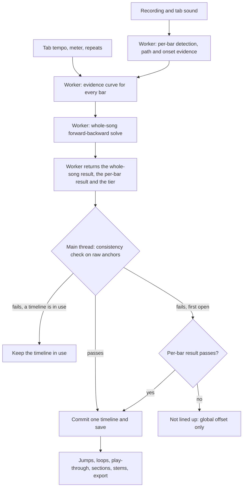

# Whole-Song Timeline - Plan

## Goal Capsule

- **Objective:** Loading a recording gives one whole-song timeline, worked out automatically, on which every bar line lands on the music to within a few hundredths of a second.
- **Means:** A whole-song chain solve over per-bar evidence, informed by the tab's tempo and meter (KTD2, KTD3, KTD4).
- **Product authority:** The app's owner, who made the scope decisions in the brainstorm. This plan covers the whole-song timeline only; the neighbouring ideas under How This Work Fits Together are not active scope.
- **Authority hierarchy:** A requirement wins on product behavior, a Key Technical Decision wins on implementation mechanism within its cited requirements, and a unit overrides neither. Acceptance examples and flows illustrate and never amend.
- **Execution profile:** Code, test-first for the whole-song pass. The tolerance tests on generated recordings are written before the detector is tuned, and a measurement on the owner's song gates the rest of the work.
- **Stop conditions:** Stop and report if, after U9, bar lines on generated tight recordings stay outside 30 ms, or the owner's `.wav` shows held-out error outside a few hundredths on firm bars (and on weak bars, when hand-labelled times exist). The `.mp3` mix is reported but does not trigger the stop, because its decoder delay and padding are about the size of the target. The recording-led bar grid is then evaluated before more is built. Stop also on evidence that a settled decision cannot work.
- **Tail ownership:** The implementer lands the work with the Verification Contract passing. The owner rebuilds the desktop app and checks both mixes of the test song by hand.
- **Open blockers:** None.

---

## Product Contract

**Product Contract preservation:** Clarified, no scope change. R7, R10 and R12 now name the states around a committed timeline (lined up, roughly lined up, not lined up), AE5 to AE8 were added, and AE7 was narrowed to what the code can do. All other IDs and meanings are unchanged.

### Summary

Opening a recording produces one timeline for the whole song, found automatically with no hand fixes. Jumps, loops, play-through, sections and export all read that timeline, and every bar line lands within a few hundredths of a second of the music. The tab stays steady inside each bar and re-syncs at the next bar line.

### Problem Frame

Sections line up when played one at a time, but the full play-through and the exported video do not follow the same corrections. The owner reports it gets worse as they move around, that there is no single source of truth, and that every section reads uncertain.

On the owner's real song (a 175-bar tab, a `.wav` and an `.mp3` of one mix), all 175 bars match the tab, yet only 55 are placed on a firm onset. The rest sit on a 0.1 s grid, and about one bar in ten steps by 0.1 s. Two forms of timing coexist, and a saved timeline that no longer fits the tab silently falls back to the older form. Four manual controls add more ways to change the timing without changing the rest.

The exact cause of "worse as I move around" was not isolated. Part of it may be inexact seeking on compressed recordings, which is separate work.

### Key Decisions

- KD1. **Fully automatic, no hand fixes.** (session-settled: user-directed — chosen over a tap-to-pin tool and a weak-bar view corrected by hand: detection should get it right on its own.) Governs R4, R10.
- KD2. **Every bar line within a few hundredths, with the tab steady inside the bar.** (session-settled: user-directed — chosen over a tenth of a second, over a beat or so, and over following the band beat by beat: tight bar lines are reachable without reversing the steady-inside-a-bar decision.) Governs R5, R6.
- KD3. **A whole-song solve over per-bar detection alone.** (session-settled: user-directed — chosen over leaving detection unchanged and over a recording-led bar grid: it closes the accuracy gap and builds on the evidence the app already produces.) Governs R4.
- KD4. **Only a single global offset stays, as a fallback.** (session-settled: user-directed — chosen over removing every manual control and over keeping them all out of the way: a recording the app cannot line up still needs a way out.) Governs R7, R10.
- KD5. **Exact seeking on compressed recordings is separate work.** (session-settled: user-directed — chosen over folding it in: the accuracy target is stated as holding on exact audio.) Governs R5.
- KD6. **Saved older timings are re-detected automatically.** (session-settled: user-approved — proposed with the tradeoff that no one is left to press Re-analyse once hand fixes go; the owner confirmed it.) Governs R8, R9.
- KD7. **The confidence readout stays as a plain status.** (session-settled: user-approved — proposed as an assumption in the scope summary; the owner confirmed it.) Governs R12.

### Requirements

**One timeline**

- R1. Opening a recording produces one whole-song timeline, and jumps, loops, play-through, sections and export all read it.
- R2. The timeline holds a position for every played bar; the older single-offset-plus-extra-playing form is used only to import old saved records and for the global-offset fallback in R7.
- R3. When the timeline changes, every reader sees the change together, so a section jump, the play-through and an exported frame agree at any recording position.

**Automatic placement**

- R4. The app places every bar line automatically, in a whole-song pass that settles bars with weak evidence from steady-tempo stretches, the tab's tempo and meter changes, and repeated parts.
- R5. Every bar line lands within a few hundredths of a second (about 20 to 40 ms) of the music, measured on exact audio.
- R6. A bar the recording plays long, or skips, keeps its current meaning: the tab waits on the line or steps past it, and the whole-song pass never smooths over a real jump.
- R7. A recording the app cannot line up at all (not found, silent, out of range, too long, or no consistent result) is reported with its reason and plays against the global offset alone, which keeps any offset the owner had set.

**Saved timings**

- R8. A recording saved before this change, whether offset-only or without per-bar positions, is re-detected automatically when it opens.
- R9. A saved timeline is reused on reopening, and is re-detected when it no longer fits the tab's bars.

**Controls and status**

- R10. The only manual timing control is the global offset, shown only while no timeline is committed; the per-stretch nudges, the remove buttons and the revert to manual are removed.
- R11. Re-analyse stays and re-runs the same automatic pass.
- R12. The status says whether a recording is lined up, only roughly lined up, or could not be lined up, with nothing to correct from it.

**Self-check**

- R13. The finished timeline passes an automatic whole-song consistency check before it is committed.

### Key Flows

- F1. Open a recording
  - **Trigger:** The owner loads a recording for a tab.
  - **Steps:** The app detects every bar, runs the whole-song pass, checks the result, and commits one timeline.
  - **Outcome:** The song plays, jumps and exports against that timeline with no further action.
  - **Covered by:** R1, R3, R4, R5, R13

- F2. Reopen an older saved recording
  - **Trigger:** The owner opens a recording whose saved timing predates per-bar positions, or no longer fits the tab.
  - **Steps:** The app notices the record, re-detects without a prompt, and replaces the saved timeline.
  - **Outcome:** The recording opens on a current whole-song timeline.
  - **Covered by:** R8, R9

- F3. A recording that cannot be lined up
  - **Trigger:** Detection reports that no match was found.
  - **Steps:** The app says so and offers the global offset.
  - **Outcome:** The owner can still play along against a single offset.
  - **Covered by:** R7, R10

### Acceptance Examples

- AE1. **Covers R1, R3.** Given a committed timeline, when the owner jumps to a section, plays on through the next one, and exports the video, then the tab time at any recording position is the same in all three.
- AE2. **Covers R8.** Given a recording last aligned before per-bar timing existed, when it opens, then it is re-detected without a button press and the status says so.
- AE3. **Covers R6.** Given a bar the recording plays twice as long as the tab, when the whole-song pass finishes, then the tab still waits on that bar line and the bars after it keep their positions.
- AE4. **Covers R9.** Given a saved timeline whose bar count no longer matches an edited tab, when the recording opens, then it is re-detected and no older-form timing is played silently.
- AE5. **Covers R6.** Given a recording that skips a bar the tab contains, when the whole-song pass finishes, then the skipped bar shares the next bar's position and the bars on both sides keep theirs.
- AE6. **Covers R4, R6.** Given a section the tab writes out twice that the band plays twice in full, when the pass finishes, then each pass keeps its own positions and neither is pulled toward the other.
- AE7. **Covers R3.** Given a loop set on a range of bars, when the timeline is replaced, then the loop keeps its bar range and its recording times follow the new timeline.
- AE8. **Covers R7, R8.** Given a recording with a hand-set global offset and no saved timeline, when re-detection finds no consistent result, then the offset stays in force and the status says detection failed.

### Success Criteria

- On the owner's test song (both the `.wav` and the `.mp3` mix, on exact audio), every bar line lands within a few hundredths of a second of the music.
- Nothing needs doing between loading a recording and having a usable timeline.
- Re-detecting a recording twice gives the same timeline.

### Scope Boundaries

**Deferred for later**

- Exact seeking on compressed recordings, from the first jump. Its own brainstorm; this plan's accuracy target depends on it for `.mp3` files.
- Stopping rebuilds from erasing saved timings, and a portable sync file. R8 makes a lost saved timing cheap to recover but does not prevent the loss.
- Calibrating any neck photo, and showing techniques on the neck.
- Tab-marker sections and a pass list for repeats.

**Outside this plan**

- Following the band beat by beat inside a bar. The tab stays steady inside each bar.
- Hand-correction tools beyond the global offset: tap-to-pin, pinned bars and per-stretch nudges.
- A recording-led bar grid is held back as a challenger. It is evaluated only if bar lines still miss by more than a few hundredths after the whole-song pass.

### How This Work Fits Together

<!-- ce-section: work-relationships -->
This plan covers the whole-song timeline. The breakdown below is the current understanding, not a committed roadmap.

- Exact seeking from the first jump
  - Can proceed independently of this plan.
  - Shares the accuracy target: the target in R5 holds only on exact audio.
- Stop rebuilds erasing saved timings, then a portable sync file
  - Can proceed independently for the packaging fix.
  - Depends on this plan's timeline shape for the file format.
- Calibrate any neck photo, and techniques on the neck
  - Can proceed independently of this plan.
- Show weak bars and let the owner pin them
  - Still to decide: this plan's no-hand-fixes decision removes the pinning half of that idea, and whether the display half has a use is open.

### Dependencies / Assumptions

- Assumption: bar-line accuracy is judged on exact audio. A compressed recording can land up to about a second off after a jump until its exact copy is in use.
- Assumption: no ground truth exists yet for "a few hundredths". The owner's song, with its steady grid and onset peaks, is the only available reference, and KTD11 defines how accuracy is measured.
- Assumption: the steady-inside-a-bar playback model and the one-second rule for extra playing both stay as they are.
- The working tree holds uncommitted changes to bar placement (a finer average inside each bar, and a step that settles bars without a firm onset) and to the section readout wording. They are committed as their own change before U1, so the baseline is a named commit. U9 removes the settle step and keeps the finer average only if the measurement supports it.
- Measured on the owner's song: all 175 bars matched, 55 bars carry an onset score of at least 3, typical bar-length error against the tab is about 4 to 40 ms, and some bars step by 0.1 to 0.15 s. The tab has stepwise tempo changes and mixed meters.

### Outstanding Questions

**Resolve Before Planning**

- None.

**Deferred to Implementation**

- Whether hand-labelled bar-line times for a stretch of the owner's `.wav` can be supplied. Without them, the held-out and agreement checks in KTD11 stand in.
- Whether pooling evidence across repeated parts is needed at all. U5 is built only if U9's measurement leaves bars outside the target.
- The share of bars and the uncertainty that separate lined up from roughly lined up (KTD7). U1 and U9 calibrate the starting values.

---

## Planning Contract

### Key Technical Decisions

- KTD1. **One timeline form is read; the edit methods are removed.** Playback, stems, loops, sections and export read a per-bar timeline built from a committed whole-song result. The offset-and-extra-playing form stays fully readable, because it is what plays for an older record and for the fallback, but it is built only to import old records and for the global-offset fallback. The methods that edit extra playing (`withHold`, `withoutHold`, `withHoldLength`) go, `withBase` stays for fallback maps, and a test guards `withBase` against being used on a per-bar timeline. Holds stay as a read-only value derived from the per-bar timeline. Governs R2, R3, R10.
- KTD2. **The whole-song pass is a forward-backward chain solve over per-bar offsets, not smoothing.** Each bar has an evidence curve over candidate offsets around its path value, and the solve runs across the whole song. A transition cost charges for a change in offset between consecutive bars: a truncated or absolute-value cost scaled by the bar's length in seconds, charged on the offset after removing a global drift estimate, so a band that steadily runs fast or slow is not penalised. The cost is small where the tab's tempo and meter are steady and larger at its tempo or meter changes. The forward-backward form gives each bar a marginal peak and spread, which is the uncertainty KTD7 needs. Weak evidence then accumulates along a steady stretch, which smoothing cannot do. Governs R4, R5, R6.
- KTD3. **Evidence covers the bar, at the existing 100 Hz onset rate, with the peak interpolated.** The onset comparison runs over the bar rather than its first 1.5 s, across about 0.3 s either side of the path value, at the 10 ms the onset rate already gives. Each bar's curve is normalised with a capped score so loud bars do not dominate, and is weighted toward the bar start so the peak reflects the bar line and not a compromise across a bar that runs long or short. There is no chroma term, because chroma frames are the 0.1 s grid. Peaks are interpolated between steps. Governs R5.
- KTD4. **Runs of extra or skipped playing are handled explicitly.** A bar that holds a wait run is scored only up to the run's start, bars the path marks as skipped have no evidence and no state in the chain, and the chain crosses a run with the run-induced jump removed from the cost, so the transition is charged on absolute offset. Skipped bars are then given the next bar's position, as today. Governs R6.
- KTD5. **The tab's tempo, meter and repeats reach the matcher as a parallel array.** A per-bar record (tempo, beats per bar, score-bar number) travels beside the start and end of each bar through the app's analysis arguments and the job. The saved bars keep their shape. Governs R4, R6.
- KTD6. **Repeated parts lend evidence only to weak bars.** If used, a repeat adds its evidence to a bar whose own evidence is weak, and never overrides a bar length that differs from the tab's by more than a margin. It is built only if measurement shows it is needed. Governs R4, R6.
- KTD7. **The consistency check runs on the raw anchors, on the main thread, at commit.** The worker returns both the whole-song result and the per-bar result (the output of the existing per-bar detection, without the removed settle step), with the outcome tier computed from the uncertainty. At commit a pure check asserts that every bar is present, anchors never decrease, no bar is shorter than a floor unless the recording skips it, and no bar is longer than the tab's by more than the extra-playing rule allows without a recorded stretch. It supersedes the silent repair of decreasing anchors in the match path. On failure the timeline in use stays. On a first open the per-bar result stands if it passes, at most as roughly lined up, and otherwise the recording is not lined up. Governs R7, R13.
- KTD8. **A timeline is lined up, roughly lined up, or not lined up.** Lined up means a high enough share of bars have evidence alone, before the transition prior, inside the target, and bars the prior alone settled count as settled, not as inside the target. Roughly lined up means a timeline is committed and the status says the target is not met. Not lined up means no timeline. Starting thresholds are calibrated in U1 and U9. Governs R5, R7, R12.
- KTD9. **Saved records gain a revision, a tab fingerprint and an attempt marker, additively.** The new fields live inside the saved alignment, are optional, and are read with type checks, because the profile normaliser rebuilds each entry from named fields and would otherwise drop them. A field with a bad type reads as absent and never drops the alignment, the mix or the section names. The profile format version does not change, because a bump would empty every saved profile. The fingerprint is the tab's bar count and a hash of its bar boundaries, so an edit that moves timing between bars without changing the total is still caught. The offset the owner set and the previous offset (KTD10) are two more optional fields of the same kind, and the existing offset field keeps its meaning for older builds. A record without a current revision, with a mismatching fingerprint, or whose anchors do not fit is re-detected, while pitch-only changes such as another track or tuning keep the timeline. Only the commit of a detected timeline stamps the revision and fingerprint, so a mix change on an older record never makes it look current. A failed attempt is recorded (revision tried, failed, fingerprint) and is not retried on open until the revision or tab changes or the owner presses Re-analyse, and a transient failure such as a cancelled run is not recorded. Governs R8, R9.
- KTD10. **A hand-set offset survives until a detected timeline passes the check, and a derived base is never saved as the owner's offset.** Re-detection never clears the owner's global offset unless it yields a committed timeline. A committed timeline clears the offset and keeps the previous value in the record, so a rollback has something to fall back to. The offset control shows only when there is no timeline. The saved offset is stored separately from the base a per-bar timeline derives, so restoring never treats a derived base as hand-set. A result is discarded only if the offset moved after its run began. Governs R7, R8, R10.
- KTD11. **Accuracy is measured by generated ground truth and by agreement checks.** Gating tests use generated recordings with known bar lines (within 30 ms on tight recordings, 40 ms on drifting ones, including a recording whose bar length drifts). For the owner's song, a dev-only browser page (not shipped, not part of the tests, because decoding and the tab render need a browser) reads the audio and tab and reports held-out bars (predict a bar from its neighbours and compare with its own onset), forward and backward agreement, and onset energy at the predicted bar lines. It reports bars with a firm onset and weak bars separately, and the `.mp3` is measured against the decoded buffer the aligner sees. The 55 onset-pinned bars are not ground truth for the other 120, so a claim about weak bars on the owner's song rests on generated fixtures with long sustained-chord runs and a by-hand listening check unless hand-labelled bar lines are supplied. Governs R5.
- KTD12. **The pass is deterministic and one timeline serves plain and stem playback.** It uses no random numbers and never reads the previous result as a starting point, so detecting twice gives the same timeline. Stems are time-aligned to the mix and read the recording's single timeline. Governs R1, R3.
- KTD13. **One guarded commit path and one status type.** Every timeline replacement goes through a single function that checks the run is the latest, the recording is the same, and the tab fingerprint matches, and then runs the consistency check. The status extends the existing `AlignStatus` with lined-up, roughly-lined-up, kept-previous, re-detecting and detection-failed, and the offset control's visibility, what plays and the export button follow from it. The phases for the retired revert and baseline-missing cases, and the rule that discards a result because the offset moved, are removed or reworded. The swap keeps the recording position and any pending landing check, and a commit is deferred while an export is running. Export is disabled while analysis runs, with a visible reason. Governs R3, R10, R11, R12.
- KTD14. **Saves are serialized and a failed attempt writes nothing else.** The profile stores read, change and write the whole file, so two saves in quick succession can drop an entry. Each store chains its saves one after another. A cancelled or failed run changes nothing in the saved record apart from the attempt marker in KTD9. Governs R8, R9.

### High-Level Technical Design

The whole-song pass sits between per-bar detection and the commit. The matcher runs in the worker, and the check and commit run on the main thread.

The states around a timeline decide what plays, what the offset control does and what is saved.

| State | What plays | Offset control | Saved | Status |
|---|---|---|---|---|
| Detecting, first open | The saved offset only, or none | Hidden | Nothing yet | Detecting |
| Detecting, older record whose tab fingerprint matches | The older record until the new timeline commits | Hidden | Older record kept | Re-detecting the saved timing |
| Detecting, older record with a stale fingerprint, or offset-only | The saved offset only | Hidden | Older record kept | Re-detecting the saved timing |
| Lined up | The committed timeline | Hidden | Timeline, revision, fingerprint | Lined up |
| Roughly lined up | The committed timeline | Hidden | Same as lined up | Roughly lined up: target not met |
| Not lined up, including a remembered failed attempt | The global offset alone | Shown | Offset kept, attempt marker | Not lined up, or detection failed, with the reason |
| Re-detect failed the check | The timeline already in use | Hidden | Previous timeline kept | Kept the previous timeline |

### Assumptions

- The tab's tempo, beats per bar and score-bar number are available per played bar from the existing timeline model, and repeated parts show up as the same score bar visited again.
- A recording that loops a section (the band plays it more often than the tab writes it) is a skipped-or-extra case handled by the path, not by repeat pooling.
- The onset rate is already 100 Hz and the chroma rate 10 Hz, so no new rate is added.
- The solve runs in the existing analysis worker and stays linear in the number of bars, with about 60 candidate offsets per bar. The evidence curves cost a few hundred samples times those offsets per bar, which is small.
- Published methods reach about 20 to 40 ms median on clean material, and almost nothing is published for dense, distorted guitar. The target is therefore a goal to be measured, not a guarantee.

### Alternatives Considered

- **Smoothing the per-bar offsets after detection.** Rejected: smoothing adds no evidence, and held-out checks on the owner's song showed it matched the unsmoothed error.
- **A single best path (Viterbi) instead of forward-backward.** Rejected: it gives no per-bar uncertainty, which the outcome tiers need.
- **A finer chroma frame rate for the whole path.** Rejected as the main route: it shrinks the 0.1 s grid but costs time and memory on every recording while the weak bars still have no onset evidence.
- **A Kalman or Rauch-Tung-Striebel smoother over bar anchors.** Kept as a fallback form of the solve if the lattice proves too rigid, since it also weights each bar by its own evidence.
- **Re-detecting only when the owner presses Re-analyse.** Rejected by KD6.
- **A second state module beside `AlignStatus`.** Rejected: two state machines would drift, so KTD13 extends the one that exists.

### System-Wide Impact

- **Playback, stems and export:** read the same timeline methods. The export keeps its check for a timeline or recorded stretches, which is still needed so a fallback offset reaches the audio but not the frame times.
- **Saved profiles:** gain three additive fields, and older records are re-detected, so the first open after the change runs a full analysis for each older recording.
- **Section list and readout:** section rows keep working, with holds read as a derived value. The precision wording must stop promising only a tenth of a second.
- **Loops:** stored in tab time, so a new timeline leaves their range alone and changes only the recording times they map to (AE7).
- **Running clock:** a swap under playback keeps the recording position and any pending landing check. A loop that spans the swap can wrap straight away, which U8 pins down.
- **Desktop rebuilds:** the packaging script clears saved profiles, which R8 recovers by re-detecting on the next open.

### Risks & Dependencies

- **The accuracy target may not be reachable on dense or loose recordings.** Mitigation: U1 measures before building, KTD8 gives an honest "roughly lined up" outcome, and the stop condition routes to the recording-led bar grid.
- **Weak onsets on distorted music.** Distortion removes sharp attacks, so the evidence curve stays flat for many bars whatever the method. The solve is the mitigation, since it spreads the evidence of strong bars along steady stretches.
- **Saved-profile migration.** An older build opening a newer record keeps the anchors and sections but drops the new fields on its next save, so the newer build re-detects once per recording. Section names survive, and the hand-set offset is kept in the record when a timeline replaces it.
- **Overlapping saves can drop a profile entry.** Mitigation: KTD14 serializes saves in each store. Two windows open at once can still lose an update, and that risk is accepted.
- **A failed re-detection could repeat on every open.** Mitigation: the attempt marker in KTD9.
- **Re-detecting every older recording on first open is slow and needs the tab's sound loaded.** Analysis waits for the sound, and the older record plays meanwhile where its fingerprint still matches.
- **Removing the manual controls removes a safety net for recordings that match poorly.** Mitigation: the global offset stays for recordings that cannot be lined up, and Re-analyse stays.
- **Dependency: exact seeking.** R5 holds on exact audio only, so an `.mp3` can still jump off until that separate work lands.

### Documentation / Operational Notes

- The desktop packaging script clears the app's data folder, which holds saved profiles. Before the owner rebuilds the app, back up the profiles file, or accept that each recording re-detects on its next open.
- The section readout and status wording change, so any help text that names "extra playing" lists or "Use manual offset" is updated with U7.

---

## Implementation Units

### U1. Accuracy harness and baseline

- **Goal:** Make "a few hundredths" testable, and record what today's detector scores before changing it.
- **Requirements:** R5, R6; KTD11.
- **Dependencies:** None. The uncommitted placement changes are committed first, so the baseline is a named commit.
- **Files:**
  - `tests/helpers/synthetic-audio.ts` (modify)
  - `tests/helpers/timeline-accuracy.ts` (create)
  - `tests/alignment/accuracy.test.ts` (create)
- **Approach:**
  - Extend the generated-song helper with bars that have sparse onsets (sustained chords), tab tempo steps, mixed meters, a skipped bar, a bar played twice, and a recording whose bar length drifts, each with known bar-line times.
  - Add an accuracy helper that reports per-bar error, the share within 20, 40 and 100 ms, and the held-out error (hide a bar's own evidence, predict it from its neighbours, compare).
  - Write the tolerance tests at the targets in KTD11 against today's detector, marked as expected failures where the baseline misses, so U9 can flip them.
- **Execution note:** Test-first. U9 turns the expected failures into passes.
- **Patterns to follow:** the drifting-band fixture in `tests/alignment/match.test.ts`, and `bandPerformance`, `structuredSong` and `barSpans` in `tests/helpers/synthetic-audio.ts`.
- **Test scenarios:**
  - Happy path: a tight steady generated recording reports a per-bar error list and the share within each tolerance.
  - Edge: a recording whose bars are mostly sustained chords reports a lower share within 40 ms than a recording with a chord on every bar, which is the baseline gap.
  - Edge: a recording whose bar length drifts exposes the bar-line bias that a whole-bar fit would add.
  - Edge: a tab with tempo steps produces truth anchors that follow the tab's tempo map.
  - Failure path: a skipped bar and a bar played twice show whole-bar offsets in the report, not small errors.
  - Integration: running the matcher twice on one fixture gives identical anchors.
- **Verification:** The fixtures and helper exist, the baseline shares are written in the test file, and the tolerance tests fail only where the baseline misses.

### U2. Tab tempo, meter and repeats reach the matcher

- **Goal:** Give the matcher a per-bar view of the tab beyond start and end (tempo, beats per bar and score-bar number).
- **Requirements:** R4, R6; KTD5.
- **Dependencies:** U1.
- **Files:**
  - `src/alignment/analyze.ts` (modify)
  - `src/alignment/job.ts` (modify)
  - `src/alignment/match.ts` (modify, input type)
  - `src/app/App.tsx` (modify, the call that builds the analysis arguments)
  - `tests/alignment/analyze.test.ts` (modify)
  - `tests/alignment/match.test.ts` (modify)
- **Approach:**
  - Build the per-bar record next to the existing bar spans from the timeline's bar events: tempo, beats per bar and score-bar number.
  - Add the record to the analysis arguments and pass it from the app, carry it through the job as plain data, and accept it as an optional matcher input, so existing callers and the saved bars are unchanged.
- **Patterns to follow:** how bar spans are built and passed today, and the worker boundary that carries plain data only.
- **Test scenarios:**
  - Happy path: a timeline with a tempo step and a meter change yields a per-bar record with the right tempo and beats for each bar.
  - Edge: a tab that visits a score bar twice carries the same score-bar number on both passes.
  - Edge: a matcher call without the new input behaves exactly as before.
  - Integration: the job result for a run with the new input is unchanged in shape and structured-clone safe.
- **Verification:** The matcher receives the per-bar record in a real run from the app, and existing matcher tests pass unchanged.

### U3. Whole-bar evidence curves

- **Goal:** Give every bar an evidence curve over candidate offsets, so the solve has something to accumulate.
- **Requirements:** R4, R5; KTD3, KTD4.
- **Dependencies:** U1, U2.
- **Files:**
  - `src/alignment/evidence.ts` (create)
  - `src/alignment/match.ts` (modify)
  - `tests/alignment/evidence.test.ts` (create)
- **Approach:**
  - Compute the onset comparison between the tab and the recording over the bar, at the existing 100 Hz rate, across about 0.3 s either side of the path value.
  - Truncate the window at the start of a wait run in the bar, and give skipped bars no curve.
  - Normalise each curve with a capped score, weight it toward the bar start, and interpolate the peak between steps.
  - Leave the chroma frames out of the curve.
- **Execution note:** Test-first against U1's fixtures.
- **Patterns to follow:** `refineAnchor` in `src/alignment/match.ts`, which this generalises from one peak to the whole curve, and the constants block with a one-line reason for each value.
- **Test scenarios:**
  - Happy path: a bar with a clear chord has its curve peak at the true offset, to within one step.
  - Edge: a sustained-chord bar gives a flat but correctly centred curve.
  - Edge: a bar holding a wait run is scored only up to the run, so the extra material does not shift the peak.
  - Edge: a skipped bar gets no curve.
  - Edge: a bar that runs 40 ms long peaks near its start, not at a compromise across the bar.
- **Verification:** Curves exist for every non-skipped bar, and a test shows the start-weighted peak beating a whole-bar peak on the drifting-length fixture.

### U9. The whole-song solve and the measurement gate

- **Goal:** Replace the local settle step with the whole-song pass that reaches the accuracy target.
- **Requirements:** R4, R5, R6; KD2, KD3; KTD2, KTD4, KTD8, KTD11, KTD12; AE3, AE5, AE6.
- **Dependencies:** U3.
- **Files:**
  - `src/alignment/whole-song.ts` (create)
  - `src/alignment/match.ts` (modify)
  - `src/alignment/job.ts` (modify)
  - `tests/alignment/whole-song.test.ts` (create)
  - `dev/real-song-spike.html` (create, dev-only page served by the dev server, not an entry of the production build)
  - `dev/real-song-spike.ts` (create)
  - `tests/alignment/match.test.ts` (modify)
  - `tests/alignment/accuracy.test.ts` (modify)
- **Approach:**
  - Run a forward-backward pass over the non-skipped bars, with the transition cost from KTD2 and the per-bar record from U2, and a free transition across a path run.
  - Return one offset per bar with its marginal spread, and the tier from KTD8, then round to 10 ms only at the end.
  - Give skipped bars the next bar's position, as today.
  - Return both the whole-song result and the per-bar result (the existing detection without the settle step), so the app can choose on a first open.
  - Remove the local settle step and its options, and keep the finer in-bar average only if the measurement supports it.
  - The dev-only page runs the real decode and tab render in the browser on the owner's recording and tab, and prints held-out error (firm and weak bars separately), forward and backward agreement, and onset energy at bar lines.
  - Before the transition cost is chosen, use the firm bars that sit next to a 0.1 to 0.15 s step to classify those steps as grid artifacts or real playing, and set the truncation point accordingly.
  - Reject a path run that the evidence does not confirm before the chain crosses it.
- **Execution note:** Test-first against U1's fixtures. Before tuning the transition costs, run the dev-only page on both mixes. If held-out error on the `.wav` stays outside a few hundredths, stop as the Goal Capsule says.
- **Technical design:** Directional only.
  - States per bar: candidate offsets around the path value.
  - Emission: the bar's normalised evidence at that offset.
  - Transition: grows with the change in offset between bars after removing the global drift, scaled by bar length and by the tab's tempo and meter steadiness.
  - Result: per-bar marginal peak and spread over the whole song.
- **Patterns to follow:** the constants block, small pure functions with comments that say why, the result union with a reason code, and no new dependencies.
- **Test scenarios:**
  - Covers AE3. A bar recorded twice as long as the tab keeps its wait and the bars after it keep their positions.
  - Covers AE5. A skipped bar shares the next bar's position and neighbours are unchanged.
  - Covers AE6. Two full passes of one written-out section keep their own positions, as a guard that does not depend on U5.
  - Happy path: tight generated recordings land every bar within 30 ms.
  - Edge: sustained-chord bars between strong bars land within 40 ms, which the baseline missed.
  - Edge: a band that runs steadily slow, with an offset drifting bar by bar, is not penalised for the drift.
  - Edge: a tab tempo step moves the allowed offset change at that bar and nowhere else.
  - Failure path: a recording with no usable evidence returns the per-bar result without inventing precision.
  - Failure path: a spurious wait run at a weak bar, which the evidence does not support, is rejected and does not cut the chain.
  - Integration: detecting the same fixture twice gives identical anchors.
- **Verification:** The tolerance tests from U1 pass, existing matcher tests pass, and the owner's song measurement is printed for both mixes, with weak-bar results labelled unverified unless hand-labelled times exist.

### U4. Consistency check, outcome tiers and failure behaviour

- **Goal:** Check the finished timeline before it is committed and name the three outcomes.
- **Requirements:** R7, R12, R13; KTD7, KTD8.
- **Dependencies:** U9.
- **Files:**
  - `src/alignment/timeline-check.ts` (create)
  - `src/alignment/match.ts` (modify, the not-found reason)
  - `src/alignment/job.ts` (modify, the job result)
  - `src/alignment/analyze.ts` (modify, the analysis result)
  - `src/app/auto-align.ts` (modify, the status type)
  - `src/app/alignment-controls.ts` (modify, the status text)
  - `tests/alignment/timeline-check.test.ts` (create)
  - `tests/app/auto-align.test.ts` (modify)
  - `tests/app/alignment-controls.test.ts` (modify, the new status cases)
- **Approach:**
  - Write the check as a pure function over bars and raw anchors that returns the list of problems, so a failure can say why, and run it before the anchors become a timeline.
  - Add the "inconsistent" reason in the matcher result, the job result, the analysis result and the status type, and word it in the status text in the same change so the exhaustive switch keeps compiling.
  - Carry the outcome tier with the result, using the uncertainty from U9.
- **Patterns to follow:** the result union with a reason code and no throwing for no-match, and the exhaustive status-text switch.
- **Test scenarios:**
  - Happy path: a clean timeline passes with no problems.
  - Failure path: anchors that decrease, a missing bar, or a bar far longer than the tab's without a recorded stretch each fail and name the problem.
  - Edge: a skipped bar (shared anchor) and a deliberate long bar pass.
  - Integration: a first open whose whole-song result fails but whose per-bar result passes commits the per-bar result.
  - Integration: a first open where both fail reports not lined up with the reason shown in the status text.
- **Verification:** A committed timeline always carries a passing check, every failure path has a stated outcome, and the project type-checks.

### U5. Repeated parts as extra evidence (only if needed)

- **Goal:** Add evidence from repeated parts to bars that stay weak after U9.
- **Requirements:** R4, R6; KTD6; AE6.
- **Dependencies:** U9.
- **Files:**
  - `src/alignment/whole-song.ts` (modify)
  - `tests/alignment/whole-song.test.ts` (modify)
- **Approach:**
  - Find repeated parts from score bars visited more than once in the per-bar record and from the tab render's bar similarity.
  - Add a repeat's evidence to a weak bar only, and ignore it when the two bars' lengths differ by more than a margin.
- **Execution note:** Build this only if U9's measurement leaves bars outside the target on the owner's song. Keep it only if held-out error improves without hurting generated fixtures.
- **Test scenarios:**
  - Edge: a repeat that the band plays at a different length lends no evidence.
  - Edge: a strong bar is unchanged by its repeat.
  - Happy path: a weak bar in the second pass of a written-out section moves toward the truth when its first pass is strong.
- **Verification:** The held-out error before and after is recorded, and the unit is kept or removed on that evidence. When it is dropped, R4's repeated-parts input counts as met because that record shows it is not needed.

### U6. Saved-record fields and the re-detect decisions

- **Goal:** Make saved timings carry what is needed to decide when to re-detect, without losing any existing data.
- **Requirements:** R8, R9; F2; KD6; KTD9, KTD10, KTD14; AE2, AE4.
- **Dependencies:** U4.
- **Files:**
  - `src/audio/recording-profile.ts` (modify)
  - `src/audio/profile-store-web.ts` (modify)
  - `src/stems/profile-store-shell.ts` (modify)
  - `src-tauri/src/profiles.rs` (modify, a test)
  - `src/app/auto-align.ts` (modify)
  - `src/app/restore-profile.ts` (modify)
  - `tests/audio/recording-profile.test.ts` (modify)
  - `tests/audio/recording-profile-baseline.test.ts` (modify)
  - `tests/audio/profile-store-web.test.ts` (modify)
  - `tests/app/auto-align.test.ts` (modify)
  - `tests/app/restore-profile.test.ts` (modify)
- **Approach:**
  - Read and write the revision, fingerprint and attempt marker inside the saved alignment with type checks, and keep the format version unchanged.
  - Make the record-to-timeline step return a reason with a rebuilt map when saved anchors do not fit, so a stale record is re-detected instead of falling back silently.
  - Replace the rule that skips detection whenever a profile exists with a test on revision, fingerprint and attempt marker.
  - Save the owner's global offset apart from the base a per-bar timeline derives, and keep the previous offset in the record when a timeline replaces it.
  - Stamp the revision and fingerprint only when a detected timeline commits, and leave every other save to carry what the record already had.
  - Chain saves one after another in both stores, and add a Rust test that extra per-entry fields survive a read and write.
- **Patterns to follow:** the additive normalising in `src/audio/recording-profile.ts`, and the save debouncer in the app.
- **Test scenarios:**
  - Covers AE2. A record with no timeline revision is re-detected on open.
  - Covers AE4. A record whose fingerprint no longer matches is re-detected and never plays as the older form.
  - Happy path: a current record is reused with no analysis.
  - Edge: a pitch-only change (another track or tuning) keeps the timeline.
  - Edge: a saved profile file from before the change, with a mix, section names, anchors and an offset-only entry, loads, takes a mix change, a commit and a save, and every other entry is unchanged.
  - Edge: a new field with a bad type reads as absent and keeps the alignment, the mix and the section names.
  - Edge: a mix change on an older record leaves its revision and fingerprint unchanged.
  - Failure path: a failed run records the attempt marker and is not retried on the next open, while a cancelled run writes nothing, and Re-analyse retries either way.
  - Integration: saving recording A and then recording B in quick succession leaves both entries in the file.
  - Integration: a frozen copy of the old profile normaliser loads a new record and the offset stays usable.
- **Verification:** Older records re-detect on open, saved mixes and section names survive, and a downgrade costs one re-detect per recording.

### U10. The commit path, status and offset behaviour in the app

- **Goal:** Route every timeline replacement through one guarded commit, make the app's states explicit, and take the retired controls out in the same change so the project keeps type-checking.
- **Requirements:** R3, R7, R10, R11, R12; KTD10, KTD13; AE8.
- **Dependencies:** U6.
- **Files:**
  - `src/app/auto-align.ts` (modify)
  - `src/app/alignment-controls.ts` (modify, the status text)
  - `src/app/AlignmentPanel.tsx` (modify)
  - `src/app/App.tsx` (modify)
  - `tests/app/auto-align.test.ts` (modify)
  - `tests/app/alignment-controls.test.ts` (modify)
- **Approach:**
  - Add one commit function that checks the run is the latest, the recording is the same and the tab fingerprint matches, then runs the consistency check, and use it for both a fresh result and a restored one.
  - Extend the status type with the new phases, and remove the revert, baseline-missing and discarded phases together with their status text, the revert, nudge and remove buttons and their handlers, and the rule that discards a result because the offset moved.
  - Derive from the status what plays, whether the offset control is shown and whether export is enabled, in a pure function, and use it in the app.
  - Keep the recording position and any pending landing check across a swap, and defer a commit while an export is running.
  - Discard a result only if the offset moved after its run began, and keep a hand-set offset in force until a timeline commits.
- **Patterns to follow:** the existing run guard, the status type and its exhaustive text switch, and the wait-for-sound path for first-time analysis.
- **Test scenarios:**
  - Covers AE8. Detection that finds nothing leaves the hand-set offset in force and says detection failed.
  - Happy path: the pure function returns the right row of the states table for each status.
  - Failure path: a result for an earlier run, or for a different recording or tab fingerprint, is never committed or saved.
  - Edge: a result is discarded when the offset moved after the run began, and applied when it moved before.
  - Integration: pressing Re-analyse twice cancels the first run, and only the second commits.
  - Integration: a commit requested while an export is running waits until the export ends.
  - Integration: Covers F1. A first open ends in a committed, saved timeline with a lined-up or roughly-lined-up status.
- **Verification:** The project type-checks at the end of this unit, no path plays the older form on a stale fingerprint, and the export button is disabled while analysis runs, with a visible reason.

### U7. Remove the retired timing helpers and update the wording

- **Goal:** Finish leaving one control (the global offset, shown only without a timeline) by deleting what U10 stopped using, and align the wording with the new accuracy.
- **Requirements:** R2, R10, R11, R12; KD1, KD4; KTD1, KTD10; F3.
- **Dependencies:** U10.
- **Files:**
  - `src/audio/alignment-map.ts` (modify)
  - `src/app/alignment-controls.ts` (modify)
  - `src/app/OffsetSlider.tsx` (modify)
  - `src/app/section-controls.ts` (modify)
  - `tests/audio/alignment-map.test.ts` (modify)
  - `tests/audio/alignment-map-anchors.test.ts` (modify)
  - `tests/app/alignment-controls.test.ts` (modify)
  - `tests/app/auto-align.test.ts` (modify)
  - `tests/app/section-controls.test.ts` (modify)
- **Approach:**
  - Remove the extra-playing edit methods from the timeline class, and the section-list, nudge, remove and revert helpers, leaving `withBase` for fallback maps with a guard against per-bar timelines.
  - Show the offset control only when the status function from U10 says there is no timeline, and clear the offset when a timeline commits.
  - Reword the precision line to "N of M bars confirmed by onsets, the rest settled from the whole song", and the offset control's note that mentions extra-playing lists.
  - Keep Re-analyse, the section list and the export check for a timeline or recorded stretches, which a fallback offset still needs.
  - Delete the tests that cover what goes: the nudge, remove, revert and section-list cases in `tests/app/alignment-controls.test.ts`, the cases that use the three edit methods in `tests/audio/alignment-map.test.ts` and `tests/audio/alignment-map-anchors.test.ts`, and the leftover baseline-missing cases in `tests/app/auto-align.test.ts`.
- **Patterns to follow:** the existing readout tests and the status text switch.
- **Test scenarios:**
  - Covers F3. With no timeline the offset control is shown, and a change moves the playhead against the recording only.
  - Happy path: with a committed timeline the offset control is hidden and the status reads lined up.
  - Edge: a committed timeline clears a previously set offset and keeps the old value in the record.
  - Edge: `withBase` on a per-bar timeline is refused or has no effect, by test.
  - Edge: the precision line for 23 bars with 17 confirmed reads "17 of 23 bars confirmed by onsets, the rest settled from the whole song".
  - Integration: a fallback map with a non-zero offset and no recorded stretches still places the audio at the offset in an export.
- **Verification:** None of the retired helpers or methods remain, the project type-checks, and the section panel and Re-analyse still work.

### U8. One timeline, three readers

- **Goal:** Prove that a jump, the play-through and an exported frame agree, and that a loop survives a new timeline.
- **Requirements:** R1, R3; KTD12, KTD13; AE1, AE7.
- **Dependencies:** U7.
- **Files:**
  - `tests/export/timeline-agreement.test.ts` (create)
  - `tests/audio/user-audio-anchors.test.ts` (modify)
- **Approach:**
  - Run a jump, a continuous play-through and the export's frame-time calculation over one timeline and compare tab time at the same recording positions.
  - Replace the timeline under a set loop and check its tab range, the recomputed recording times and what happens when the loop end is already passed.
  - Cover the stem clock reading the same timeline as the plain recording.
- **Patterns to follow:** the export placement tests and the random-movement clock test.
- **Test scenarios:**
  - Covers AE1. Over a timeline with a long bar, a skipped bar and a tempo step, sampling every 0.5 s of recording time, the jump, the play-through and the export frame calculation give the same tab time to within 1 ms.
  - Covers AE7. After replacing the timeline, a loop keeps its tab range and its recording times follow the new timeline.
  - Edge: a loop that spans a swap whose end is already behind the recording position wraps to its start once.
  - Integration: the stem clock and the plain recording clock return the same tab time from one timeline.
- **Verification:** The agreement test passes over timelines with a hold, a skip and a tempo step.

---

## Verification Contract

| Check | Command or action | Applies to |
|---|---|---|
| Type-check | `npx tsc --noEmit -p .` | Every unit |
| Unit and matcher tests | `npx vitest run` | Every unit; matcher tests run longer |
| Matcher and accuracy only | `npx vitest run tests/alignment` | U1 to U5, U9 |
| Production build | `npm run build` | Before finishing |
| Rust test for saved profiles | The project's Rust test run for the shell | U6 |
| Measurement on the owner's song | Open the dev-only page `dev/real-song-spike.html` through the dev server with the `.wav` and the `.mp3` mix, and record held-out error for firm and weak bars separately, forward and backward agreement, and onset energy at bar lines (KTD11) | U9, U5 |
| Profile safety by hand | Copy the owner's real profiles file before running the app, use it for a session, and confirm the entry count and every untouched entry are identical afterwards | U6, U10 |
| By-hand check of the finished app | Open both mixes, jump between sections, play through, and export a short clip | U10, U7, U8 |

## Definition of Done

- Every requirement R1 to R13 is met (R4 as stated below), and AE1 to AE8 pass as tests or by-hand checks where noted.
- On generated tight recordings every bar line is within 30 ms, and on drifting ones within 40 ms.
- The owner's `.wav` shows held-out error within a few hundredths on firm bars (and on weak bars when hand-labelled times exist), or the Goal Capsule's stop condition was reported. The `.mp3` result is reported alongside, and weak-bar accuracy is stated as unverified when no hand-labelled times exist.
- R4's repeated-parts input is met by U5, or by U5's recorded evidence that it is not needed.
- Detecting the same recording twice gives identical timelines.
- Older saved records re-detect on open, the saved mixes and section names survive, and no path plays the older form silently.
- The removed controls, methods and status phases are gone, with no abandoned experiment code left in the diff.
- `npx tsc --noEmit -p .`, `npx vitest run` and `npm run build` pass.

### Per-unit done

- U1: fixtures, helper and baseline tests exist, and expected failures match the measured baseline.
- U2: the matcher receives the per-bar record in a real run, and existing tests pass unchanged.
- U3: evidence curves exist for every non-skipped bar, and the start-weighting test passes.
- U9: tolerance tests pass and the owner's song measurement is printed.
- U4: every commit passes the check, and every failure has a stated outcome.
- U5: kept or removed on recorded evidence.
- U6: saved profiles load, migrate and save without losing any entry, mix or section name.
- U10: one guarded commit path serves every timeline replacement, and the states table holds.
- U7: one offset control remains, shown only without a timeline.
- U8: the agreement and loop tests pass.

---

## Sources / Research

- `docs/plans/2026-10-05-1838-feat-bar-level-alignment-plan.md`: the steady-inside-a-bar decision, and the deferral of speeding the highway up and down to follow the band's tempo and of moving a single anchor by hand.
- `docs/ideation/2026-10-05-neck-view-and-recording-sync-ideation.html`: the idea this plan came from, and the neighbouring ideas.
- `src/alignment/match.ts`, `src/alignment/job.ts` and `src/alignment/analyze.ts`: the per-bar detection, the worker job and the place the whole-song pass slots in after onset refinement.
- `src/audio/alignment-map.ts`, `src/app/auto-align.ts` and `src/export/exporter.ts`: the two timing forms, the silent fallback to the older form, and the export's use of the alignment.
- `src/audio/recording-profile.ts`, `src/stems/profile-store-shell.ts` and `src-tauri/src/profiles.rs`: how saved profiles are normalised, stored and rewritten.
- `src/app/AlignmentPanel.tsx`, `src/app/alignment-controls.ts` and `src/app/OffsetSlider.tsx`: the manual controls this plan removes or keeps.
- `tests/alignment/match.test.ts` and `tests/helpers/synthetic-audio.ts`: the drifting-band fixture and generated-song helpers that U1 extends.
- Dixon and Widmer's MATCH: forward-constrained dynamic time warping over onset-emphasising features, with about 20 ms median and 41 ms mean error on clean piano.
- Niedermayer and Widmer, "A multi-pass algorithm for accurate audio-to-score alignment" (ISMIR 2010): take anchors from confident places and re-estimate the rest between them, the structure KTD2 follows.
- Ewert and Mueller, "Refinement strategies for music synchronization" (CMMR 2008): refining a coarse chroma alignment at a fine layer with onset-based features, the basis for KTD3.
