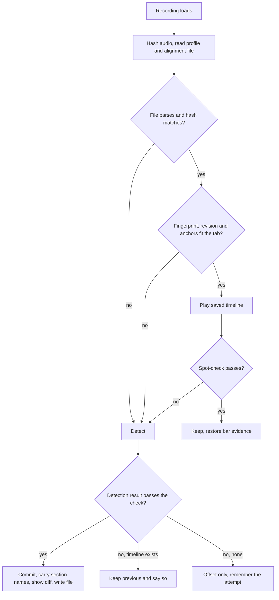

## Goal Capsule

- **Objective:** A player's saved work on a recording, meaning its alignment, section names and profile, survives app rebuilds and tab edits. When something does change, the app says what changed instead of quietly falling back.
- **Means:** One readable, editable alignment file per recording, verified on load and re-detected with a reported diff when the tab changed (KTD1, KTD3, KTD5). A rebuild keeps `data/` (KTD6).
- **Product authority:** The user's confirmed scope in the brainstorm dialogue. Detection quality and the timeline's playback behavior are not active scope.
- **Open blockers:** None.
- **Execution profile:** TypeScript page logic plus a small Rust shell addition and one PowerShell script change. Tests are Vitest and `cargo test`; packaging is checked by a smoke run.
- **Product Contract preservation:** Product Contract unchanged. Outstanding Questions that planning settled moved into Key Technical Decisions; the rest stay deferred.

---

## Product Contract

### Summary

Rebuilding the Windows desktop package keeps the existing `data/` folder, so saved profiles, stems and downloaded models survive. Each recording's alignment moves into its own readable, editable file keyed by the recording's content hash. On load the app checks the audio and spot-checks anchors. When the tab has changed, it re-detects and reports what moved, for example "38 bars re-pinned, 2 sections kept".

### Problem Frame

`scripts/package-windows.ps1` deletes the whole staged package folder before staging, and `data/` lives inside it. Every rebuild therefore wipes saved profiles, stems and model downloads.

Alignment is already remembered per recording in `recording-profiles.json`, keyed by content hash and stamped with a tab fingerprint. When the tab changes or a record is stale, the app detects again without saying so, and the player cannot see or correct what was saved.

### Requirements

**Packaging**

- R1. Rebuilding the desktop package preserves the existing `data/` folder and everything in it.
- R2. A first build, or a build with no existing `data/`, still produces an empty `data/` folder.

**Per-recording alignment file**

- R3. Each recording's alignment is stored in its own human-readable file, named from the recording's content hash.
- R4. The file holds the anchors and end anchor, the holds, the section names, the source (auto or manual), the tab fingerprint and the per-bar evidence behind each placement.
- R5. The file is the source of truth for alignment and may be edited by hand. The app reads those edits on load.
- R6. Offset and mix stay in the existing profile. The alignment part of the profile entry is no longer written there.
- R7. A recording whose alignment is in the old profile format, or that has no alignment file, is detected again on first open. There is no migration.
- R8. A file that is missing, unreadable, or fails validation counts as no saved alignment.

**Verification on load**

- R9. On load the app confirms the file belongs to this recording by hashing the audio. It also spot-checks a few anchors against the audio.
- R10. A failed spot-check re-detects the alignment (R12).

**Tab change and re-detection**

- R11. When the tab no longer matches the saved fingerprint, the app re-detects against the current tab.
- R12. Re-detection overwrites the saved alignment, hand edits included. Section names carry over wherever the bars still match.
- R13. After re-detection the app shows a summary of what changed: how many bars were re-pinned, how many hand-edited bars were replaced, and how many sections were kept.
- R14. A re-detection that fails keeps the previous alignment for playback and says so. It does not silently fall back to offset plus holds.

### Key Decisions

- **Re-detect, carry section names over, show the diff on a tab change** (session-settled: user-directed — chosen over keeping the old alignment and offering a re-detect, and over replacing everything: the fix should be automatic, visible, and should not discard the player's naming). Governs R11, R12, R13.
- **Re-detection overwrites hand edits** (session-settled: user-directed — chosen over locking hand-edited bars and over asking before each re-detection: a changed tab must not leave the player stuck on bars that no longer fit). Governs R10, R12.
- **The per-recording file is the editable source of truth** (session-settled: user-directed — chosen over an export that is never read back and over a non-editable store: the player wants to inspect and correct alignment directly). Governs R3, R5, R6.

### Acceptance Examples

- AE1. **Covers R1, R2.** Given a package with saved profiles in `data/`, when the package is rebuilt, the profiles are still there. When there was no `data/`, the build creates an empty one.
- AE2. **Covers R11, R12, R13.** Given a recording aligned against a tab, when 38 bars of the tab change and the recording is opened, the alignment is re-detected, section names are kept where bars still match, and the app reports "38 bars re-pinned".
- AE3. **Covers R5, R10, R12, R13.** Given a hand-edited anchor that fails the spot-check, when the recording opens, the app re-detects, replaces the edit, and the summary counts it among the replaced bars.
- AE4. **Covers R8, R12.** Given an alignment file that no longer parses, when the recording opens, it is treated as no saved alignment and detected again.
- AE5. **Covers R14.** Given a re-detection that fails after a tab change, the previous alignment still plays and the app says detection failed.

### Scope Boundaries

- Not changing how detection works. This covers only how its results are stored, checked and reported.
- Not migrating old saved alignments (R7).
- Offset and mix storage is unchanged (R6).

#### Deferred to Follow-Up Work

- Pruning old alignment files. Each is a few kilobytes, so the first version keeps them all.

### Outstanding Questions

#### Deferred to Planning

- The spot-check's sample size and tolerance, and the diff summary's wording and how long it stays visible. Both are tuned against real recordings during implementation (U5, U6).

### Sources / Research

- `scripts/package-windows.ps1:66` removes the staged package folder, `data/` included, before copying.
- `src/audio/recording-profile.ts` defines the existing per-hash profile, with `anchors`, `holds`, `sections`, `fingerprint` and `revision`.
- `src/app/auto-align.ts:146` decides when a saved record is reused and when it is detected again.
- `src-tauri/src/main.rs:217` reads and writes `recording-profiles.json` in the shell's data folder.
- `docs/plans/2026-10-05-2338-feat-whole-song-timeline-plan.md` is the prior plan for the whole-song timeline this builds on.

---

## Planning Contract

### Existing ground

- The recording's SHA-256 is already computed (`src/stems/file-hash.ts`) and is already the profile's key, so R9's ownership check is the file recording its own hash and the app comparing it. No new hashing.
- `settleAnalysis` in `src/app/auto-align.ts` already keeps the previous timeline when a re-detection fails on a recording that has one (`kept-previous`), which is R14. `carryNames` in `src/app/section-controls.ts` already carries section names over when a section's first and last bar still match, which is R12's carry-over.
- The per-bar confidence and matched flags (`barConfidence`, `barMatched`) are produced by detection and held only in memory (`barHealth` in `src/app/App.tsx`). A reused timeline therefore shows "not measured" today. Persisting them (R4) also fixes that.
- `tabFingerprint` (`src/audio/tab-fingerprint.ts`) is one hash over the whole tab, so it can say the tab changed but not how many bars.

### Key Technical Decisions

- KTD1. **The in-memory type stays `AlignmentRecord`; only persistence moves.** The file adds per-bar evidence to the record (`detected`, `tab`, `confidence`, `matched`). Restore builds `profile.alignment` from the file and hands it to the existing `decideOnOpen`, so the reuse/detect/stay logic changes little. Governs R3, R4, R6.
- KTD2. **Readable file shape.** Pretty-printed JSON with a `bars` list, one entry per played bar, holding its editable `start`, the originally `detected` start, the `tab` signature of the tab bar it was placed against, and its `confidence` and `matched` flag. Top-level fields carry `version`, the recording hash, `source`, `tier`, `revision`, tab fingerprint, `endAnchor`, `holds`, `sections`, `previousOffset` and a failed `attempt` when one is remembered. Governs R4, R5.
- KTD3. **The diff is computed from the saved file and the new result.** "Re-pinned" is every bar whose tab signature changed plus every unchanged-signature bar whose new start differs from the saved start beyond a tolerance. "Hand edits replaced" is every saved bar whose `start` differed from its `detected` value. "Sections kept" is the count `carryNames` carries. Governs R12, R13. This is why KTD2 stores `detected` and `tab` per bar.
- KTD4. **The spot-check is decode-only.** It samples bars that were `matched` with confidence at detection, and tests whether the decoded recording has an onset near each saved `start`. It reuses the decode cache in `src/alignment/analyze.ts` and the recording's onset peaks from `src/alignment/evidence.ts`, and never renders the tab, which would cost nearly as much as re-detecting. A hand edit passes when it still lands on a real onset. Governs R9, R10.
- KTD5. **Load order.** The file is read with the profile. A file that parses and whose hash matches is validated against the current tab's bars with the existing `checkTimeline`. It plays immediately, and the spot-check runs after. A failed check swaps to detection exactly as a stale fingerprint does today. Governs R8, R9, R10, R11.
- KTD6. **Packaging deletes everything in the staged folder except `data/`.** It no longer removes the folder itself. The build still creates `data/` when absent. Governs R1, R2.
- KTD7. **Two backends, one store.** The desktop shell writes `data/alignments/<hash>.json` through new shell commands that accept only a 64-character lowercase hex hash and write atomically like `write_atomic` in `src-tauri/src/main.rs`. The web build keeps the same record per hash in browser storage, with the same diff and spot-check but no hand-editable file. Governs R3, R5.
- KTD8. **Old alignment in a profile entry is ignored, not migrated.** `normalizeProfile` stops reading or writing `alignment`, so older records simply lack a file and are detected again. Governs R6, R7.

### High-Level Technical Design

The restore and re-detect flow, directional only:

---

## Implementation Units

### U1. Package keeps `data/`

- **Goal:** A rebuild no longer wipes saved profiles, stems or models.
- **Requirements:** R1, R2 (KTD6).
- **Dependencies:** none.
- **Files:** `scripts/package-windows.ps1`, `docs/desktop-packaging.md`.
- **Approach:**
  1. Replace the removal of the staged folder with removal of its contents other than `data/`, so a missing folder is created and an existing one keeps `data/`.
  2. Keep the final step that creates `data/` when it is absent.
  3. Note in the packaging doc that a rebuild preserves `data/`, and that deleting it is now the player's choice.
- **Execution note:** Packaging work; prefer a smoke run over unit coverage. Use `-SkipShell` to avoid the Rust build while checking.
- **Patterns to follow:** The existing `Remove-Item` and `New-Item` calls in the script.
- **Test scenarios:**
  - Test expectation: none -- no test harness covers the script. Verify by smoke run: Covers AE1. With a marker file in `dist-desktop/TabHighway-Windows-x64/data/`, a rebuild leaves it in place and replaces `python/`, `backend/` and `engine/`.
  - Smoke: with no staged folder at all, a build creates an empty `data/`.
  - Smoke: a stale file in the staged root, not in `data/`, is gone after a rebuild.
- **Verification:** The marker file survives and the staged package otherwise matches a fresh build.

### U2. Alignment file format

- **Goal:** A pure, tested read/write of the readable file.
- **Requirements:** R3, R4, R5, R8 (KTD1, KTD2).
- **Dependencies:** none.
- **Files:** `src/audio/alignment-file.ts`, `src/audio/recording-profile.ts` (extend `AlignmentRecord` with per-bar evidence), `tests/audio/alignment-file.test.ts`.
- **Approach:**
  1. Define the file shape and a serializer from `AlignmentRecord` to pretty JSON, and a lenient parser back that validates like `normalizeAlignment` does today.
  2. Parsing rejects a file whose recording hash is not the expected one, or whose `bars` are not whole numbers of ordered, finite starts, as no alignment (R8).
  3. Fields are optional and read with type checks, so one bad field never costs the rest, matching the existing record's style.
  4. Add the per-bar `tab` signature helper beside `tabFingerprint` in `src/audio/tab-fingerprint.ts`.
- **Patterns to follow:** `normalizeAlignment` and `normalizeSections` in `src/audio/recording-profile.ts`.
- **Test scenarios:**
  - Happy path: a record with anchors, holds, sections, evidence and a tab signature per bar round-trips unchanged.
  - Happy path: the written file lists one entry per bar with `start`, `detected`, `tab`, `confidence`, `matched`.
  - Edge: a hand-edited `start` is read back as the edited value while `detected` keeps the original.
  - Edge: a missing optional field (no evidence) parses to a record without evidence.
  - Error: text that is not JSON, a wrong version, a hash for another recording, non-finite starts or unordered bars each read as no alignment. Covers AE4.
  - Error: a section list that overlaps is dropped without losing the anchors.
- **Verification:** Parser and serializer tests pass, and the typecheck is clean.

### U3. Shell storage and store interface

- **Goal:** Read and write one alignment file per recording on desktop, and a browser-storage equivalent on the web.
- **Requirements:** R3, R5, R6, R8 (KTD7).
- **Dependencies:** U2.
- **Files:** `src-tauri/src/alignments.rs`, `src-tauri/src/main.rs`, `src/audio/alignment-store.ts`, `src/stems/alignment-store-shell.ts`, `src/audio/alignment-store-web.ts`, `tests/audio/alignment-store.test.ts`, `tests/audio/alignment-store-web.test.ts`.
- **Approach:**
  1. Add `alignment_read` and `alignment_write` shell commands that take a hash, accept only 64 lowercase hex characters, and read or write `data/alignments/<hash>.json`.
  2. A missing file reads as none, and any other read error is an error so the page skips a save instead of overwriting.
  3. Writes go through the existing atomic write helper, and the directory is created on first write.
  4. Define an `AlignmentStore` with `load(hash)` and `save(hash, record)` that never throws, like `ProfileStore`. Desktop uses the shell commands. Web keeps one record per hash in browser storage.
  5. Saves for the same hash are queued, like `FileProfileStore`.
- **Patterns to follow:** `FileProfileStore` and `WebProfileStore` in `src/audio/recording-profile.ts` and `src/audio/profile-store-web.ts`; `profiles_read` and `profiles_write` in `src-tauri/src/main.rs`; unit tests in `src-tauri/src/profiles.rs`.
- **Test scenarios:**
  - Happy path: a record saved then loaded by the same hash is equal.
  - Edge: loading an unknown hash returns null.
  - Edge: two saves in quick succession for one hash leave the second.
  - Error: a hash that is not 64 lowercase hex characters, or contains path separators, is refused by the Rust side. Rust unit test.
  - Error: a read error that is not "missing" returns an error and the page skips the save. Rust unit test.
  - Error: unavailable browser storage makes load null and save a skipped no-op, never a throw.
- **Verification:** `cargo test` for the shell module and Vitest for both stores pass.

### U4. Save and restore through the file

- **Goal:** The app saves and restores alignment through the store, and the profile no longer carries it.
- **Requirements:** R3, R4, R6, R7 (KTD1, KTD8).
- **Dependencies:** U2, U3.
- **Files:** `src/app/App.tsx`, `src/app/auto-align.ts`, `src/audio/recording-profile.ts`, `src/app/restore-profile.ts`, `tests/app/auto-align.test.ts`, `tests/app/restore-profile.test.ts`, `tests/audio/recording-profile.test.ts`, `tests/audio/recording-profile-baseline.test.ts`.
- **Approach:**
  1. `scheduleProfileSave` writes offset and mix to the profile and the alignment record to the `AlignmentStore`, both debounced together.
  2. `recordFromMap` takes the detected bar evidence and tab signatures and stores them, with `detected` set from the detection result and kept across later saves.
  3. `restoreProfile` loads the file alongside the profile and passes `{ ...profile, alignment }` to `decideOnOpen`. On reuse it also restores `barHealth` from the file's evidence.
  4. `normalizeProfile` stops reading and writing `alignment`.
- **Execution note:** Add characterization coverage of `decideOnOpen` and `restoreProfile` before moving the source of the record, since they carry the open-time decisions.
- **Patterns to follow:** The existing debouncer and run guard in `src/app/App.tsx`.
- **Test scenarios:**
  - Happy path: a committed detection saves a file whose anchors, holds, sections, evidence and fingerprint match it, and the profile entry holds offset and mix only. Covers R6.
  - Happy path: reopening the recording reuses the file's timeline with no analysis and shows the saved bar health rather than "not measured".
  - Edge: an old profile entry that still carries an alignment is ignored and the recording is detected. Covers R7.
  - Edge: a manual or offset-only recording saves no anchors but keeps its holds and source in the file.
  - Error: a failed file read behaves as no saved alignment; a failed write is skipped silently.
  - Integration: save, reload the page state, reopen: the same timeline plays.
- **Verification:** The existing auto-align and profile tests, adjusted for the moved record, pass.

### U5. Verify on load

- **Goal:** A saved file is checked against the audio before it is trusted.
- **Requirements:** R9, R10 (KTD4, KTD5).
- **Dependencies:** U4.
- **Files:** `src/alignment/spot-check.ts`, `src/alignment/analyze.ts` (export the shared decode), `src/app/App.tsx`, `src/app/auto-align.ts`, `tests/alignment/spot-check.test.ts`, `tests/app/auto-align.test.ts`.
- **Approach:**
  1. `spotCheck` takes the decoded recording's onset peaks and the file's bars. It samples a few bars that were matched with confidence at detection, and passes when most have an onset near their `start`.
  2. The decoded recording comes from the shared decode cache, so a following detection does not decode again.
  3. `restoreProfile` runs the check after a reuse decision and, on failure, requests detection the way a stale fingerprint does.
  4. The file's recorded hash is compared with the recording's hash before anything else (R9).
- **Patterns to follow:** `onsetPeaks` and `ONSET_RATE` in `src/alignment/evidence.ts` and `src/alignment/features.ts`; the dependency-injection style of `AnalysisDeps` for fakes in tests.
- **Test scenarios:**
  - Happy path: a file freshly written from a detection passes against the same recording.
  - Error: an anchor moved by hand to a silent stretch fails the check. Covers AE3.
  - Edge: an edit that still lands on a real onset passes.
  - Edge: a file with no confident matched bars to sample passes without failing, since nothing can be checked.
  - Error: a file whose recorded hash differs from the recording's is rejected as no saved alignment.
  - Integration: a failed check leads to detection, and the previous timeline plays until the new one commits.
- **Verification:** The spot-check tests pass, and a reuse with a stubbed passing check never starts analysis.

### U6. Report what changed

- **Goal:** A re-detection after a tab change or a failed check tells the player what moved.
- **Requirements:** R11, R12, R13, R14 (KTD3).
- **Dependencies:** U4, U5.
- **Files:** `src/app/alignment-diff.ts`, `src/app/alignment-controls.ts`, `src/app/App.tsx`, `src/app/auto-align.ts`, `tests/app/alignment-diff.test.ts`, `tests/app/auto-align.test.ts`.
- **Approach:**
  1. `diffAlignments(previousRecord, nextRecord, nextBars)` returns the counts of bars re-pinned, hand edits replaced, sections kept and tab bars changed.
  2. `App` keeps the previous record in hand when a re-detection starts, and on commit stores the diff and shows it beside the alignment status. A failed re-detection shows the existing `kept-previous` status, now naming the cause.
  3. The summary appears only when something was replaced or re-pinned, and is dismissible.
- **Patterns to follow:** `AlignStatus` and its text in `src/app/alignment-controls.ts`.
- **Test scenarios:**
  - Happy path: 38 bars with changed tab signatures give "38 bars re-pinned". Covers AE2.
  - Happy path: unchanged bars whose new start moves beyond the tolerance count as re-pinned, and unchanged ones do not.
  - Edge: a saved bar whose `start` differs from `detected` counts as a replaced hand edit; one that equals it does not. Covers AE3.
  - Edge: section names carry over where first and last bar match, and the count of kept sections reflects it.
  - Edge: a tab with a different number of bars aligns saved and new bars by signature, and added or removed bars count as re-pinned.
  - Error: a failed re-detection reports that it kept the previous alignment and why. Covers AE5.
  - Edge: an identical re-detection produces no summary.
- **Verification:** The diff tests pass, and the status text appears in the alignment panel for each case.

---

## Verification Contract

| Check | Command | Applies to |
|---|---|---|
| Page tests | `npm test` | U2 to U6 |
| Types | `npm run typecheck` | U2 to U6 |
| Shell tests | `cargo test` in `src-tauri` | U3 |
| Packaging smoke | `scripts/package-windows.ps1 -SkipShell` twice, with a marker file in the staged `data/` between runs | U1 |
| Manual desktop pass | Align a recording, rebuild the package, reopen: the alignment is reused and `data/alignments/<hash>.json` reads clearly. Edit a start off its onset: the next open re-detects and reports it. | U1 to U6 |

## Definition of Done

- Every requirement R1 to R14 has an implementing unit and each acceptance example AE1 to AE5 is covered by a test or the smoke checks above.
- `npm test`, `npm run typecheck` and `cargo test` pass.
- `docs/desktop-packaging.md` states that a rebuild preserves `data/`.
- Old alignment fields are no longer written to `recording-profiles.json`, and abandoned experiments or dead code from this work are removed.
- U1: the rebuild keeps a marker file in `data/`. U2: the file round-trips and bad files read as none. U3: both stores pass and the shell refuses bad hashes. U4: save and reopen reuses the timeline. U5: a hand edit off the audio triggers detection. U6: the change summary shows for tab changes and edits.
