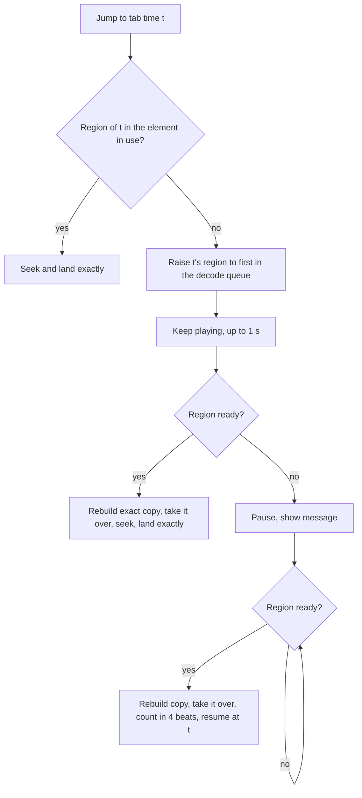

## Goal Capsule

- **Objective:** Jumping around a compressed recording lands where it says, from the first seconds after loading and for recordings of any length, so the tab stays in sync.
- **Means:** One shared store of decoded audio, filled region first and exposed to playback as a progressively rebuilt exact copy; jumps into unready regions are held in the clock (KTD1, KTD3, KTD4).
- **Product authority:** The user's confirmed scope in the brainstorm dialogue. Choosing the lead or rhythm guitar track, and any drift that remains once an exact copy is in use, are not active scope.
- **Open blockers:** None.
- **Execution profile:** TypeScript page logic in the audio, alignment, export and app layers. Tests are Vitest with injected decoders, since the test environment has no audio decoder; real-audio exactness is verified by hand in the desktop app.
- **Product Contract preservation:** Changed: R3 and R11 gain one qualifier. A recording of a format other than MP3 that is longer than the whole-copy budget stays approximate with a plain message, because only MP3 can be decoded a region at a time. The user confirmed this narrowing in the planning checkpoint. R4 also holds only while the store can hold the recording: a recording longer than the budget keeps the separate decode analysis and export used before (KTD7). All other Product Contract text is unchanged.

---

## Product Contract

### Summary

The exact copy of a compressed recording is built region first: it starts as the recording is chosen, fills in around the playhead and where the player is heading, and covers long MP3 recordings only near where they are played, within a memory budget. A jump into a region that is not exact yet is held until it is, so no jump lands off. One decoded copy serves seeking, analysis and export. A strip under the player shows which regions are exact, with one line of text.

### Problem Frame

Compressed recordings such as MP3 seek inexactly, so a jump can land up to about a second from where it says, and a different amount each time. Today a whole-file exact copy is built in the background after loading, and until it finishes the player sees a warning that jumps can land off. Recordings over 10 minutes never get a copy.

The player reports that the error compounds and the tab steadily drifts, especially when moving between sections. They are not sure whether it still happens once the copy is ready, so the fix has to be measurable on both sides of that moment.

The recording is also decoded three separate times, for the exact copy, for analysis and for export.

### Requirements

**Building the exact copy**

- R1. Building the exact copy of a compressed recording starts as soon as the recording is chosen, without waiting for playback.
- R2. The copy is built region first: around the playhead and any loop, then toward where the player is heading, with a jump target prioritized, then the rest.
- R3. A recording too long for a whole copy gets exact regions near where the player plays, within a memory budget; regions far from play may be released. No recording is left on the inexact path because of its length, except a recording of a format other than MP3 that is longer than the whole-copy budget, which can only be decoded whole.
- R4. One decoded copy of the recording serves seeking, analysis and export; none of them decodes the file again.

**Jumps**

- R5. A jump into a region that is not exact yet is held until that region is ready, and its region is built first.
- R6. While a jump is held, playback and the tab continue for about a second. If the region is still not ready, both pause at the old spot with a message, and resume at the target after a 4-beat count-in at the target bar's tempo.
- R7. A jump into an exact region lands where it says, to the precision of exact seeking.

**Showing what is exact**

- R8. A strip under the player shows the recording's exact, getting-exact and not-yet regions.
- R9. One line of text beside the strip says which part is exact and, while a jump is held, that it is held and why.
- R10. The "up to a second off" warnings are gone. The one exception is a recording with no exact copy possible (R11).
- R11. If the recording cannot be decoded, or is a format other than MP3 longer than the whole-copy budget, the app says so plainly, and jumps stay available but are labeled approximate.

**Measuring the result**

- R12. The landing error of every jump is measured and kept apart for jumps made before and after the exact copy was ready, so the effect of the fix can be seen.

### Key Decisions

- **Hold a jump into a region that is not exact yet** (session-settled: user-directed — chosen over landing now and correcting when ready, over blocking jumps until exact, and over keeping today's warning: a late correction is audible mid-playback and the warning describes a state the player wants gone). Governs R5, R7, R10.
- **Long recordings get exact regions around where the player plays** (session-settled: user-directed — chosen over keeping the 10-minute limit and over raising it with a whole copy: no recording should stay on the inexact path, and a whole copy of a long file costs too much memory). Governs R3.
- **A strip plus one line shows what is exact** (session-settled: user-directed — chosen over words only and over per-bar markers on the tab: the strip shows the regions at a glance without crowding the tab). Governs R8, R9.
- **During a hold, playback continues about a second, then pauses and restarts with a 4-beat count-in** (session-settled: user-directed — chosen over always playing on and over pausing at once: a short wait should not cause silence, a long one should not leave the music and tab out of step). Governs R6.

### Acceptance Examples

- AE1. **Covers R1, R2, R5, R6.** Given a 4-minute MP3 twenty seconds after loading, when the player jumps to a bar near 2:10 whose region is not exact yet, playback continues about a second. If the region is ready by then the jump lands exactly. If not, playback and the tab pause with a message and resume at the target after a 4-beat count-in at that bar's tempo.
- AE2. **Covers R3.** Given a 25-minute MP3, the regions near the playhead become exact, a jump far away is held until its region is ready, and memory stays within the budget.
- AE3. **Covers R4.** Given a recording that is loaded, analysed and exported in one session, the file is decoded once.
- AE4. **Covers R8, R9.** Given a recording that is exact up to 0:34 and getting the part near 2:10 exact, the strip shows those regions and the line says which part is exact.
- AE5. **Covers R10, R11.** Given a recording that cannot be decoded, or a 25-minute M4A, the app says so, labels jumps approximate, and shows no other "up to a second off" warning.
- AE6. **Covers R12.** Given a session that jumps before and after the copy is ready, the landing errors are available for each group.

### Success Criteria

- In the first seconds after loading a compressed recording, jumping between sections lands where it says, with no jump landing off.
- Repeated jumping over a session does not grow the landing error in exact regions.
- Landing errors measured before and after the copy is ready show whether the player's reported steady drift came from inexact seeking.
- Memory stays within the budget for recordings of any length.

### Scope Boundaries

- Not choosing the lead or rhythm guitar track (distorted, clean or other) from the Guitar Pro file. That is its own piece of work.
- Not fixing drift that remains once an exact copy is in use. R12 measures it; chasing the clock or timeline is a follow-up.
- The 4-beat count-in exists only as the restart after a held jump (R6), not as a general practice feature.

#### Deferred to Follow-Up Work

- A general count-in feature for practice.
- Region-first decoding for formats other than MP3.

### Dependencies / Assumptions

- Assumption: some of the player's reported drift comes from inexact early jumps. The player is unsure, so the fix is judged by R12 rather than taken as proven.

### Sources / Research

- `src/audio/exact-copy.ts` builds a whole-file WAV copy and skips recordings over 10 minutes (`EXACT_COPY_MAX_SECONDS`).
- `src/app/exact-copy-load.ts` starts the copy in the background and holds the "up to about a second off" warning text.
- The recording is decoded separately in `src/audio/exact-copy.ts`, `src/alignment/analyze.ts` (`decodeRecording`) and `src/export/audio.ts` (`decodeUserRecording`).
- `src/audio/user-audio.ts` already measures landing error (`LandingReport`), corrects a landing a limited number of times, and swaps in a replacement element at the next seek, pause or loop restart (`offerElement`).
- Every jump in the app goes through `clock.seek` (`src/app/App.tsx`), and the stem clock's leader is a `UserAudioClock` (`src/audio/stem-mix.ts`), so a hold in that clock covers every entry point.

---

## Planning Contract

### Existing ground

- Playback is an `<audio>` element, and tempo changes rely on its pitch-preserving rate, so exact playback has to stay an element rather than moving to scheduled Web Audio sources.
- The exact copy is a WAV blob behind an object URL; a blob is immutable, so a copy that grows must be a new blob and a new element, taken over through `offerElement` at a point where the element is repositioned anyway.
- A blob built from other blobs holds references, not copies, so a full-length WAV made of ready regions plus a shared block of silence costs almost no extra memory.
- Recordings are limited elsewhere: analysis refuses over 30 minutes (`MAX_ANALYSIS_SECONDS`) and export over 10 minutes (`MAX_EXPORT_SECONDS`), so the shared decode only has to serve those bounds.
- The test environment has no audio decoder; `ExactCopyDeps` and `AnalysisDeps` already inject one, and the new code follows that pattern.

### Key Technical Decisions

- KTD1. **One store of decoded audio, `RecordingPcm`.** It holds 16-bit stereo chunks of about 10 seconds at the export sample rate, each with a state (not yet, getting, exact), under a memory budget of 600 seconds of audio with least-recently-used release outside the playhead, loop and jump target. Seeking, analysis and export all read from it. Governs R3, R4.
- KTD2. **MP3 is decoded a region at a time; other formats are decoded whole.** An MP3's frame headers are scanned, without decoding, into a map from byte offset to sample position. A region is decoded from a frame-aligned slice of the file with a few whole frames of lead-in that are discarded, and trimmed to the region with the map. Other compressed formats are decoded whole into the store, and only when they fit the budget. Governs R2, R3, R11. Execution note: the first thing implementation proves, against real MP3s, is that a region's samples line up with a whole-file decode of the same file to the sample.
- KTD3. **Exact playback stays an element, rebuilt as a full-length WAV.** The WAV is made from a header, the ready chunks and one shared block of silence for the rest, and replaces the element in use only at a jump, pause or loop restart through `offerElement`. A new copy is built only when a jump or lookahead needs a region the current one lacks. Governs R5, R7.
- KTD4. **The hold lives in `UserAudioClock`.** Every jump, bar step, section jump and keyboard seek reaches it through `seek`, and the stem clock's leader is that clock, so one place holds them all. It reports its state to the app. A jump whose target region is in the element in use lands at once; otherwise it is held. Playback that reaches a region the element lacks is held the same way, so unready silence is never played. Governs R5, R6.
- KTD5. **Hold timing and count-in.** The hold plays on for 1000 ms, then pauses. The count-in is four clicks at the target bar's tempo made with Web Audio, with no asset, and the recording and tab resume together at the target after the fourth. Governs R6.
- KTD6. **Region order.** The jump target first, then the playhead and loop, then 30 seconds ahead of the playhead, then the rest in order. Chunks are decoded one at a time, so decoding never competes with itself for memory. Governs R2.
- KTD7. **Analysis and export read the store.** Analysis takes mono at its feature rate through `downsampleMono`, and export takes the placed PCM it needs, so neither decodes the file. The alignment accuracy tests must still pass. Governs R4.
- KTD8. **Landing error is split by exactness.** `LandingReport` says whether the element in use was the exact copy when the placement was made, and the app keeps a running summary for each side. Governs R12.

### High-Level Technical Design

A jump and the copy that serves it, directional only:

---

## Implementation Units

### U1. MP3 frame map

- **Goal:** Map an MP3's byte offsets to sample positions without decoding it.
- **Requirements:** R2, R3 (KTD2).
- **Dependencies:** none.
- **Files:** `src/audio/mp3-frames.ts`, `tests/audio/mp3-frames.test.ts`.
- **Approach:**
  1. Scan frame headers from the first frame after any ID3 tag, reading each frame's length and sample count from its header, and return the byte offset and starting sample of each frame, with the sample rate and channel count.
  2. Read an Xing or Info header when present to skip it, and stop at a damaged frame rather than guess.
  3. Return null for anything that is not MP3, so other formats take the whole-decode path.
- **Patterns to follow:** The pure, injected-dependency style of `src/audio/exact-copy.ts`.
- **Test scenarios:**
  - Happy path: a built constant-bitrate stream gives frames at the expected byte offsets and 1152-sample steps.
  - Happy path: a variable-bitrate stream, whose frame sizes differ, gives cumulative positions that match the sum of frame sizes.
  - Edge: an ID3v2 tag before the audio is skipped, and a leading Xing frame is not counted as audio.
  - Edge: MPEG-2 sample rates and mono streams get the right frame sample counts.
  - Error: a stream that does not start with a frame, a truncated final frame, and a non-MP3 file (WAV, M4A header) return null or stop cleanly.
- **Verification:** The frame map for fixture streams matches their known layout.

### U2. Decoded-audio store and region decode

- **Goal:** One store of decoded audio that fills a region at a time for MP3 and whole for other formats.
- **Requirements:** R2, R3, R4, R11 (KTD1, KTD2).
- **Dependencies:** U1.
- **Files:** `src/audio/recording-pcm.ts`, `tests/audio/recording-pcm.test.ts`, `tests/audio/exact-copy.test.ts`.
- **Approach:**
  1. Hold 16-bit stereo chunks at the export sample rate with a state each, and report changes to listeners so the strip and the exact copy can follow.
  2. Fill a chunk by decoding a frame-aligned slice with lead-in frames discarded, trimmed through the frame map; fill a non-MP3 recording by one whole decode split into chunks.
  3. Keep to the memory budget by releasing the least recently used chunk outside the playhead, loop and jump target, and never release one in use.
  4. A recording that cannot be decoded, or a non-MP3 recording over the budget, reports "not possible" instead of failing.
- **Execution note:** Start by characterizing against real MP3s in the desktop app that a region's samples line up with a whole-file decode; if they do not, the closest feasible shape goes back to the user before the rest is built.
- **Patterns to follow:** `ExactCopyDeps` and the `ExactCopyBuilder` cache in `src/audio/exact-copy.ts`.
- **Test scenarios:**
  - Happy path: with a fake decoder, requesting a region decodes only the frames that cover it plus the lead-in, and the chunk is trimmed to the region exactly.
  - Happy path: a non-MP3 recording is decoded once and split into chunks that are all exact.
  - Edge: the budget is reached, so the least recently used chunk outside the playhead is released and one in use is kept.
  - Edge: requesting a region already exact decodes nothing.
  - Error: a decode failure for one region marks it failed without stopping the others; a non-MP3 file over the budget reports not possible.
  - Integration: the existing exact-copy cases still hold when the builder is fed from the store.
- **Verification:** Chunk contents and states follow the fake decoder's input, and memory never passes the budget.

### U3. Region order

- **Goal:** Decide which region is decoded next from where the player is and is going.
- **Requirements:** R2, R5 (KTD6).
- **Dependencies:** U2.
- **Files:** `src/audio/region-queue.ts`, `tests/audio/region-queue.test.ts`.
- **Approach:**
  1. Keep the playhead, loop and a requested jump target, and order the queue as KTD6 says.
  2. Decode one chunk at a time, and take a new target without waiting for the chunk in progress.
  3. Stop cleanly when the recording is replaced or removed.
- **Patterns to follow:** The run guard in `src/stems/run-guard.ts` for dropping stale work.
- **Test scenarios:**
  - Happy path: with the playhead at 0:12, regions fill in order from there, then 30 seconds ahead, then the rest.
  - Happy path: a jump target moves its region to the front at once.
  - Edge: a loop is filled before regions past it; a playhead that moves reorders the queue.
  - Edge: a target in a region already exact changes nothing.
  - Error: removing the recording stops the queue and leaves no pending decode.
- **Verification:** The order of decode calls matches the stated priority.

### U4. Progressive exact copy

- **Goal:** Offer playback an exact element that grows as regions become ready.
- **Requirements:** R1, R5, R7 (KTD3).
- **Dependencies:** U2, U3.
- **Files:** `src/audio/exact-copy.ts`, `src/app/exact-copy-load.ts`, `tests/audio/exact-copy.test.ts`, `tests/app/exact-copy-load.test.ts`.
- **Approach:**
  1. Build a full-length WAV blob from a header, the ready chunks and one shared block of silence for the rest, and make an element from it.
  2. Offer a new element to the clock only when a jump or the lookahead needs a region the current one lacks, and release the element and object URL it replaces.
  3. Start building when the recording is chosen, without waiting for playback, and report the store's states for the strip.
  4. A WAV recording needs no copy and is exact at once.
- **Patterns to follow:** `startExactCopy` and the cancellation and release handling already in `src/app/exact-copy-load.ts`.
- **Test scenarios:**
  - Happy path: the WAV header declares the full length and the blob's parts are the ready chunks in place with silence between.
  - Happy path: a WAV recording reports exact immediately and builds no copy.
  - Edge: a new region that a jump needs produces a new element and releases the old one's URL.
  - Edge: a copy that arrives after the recording was replaced is released and never offered.
  - Error: a failed element load leaves playback on the element in use and reports the failure.
  - Integration: the clock takes the offered element at the next seek, pause or loop restart and not mid-play.
- **Verification:** The element offered covers every region the store reports exact, and none it does not.

### U5. Held jumps and the count-in

- **Goal:** Hold a jump to an unready region and resume it exactly.
- **Requirements:** R5, R6, R7, R10 (KTD4, KTD5).
- **Dependencies:** U4.
- **Files:** `src/audio/user-audio.ts`, `src/audio/count-in.ts`, `src/audio/stem-mix.ts`, `src/app/App.tsx`, `tests/audio/user-audio.test.ts`, `tests/audio/stem-mix.test.ts`, `tests/audio/count-in.test.ts`.
- **Approach:**
  1. In `seek`, check whether the element in use covers the target region; if so, place as today, and otherwise record the hold, raise the target's region and return control to the app with the hold state.
  2. While held, keep playing for 1000 ms from the old spot; if the region is still not ready, pause the element, hold the tab, and report a held-and-paused state.
  3. When the region is ready, take over the new element, then either land at once (within the 1000 ms) or play a four-click count-in at the target bar's tempo and resume at the target.
  4. Playback that reaches a region the element lacks takes the same hold path.
  5. The stem clock's followers follow the leader through the same pause and resume.
- **Execution note:** Start from failing tests on the clock with a fake element and region store, since the hold is a state machine.
- **Patterns to follow:** The `landing` and `pendingElement` handling in `src/audio/user-audio.ts`, and the follower sync in `src/audio/stem-mix.ts`.
- **Test scenarios:**
  - Covers AE1. A jump to an unready region keeps playing, lands exactly if the region is ready within 1000 ms, and otherwise pauses and resumes after the count-in at the target.
  - Happy path: a jump into a region the element already covers places at once with no hold.
  - Edge: a second jump during a hold replaces the first, and the earlier region is not held on.
  - Edge: pausing or seeking by the player during a hold cancels it and the count-in.
  - Edge: a loop restart or an offset change during a hold does not leave the clock holding.
  - Edge: the count-in uses the tempo of the target bar, including a bar after a tempo change.
  - Error: a region that fails to decode ends the hold with a message and leaves the jump approximate on the element in use.
  - Integration: with stems, the followers pause and resume with the leader and end on the target together.
- **Verification:** No test of any jump ends with the element placed on an unready region.

### U6. Shared decode for analysis and export

- **Goal:** Analysis and export read the one decode.
- **Requirements:** R4 (KTD7).
- **Dependencies:** U2.
- **Files:** `src/alignment/analyze.ts`, `src/export/audio.ts`, `tests/alignment/analyze.test.ts`, `tests/alignment/accuracy.test.ts`, `tests/export/audio-placement.test.ts`.
- **Approach:**
  1. `decodeRecording` in the analysis returns mono at the feature rate from the store through `downsampleMono`, waiting for the whole recording to be exact, within the 30-minute analysis limit.
  2. `decodeUserRecording` for export takes the placed PCM from the store and renders it as before.
  3. A recording that has no exact copy possible keeps the decode each used before, so nothing regresses for it.
- **Patterns to follow:** The injected decode in `AnalysisDeps` in `src/alignment/analyze.ts`.
- **Test scenarios:**
  - Covers AE3. Loading, analysing and exporting one recording calls the decoder once.
  - Happy path: analysis from the store gives the same bar placements as from a direct decode on the generated accuracy recordings.
  - Edge: a recording over the budget, or one that is not region-decodable, falls back to the earlier decode.
  - Edge: export of a recording with an offset still places silence first and cuts to the tab's length.
  - Error: a store that is not complete when analysis starts waits for it and does not analyse a partial recording.
- **Verification:** `tests/alignment/accuracy.test.ts` still passes unchanged.

### U7. Strip, text and the end of the warnings

- **Goal:** Show which regions are exact, and say it plainly.
- **Requirements:** R8, R9, R10, R11 (KTD1).
- **Dependencies:** U3, U4, U5.
- **Files:** `src/app/ExactnessStrip.tsx`, `src/app/exactness-text.ts`, `src/app/exact-copy-load.ts`, `src/app/App.tsx`, `tests/app/exactness-text.test.ts`, `tests/app/exact-copy-load.test.ts`.
- **Approach:**
  1. Draw the strip from the store's chunk states: exact, getting exact, not yet, along the recording's length, with the playhead.
  2. Say in one line which part is exact; while a jump is held say it is held and why, and when it pauses say so with the count-in to come.
  3. Remove the "up to a second off" text from the states that now resolve, and keep a plain approximate message only for R11.
  4. The strip and line go away once the whole recording is exact.
- **Patterns to follow:** `copyStateText` and its notice in `src/app/exact-copy-load.ts` and `src/app/App.tsx`.
- **Test scenarios:**
  - Covers AE4. A store exact to 0:34 and getting the part near 2:10 gives a strip with those regions and a line that names the exact part.
  - Happy path: a held jump shows the held message, and a paused hold shows the pause message.
  - Edge: a completely exact recording, and a WAV recording, show nothing.
  - Covers AE5. A recording that cannot be decoded, or a long non-MP3, shows the plain approximate message and no other warning.
  - Edge: the old "up to about a second off" wording appears nowhere else.
- **Verification:** Each store state maps to exactly one strip and line.

### U8. Landing error before and after

- **Goal:** Make the effect of the fix visible.
- **Requirements:** R12 (KTD8).
- **Dependencies:** U4, U5.
- **Files:** `src/audio/user-audio.ts`, `src/app/landing-stats.ts`, `src/app/AlignmentPanel.tsx`, `src/app/App.tsx`, `tests/audio/user-audio.test.ts`, `tests/app/landing-stats.test.ts`.
- **Approach:**
  1. Add to `LandingReport` whether the exact copy was in use when the placement was made.
  2. Keep a running count, mean and largest error for each side for the session, and show both in the alignment panel.
- **Patterns to follow:** The landing report path through `recordLanding` in `src/app/App.tsx`.
- **Test scenarios:**
  - Covers AE6. Jumps before and after the copy is ready are counted in separate groups with their own mean and largest error.
  - Happy path: a session with only exact landings shows only that group.
  - Edge: a loop restart is counted as a landing in the group of the element in use.
  - Edge: no landings yet shows nothing.
- **Verification:** The panel's two groups match the reports the clock produced.

---

## Verification Contract

| Check | Command | Applies to |
|---|---|---|
| Page tests | `npm test` | U1 to U8 |
| Types | `npm run typecheck` | U1 to U8 |
| Alignment accuracy | `npx vitest run tests/alignment/accuracy.test.ts` | U6 |
| Manual pass, desktop app | Load a 4-minute MP3 and an M4A, jump between sections in the first seconds and again after the strip is all exact, compare the two landing-error groups; load a 25-minute MP3 and watch memory and the held jumps; confirm real MP3 regions line up with a whole-file decode | U2 to U8 |

## Definition of Done

- Every requirement R1 to R12 has an implementing unit, and each acceptance example AE1 to AE6 is covered by a test or the manual pass.
- `npm test` and `npm run typecheck` pass, with the alignment accuracy tests unchanged.
- The manual pass shows no jump landing off on an MP3, that landing errors are reported for both groups, and that memory stays within the budget on a 25-minute MP3.
- The "up to a second off" warnings appear only for a recording with no exact copy possible, and abandoned experiments or dead code from this work are removed.
- U1: the frame map matches fixture layouts. U2: regions line up with a whole decode and memory is bounded. U3: decode order follows priority. U4: the element offered covers only ready regions. U5: no jump ends on an unready region. U6: one decode serves all three uses. U7: the strip and line follow the store. U8: before and after landing errors are shown.
