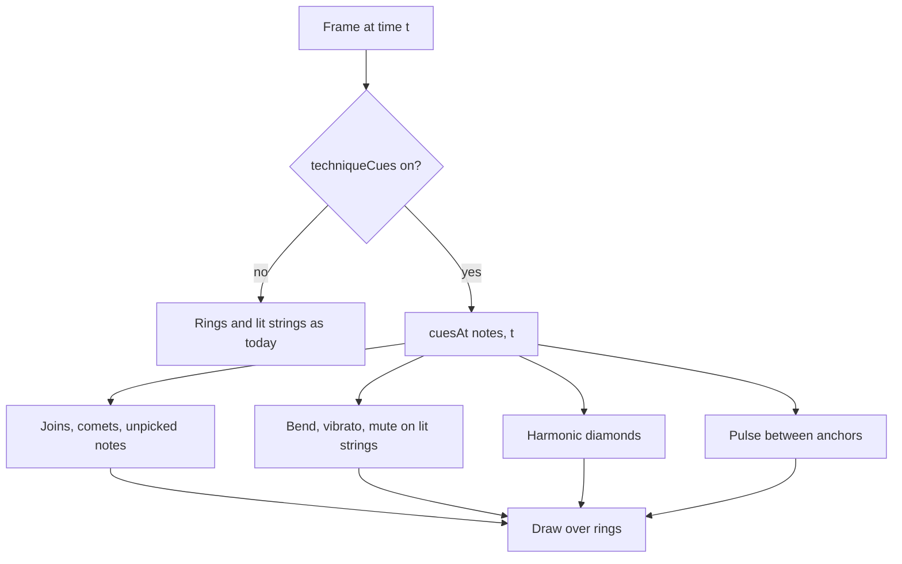

## Goal Capsule

- **Objective:** A player following the neck view can see how each note is played, above all hammer-ons, pull-offs and slides, without looking away at the tab.
- **Means:** A pure model of which cues are active at a moment, drawn over the existing rings and lit strings, behind one remembered switch that live view and export both read (KTD1, KTD2, KTD10).
- **Product authority:** The user's confirmed scope in the brainstorm dialogue. Cues for dead notes, ghost notes, let ring and tied notes, and any change to the 2D fretboard view, are not active scope.
- **Open blockers:** None.
- **Execution profile:** TypeScript rendering and app code. Tests are Vitest with the recording drawing context; how good each effect looks is judged by eye on real songs.
- **Product Contract preservation:** Product Contract unchanged. The three Outstanding Questions that planning settled moved into Key Technical Decisions.

---

## Product Contract

### Summary

The photo neck view, full screen and in exported video, shows techniques as light effects with no text. A hammer-on or pull-off joins its two rings with an arc, and the note it ends on is a softer ring with no strike pop, so it reads as a note you do not pick. A slide leaves a bright comet along the real frets. A bend deflects the lit string, vibrato shivers it, palm mute dims the string glow, and a harmonic gets a diamond. A pulse travels from the current ring to the next and arrives on the beat. One switch, on by default and remembered, turns all of it off for the clean look.

### Problem Frame

The neck view draws only a ring where to play and the string lit behind it. The player has to glance at the tab strip to learn that a note is hammered, slid or bent, and the most common cases, hammer-ons, pull-offs and slides, change what the hand does: a hammered note is not picked.

The Guitar Pro file already says which notes carry which technique, and the highway already marks them with symbols and letters. The neck view does not use that.

### Requirements

**Joined notes**

- R1. A hammer-on or pull-off is shown as an arc joining the ring of the note it starts on to the ring of the note it ends on.
- R2. The ring of the note a hammer-on or pull-off ends on is softer than a picked note's ring and has no strike pop.
- R3. A slide is shown as a bright comet travelling along the real frets from the starting fret toward the ending fret, and a slide into or out of a note leaves a shorter comet on that side.

**Marks on a single note**

- R4. A bent note deflects its lit string toward the next string, by an amount that follows the size of the bend.
- R5. A note with vibrato makes its lit string shiver for as long as the note sounds.
- R6. A palm-muted note shows its string glow dimmer than a normal note's.
- R7. A harmonic shows a diamond on its ring.

**When to arrive**

- R8. A pulse travels from the ring now being played toward the next ring and arrives on the beat the next note starts, whenever the next note is at a different position.
- R9. No cue uses text.

**The switch**

- R10. One switch turns all technique cues and the pulse off, leaving the neck as it is today. It is on by default and the choice is remembered.
- R11. The switch applies to the full-screen neck view and to exported video alike.

### Key Decisions

- **All four cue groups in the first version** (session-settled: user-directed — chosen over a smaller first version: bends, joined notes, single-note marks and the pulse were all asked for). Governs R1, R3, R4, R6, R8.
- **One switch for everything, on by default and also applied to export** (session-settled: user-directed — chosen over off by default and over separate switches for marks and pulse: the cues are meant to be seen, and one choice keeps the clean look one tap away). Governs R10, R11.
- **Glow only, no text** (session-settled: user-directed — chosen over highway-style marks and over glow with small letters: quieter and closer to a lit guitar). Governs R9.
- **The end of a hammer-on or pull-off is a softer ring with the arc** (session-settled: user-directed — chosen over the same ring plus the arc, and over arc shape telling hammer from pull: the key fact for the player is that this note is not picked). Governs R2.

### Acceptance Examples

- AE1. **Covers R1, R2.** Given a hammer-on from fret 5 to fret 7 on one string, the two rings are joined by an arc and the fret 7 ring is softer, with no strike pop.
- AE2. **Covers R3.** Given a slide from fret 5 to fret 9, a bright comet runs along the frets from 5 toward 9 over the note's length.
- AE3. **Covers R4, R5.** Given a full bend, the lit string bends toward the next string by more than for a half-step bend; given a vibrato note, the string shivers while the note sounds and settles after.
- AE4. **Covers R6, R7.** Given a palm-muted note, its string glow is dimmer than a normal note's; given a harmonic, its ring carries a diamond.
- AE5. **Covers R8.** Given a note followed by one on another fret, a pulse leaves the ring and arrives on the next ring on the beat; given the same position repeated, there is no pulse.
- AE6. **Covers R10, R11.** Given the switch is off, the full-screen view and an exported video both show the neck as they do today, and the choice is still off after the app is reopened.
- AE7. **Covers R9.** Given any of the cues, no letters or numbers are drawn for it.

### Success Criteria

- A player can tell from the neck alone which notes of a passage are hammered, pulled or slid, and which are picked, without looking at the tab.
- With the switch off, the neck view and exported video match what they are today.
- Exported video shows the same cues as the live view for the same moment.

### Scope Boundaries

- Not adding cues for dead notes, ghost notes, let ring or tied notes.
- Not changing the 2D fretboard view or its dashed path; the pulse is for the photo neck view only.
- Not telling a hammer-on from a pull-off except by the ring and the arc; there are no letters.

#### Deferred to Follow-Up Work

- Cues for dead, ghost, let-ring and tied notes.
- Separate switches for the marks and the pulse.

### Dependencies / Assumptions

- The technique data for each note (bend size, slide kind, hammer or pull, palm mute, harmonic, vibrato) is already read from the Guitar Pro file and is complete enough to draw from.

### Sources / Research

- `src/model/score.ts` defines `Techniques` on every note: bend in semitones, slide kind, hammer or pull origin or destination, palm mute, harmonic, vibrato, dead, ghost, let ring and tied.
- `src/render/neck-view.ts` draws only rings and the lit string for the photo neck view, shared by the live view and video export (`renderNeckFrame`).
- `src/render/techniques.ts` draws the highway's technique marks, and `src/render/fretboard.ts` draws the 2D view's dashed path.

---

## Planning Contract

### Existing ground

- `renderNeckView` in `src/render/neck-view.ts` is a pure function of the timeline, track, time and size, called by `NeckFullscreen` each frame and by the export worker for each video frame, so a cue drawn there appears in both.
- It draws the lit strings, the fading trail, the upcoming rings and then the playing rings with a halo, using `stepsAt`, `emphasisAt` and the helpers `photoNoteX`, `photoStringY` and `markerCentre`.
- The highway links a hammer-on or slide to the next later note on the same string (`nextOnString` in `src/render/techniques.ts`), and the fretboard picks a step's lowest-pitched note as its anchor (`anchor` in `src/render/fretboard.ts`).
- View settings such as the look-ahead and dot labels are held only for the session (`initialViewState` in `src/app/ViewControls.tsx`). Nothing but the recording profiles is remembered between sessions, so this is the first remembered view setting.
- The export reaches the worker through `BottomOptions` (`src/render/composite.ts`), which carries the look-ahead and dot labels today.
- The tests build timelines by hand with `makeTimeline` and `NoteSpec` (which takes `techniques`) and read drawing calls from `createRecordingContext`, as `tests/render/neck-view.test.ts` does.

### Key Technical Decisions

- KTD1. **A pure cue model, drawn separately.** `cuesAt` in a new `src/render/neck-cue-model.ts` turns a track's notes and a time into the cues active then: joins, comets, bends, vibrato, mutes, harmonics, unpicked notes and the pulse, each with its progress. A drawing module paints them. The model is where the rules are tested. Governs R1 to R8.
- KTD2. **The renderer draws no cues unless asked.** `NeckViewOptions` gets `techniqueCues`, false when absent, so every existing caller and test draws what it does today. The app's remembered setting supplies true by default. Governs R10, R11.
- KTD3. **Hammer-ons and pull-offs.** A note whose technique is `origin` links to the next later note on its string, as the highway does. The arc is drawn from the origin's ring to the destination's ring while either is on screen, and a note whose technique is `destination` is drawn as a softer ring, at 55% strength with no halo and no strike pop. Governs R1, R2.
- KTD4. **Slides.** A shift or legato slide links to the next later note on its string, and its comet head moves from the starting fret to the ending fret in photo coordinates over the starting note's length, with a fading tail. A slide out leaves a short comet toward the lower frets for a downward slide and the higher frets for an upward one, and a slide in arrives from below or above. Governs R3.
- KTD5. **Bend and vibrato deflect the lit string.** While the note sounds, the lit string from the ring to the bridge is offset toward the neighbouring string, by up to 55% of the gap between strings for a bend of two semitones or more, in proportion below that, easing in over the first 40% of the note. Vibrato adds a small sideways wave, 12% of the string gap at about 7 cycles a second, for as long as the note sounds. Governs R4, R5.
- KTD6. **Palm mute and harmonic.** A palm-muted note's lit string is drawn at half strength and its ring outline thinner. A harmonic's ring gets a diamond 1.5 times the ring's radius, in the neck's glass colour. Governs R6, R7.
- KTD7. **The pulse.** It runs from the playing step's anchor ring to the next step's anchor ring (a step's lowest-pitched note, as the fretboard does), with its progress eased from the playing step's start to the next step's start so it arrives on the beat, and a short fading tail. There is none when the two positions are the same or there is no next step. Governs R8.
- KTD8. **No text.** Every cue is drawn with strokes, fills and glows, never with fillText, so the cue code has none to call. Governs R9.
- KTD9. **The setting is one remembered boolean.** `neck-cues-setting.ts` reads and writes it in browser storage, guarded like the profile store so a blocked store reads as the default, which is on. Governs R10.
- KTD10. **One setting, two places to change it.** The full-screen view carries a small switch beside its close button, and the export dialog shows a checkbox for the same setting when the neck layout is chosen. The export carries it to the worker in `BottomOptions`. Governs R10, R11.

### High-Level Technical Design

The cues for a frame, directional only:

---

## Implementation Units

### U1. Cue model

- **Goal:** Say which cues are active at a moment and how far along each is.
- **Requirements:** R1 to R8 (KTD1, KTD3, KTD4, KTD5, KTD6, KTD7).
- **Dependencies:** none.
- **Files:** `src/render/neck-cue-model.ts`, `tests/render/neck-cue-model.test.ts`.
- **Approach:**
  1. `cuesAt(notes, t)` finds the notes whose cue is on screen, using the same window the neck view uses (the playing step, the trail and the upcoming steps), and returns one entry per cue.
  2. A join pairs an origin note, or a shift or legato slide, with the next later note on its string, and records its progress across the origin's length.
  3. A comet records its start and end positions and its head's progress, and a slide in or out records its side and direction.
  4. A bend, vibrato or mute records its note and its strength at `t`, easing in over the first part of the note and gone once it ends.
  5. The pulse takes the playing step's anchor and the next step's anchor, and records its eased progress, or nothing when they are at the same position.
  6. Notes whose technique is `destination` are listed as unpicked.
- **Patterns to follow:** `stepsAt` and `groupSteps` in `src/render/fretboard-steps.ts` for the window, `nextOnString` in `src/render/techniques.ts` for the links, and the pure style of `emphasisAt` in `src/render/emphasis.ts`.
- **Test scenarios:**
  - Covers AE1. A hammer-on origin on fret 5 and a later note on fret 7 of the same string give one join between them, and the later note is listed as unpicked.
  - Happy path: a pull-off down the neck gives the same shape of join, and a note in between on another string is not linked.
  - Covers AE2. A slide from fret 5 to fret 9 gives a comet whose head is at the start when the note begins, halfway at the middle of its length, and at fret 9 at its end.
  - Edge: a slide out downward and one upward give short comets on opposite sides, and a slide in does the same arriving.
  - Covers AE3. A full bend has twice the strength of a half-step bend, a bend of more than two semitones is capped, and the strength eases in and is gone after the note ends.
  - Edge: a vibrato note has a shiver while it sounds and none before it starts or after it ends.
  - Covers AE5. A note followed by one on another fret gives a pulse that is at the first ring when the first note starts and at the next ring when the next note starts; the same position repeated gives none; the last step gives none.
  - Edge: a chord's pulse follows its lowest-pitched note, and a hammer-on with no later note on its string gives no join.
  - Edge: techniques the plan does not cue (dead, ghost, let ring, tied) produce no cue.
- **Verification:** The model gives the same cues for the same notes and time every call, and plain notes give none.

### U2. Drawing the cues

- **Goal:** Draw the cues over the neck, and nothing more when they are off.
- **Requirements:** R1 to R9 (KTD2, KTD3 to KTD8).
- **Dependencies:** U1.
- **Files:** `src/render/neck-cues.ts`, `src/render/neck-view.ts`, `tests/render/neck-cues.test.ts`, `tests/render/neck-view.test.ts`.
- **Approach:**
  1. Add `techniqueCues` to `NeckViewOptions`, false when absent.
  2. When it is on, `renderNeckView` takes `cuesAt` for the frame, draws the unpicked notes as soft rings without halo or pop, applies the bend, vibrato and mute to the lit string, then draws the joins, comets, diamonds and the pulse over the rings.
  3. Each cue is drawn in the note's string colour, or the neck's glass colour for the diamond, with the soft wide glow under a bright core that the lit strings use, and no text.
  4. When it is off, the calls drawn are the ones drawn before.
- **Patterns to follow:** `drawLitStrings`, `drawHalo` and `drawRing` in `src/render/neck-view.ts`, and the recording drawing context in `tests/helpers/recording-context.ts`.
- **Test scenarios:**
  - Covers AE6. A frame drawn with the option off, and with it absent, makes exactly the calls it makes today, on a timeline full of techniques.
  - Covers AE1. With it on, a hammer-on adds an arc between the two rings and the destination ring is drawn at lower strength with no halo.
  - Covers AE2. A slide adds a comet whose head is further along later in the note.
  - Covers AE3. A bent note's lit string is drawn with a point moved off the straight line, more for a full bend than a half-step, and a vibrato note's changes with time.
  - Covers AE4. A palm-muted note's lit string is drawn at lower strength, and a harmonic adds a four-sided outline around its ring.
  - Covers AE5. A pulse dot is drawn between the two rings and moves toward the next ring as time passes.
  - Covers AE7. A frame with every cue on draws no text beyond what it drew with them off.
  - Edge: a tall screen, where the photo is turned, places each cue on the same fret and string as the ring it belongs to.
- **Verification:** The neck-view tests for the existing rings and strings pass unchanged.

### U3. The setting, the switch and export

- **Goal:** One remembered switch that the live view and the export both follow.
- **Requirements:** R10, R11 (KTD2, KTD9, KTD10).
- **Dependencies:** U2.
- **Files:** `src/app/neck-cues-setting.ts`, `src/app/App.tsx`, `src/app/NeckFullscreen.tsx`, `src/app/ExportDialog.tsx`, `src/render/composite.ts`, `src/export/encoder.worker.ts`, `src/app/app.css`, `tests/app/neck-cues-setting.test.ts`, `tests/export/composite-views.test.ts`.
- **Approach:**
  1. The setting reads and writes one boolean in browser storage, defaulting to on, and never throws.
  2. `App` holds it as state, gives it to the full-screen view and the export dialog, and saves a change.
  3. The full-screen view shows a small switch beside its close button and passes the setting to `renderNeckView`.
  4. The export dialog shows a checkbox when the neck layout is chosen, bound to the same setting, and the setting travels in `BottomOptions` to the worker, which passes it to `renderNeckFrame`.
- **Patterns to follow:** The guarded storage in `src/audio/profile-store-web.ts`, and the `BottomOptions` path for the look-ahead and dot labels.
- **Test scenarios:**
  - Covers AE6. A saved off reads as off after a fresh read; no saved value reads as on.
  - Error: storage that is blocked, unreadable or holds something that is not a boolean reads as on and never throws on a save.
  - Happy path: the export's bottom options carry the setting, and the neck frame the worker draws follows it.
  - Edge: changing the setting in the full-screen view is what the export dialog shows next, and the reverse.
  - Integration: with the setting off, a video frame and a live frame for the same moment draw the same calls as today; with it on, they draw the same cues as each other.
- **Verification:** Reopening the app keeps the choice, and an export made with it off matches an export from before this work.

---

## Verification Contract

| Check | Command | Applies to |
|---|---|---|
| Page tests | `npm test` | U1 to U3 |
| Types | `npm run typecheck` | U1 to U3 |
| Neck view tests unchanged | `npx vitest run tests/render/neck-view.test.ts` | U2 |
| Manual pass, desktop app | Open songs with many hammer-ons, pull-offs, slides, bends and palm mutes, in full screen and in an exported video, with the switch on and off; judge the effects by eye, and tune comet length, deflection, shiver and pulse speed | U1 to U3 |

## Definition of Done

- Every requirement R1 to R11 has an implementing unit, and each acceptance example AE1 to AE7 is covered by a test or the manual pass.
- `npm test` and `npm run typecheck` pass, with the existing neck-view tests unchanged.
- The manual pass shows hammer-ons, pull-offs and slides reading clearly on real songs, and a clean neck with the switch off, in the live view and in video.
- Abandoned experiments and dead code from this work are removed.
- U1: the cues follow the rules for the same notes and time. U2: the cues draw, and the off frame is today's frame. U3: the choice is remembered and the live view and export follow it.
