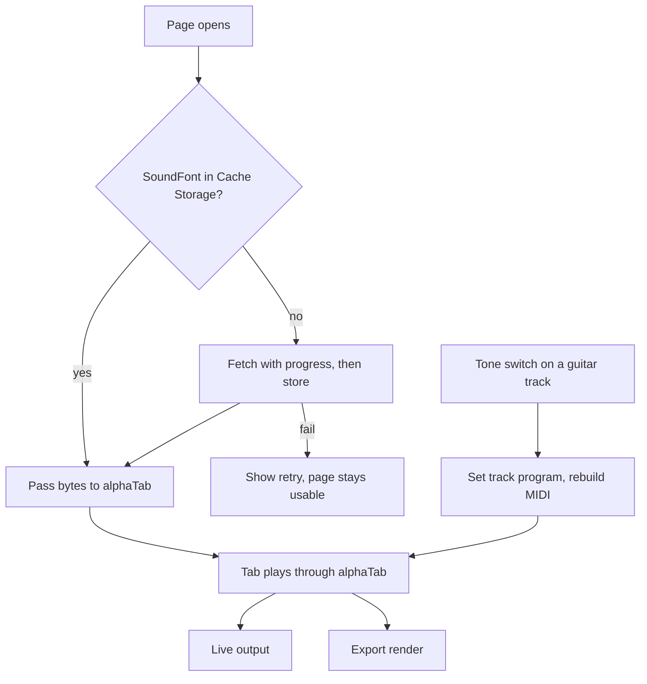

# Realistic Band Synth - Plan

## Goal Capsule

- **Objective:** With no recording loaded, a tab plays as a believable band backing track, and its guitars can sound clean, crunchy or distorted.
- **Means:** A much higher-quality SoundFont replaces the small one, and a per-track tone switch changes the guitar's instrument sound (KTD2, KTD3).
- **Authority:** The Product Contract below wins on behavior; the Planning Contract wins on mechanism. Full amp and cabinet modelling is not in scope.
- **Stop conditions:** Stop and ask the user if the SoundFont gate (U1) finds no candidate that is both permissively licensed and under 100 MB, or if the effects gate (U5) shows drive cannot be limited to guitar tracks (see Open Questions).
- **Execution profile:** Code, in the existing Vite/React/alphaTab app. U1 and U5 are decision gates; U2 to U4 are ordinary units.
- **Tail ownership:** Whoever runs `ce-work` finishes, opens the PR, and confirms the GitHub Pages deploy check passes.

Product Contract preservation: unchanged. R-IDs and meaning are as the brainstorm set them. The Dependencies and Outstanding Questions sections are updated in place, because research showed `public/` is build-generated and the earlier worry about the SoundFont never reaching GitHub was wrong.

---

## Product Contract

### Summary

Replace the small General MIDI SoundFont that plays a tab with a much higher-quality one, so drums, bass, keys, pads and guitars all sound real. Each guitar track follows the sound its tab asks for and can be overridden to Clean, Crunch or Distortion. Light effects come after the new samples are judged by ear.

### Problem Frame

With no recording loaded, the tab plays through `sonivox.sf3`, about 1 MB, loaded from `src/app/App.tsx`. The band sounds like a ringtone bank, so the tab is not something you want to play along to. The same sound feeds the exported video's audio.

### Key Decisions

- **The whole band is the target, not only the guitar.** (session-settled: user-directed — chosen over guitar-only and tone-switch-only: the tab alone should feel like a backing track.) Governs R1.
- **One big SoundFont for everyone, with no optional download.** (session-settled: user-directed — chosen over an opt-in download and desktop-only: they want everyone to get the better sound.) Governs R2, R7, R8.
- **Tone follows the tab, with a per-track override.** (session-settled: user-directed — chosen over tab-only and one global switch.) Governs R3, R4.
- **Light effects, not amp modelling.** (session-settled: user-directed — chosen over samples-only and full amp simulation.) Governs R5.

### Requirements

**Sound quality**

- R1. A tab played with no recording loaded sounds like a real band: drums, bass, keys, pads and guitars are all noticeably more authentic than today.
- R2. The higher-quality SoundFont is the only one used, on web and desktop. Its size and licence are recorded in `THIRD_PARTY_NOTICES.md`.
- R6. The exported video's audio uses the same sound as live playback.

**Guitar tone**

- R3. Each guitar track starts with the sound its tab specifies (clean, overdrive or distortion).
- R4. The player can switch any guitar track to Clean, Crunch or Distortion, and the change is heard immediately and in the export.
- R5. Light effects (amp-style drive and EQ, reverb) improve the distortion and room feel beyond what the samples give alone.

**Loading**

- R7. While the larger SoundFont loads, the player shows progress, and a failed load shows a retry without breaking the page.
- R8. After the first load, the SoundFont comes from the browser's cache and does not download again.

### Acceptance Examples

- AE1. **Covers R3, R4.** Given a tab whose guitar track asks for a clean sound, when the player switches it to Distortion, then playback is distorted from that point on, and the exported video matches.
- AE2. **Covers R7.** Given a slow connection, when the page opens, then a progress indicator shows and play stays disabled until the SoundFont is ready.
- AE3. **Covers R8.** Given the SoundFont was loaded before, when the page is opened again, then playback is ready without downloading it.

### Scope Boundaries

**Deferred for later**

- Full amp and cabinet simulation.
- An optional small-font fast-load mode.

**Outside this plan**

- Changes to how a loaded recording or its stems play.

### Dependencies / Assumptions

- alphaTab 1.8.4 can load a SoundFont from bytes and from a URL, and can layer several fonts (`loadSoundFont(data, append)`). Verified in `node_modules/@coderline/alphatab/dist/alphaTab.d.ts`.
- The tab's own instrument data is read correctly by the current player. Unverified; U3 checks it first.

### Outstanding Questions

**Deferred to Planning** (resolved by the units noted)

- Which SoundFont to use: U1 decides.
- Whether the effects can be applied to live playback and the export alike: U5 decides.

**Resolve Before Planning**

- None.

---

## Planning Contract

### Key Technical Decisions

- KTD1. **Commit the big SoundFont in a tracked folder, not `public/`.** `public/` is generated at build time by the alphaTab Vite plugin, which copies alphaTab's own font and SoundFont into it, so anything placed there by hand is wiped or ignored. A tracked `assets/soundfont/` folder, copied into the build output by `vite.config.ts`, gets the file to GitHub Pages and the desktop bundle. The file must stay under GitHub's 100 MB per-file limit. Implements R2.
- KTD2. **Fetch the SoundFont ourselves and hand alphaTab the bytes.** The app downloads it with a progress callback, stores it in the browser's Cache Storage, and passes it to alphaTab with `loadSoundFont(data, false)`. GitHub Pages' ordinary HTTP caching is too short-lived for a file this size, and alphaTab's URL loader cannot give a retry or a durable cache. Implements R7, R8. (see `src/audio/synth-bridge.ts:158`)
- KTD3. **Tone override sets the track's instrument program and rebuilds the MIDI.** Clean maps to General MIDI program 27, Crunch to 29 (Overdriven Guitar), Distortion to 30 (Distortion Guitar). The new program is written to the track's playback info, then `loadMidiForScore()` regenerates the audio events. The same score object feeds `exportAudio`, so the export follows with no extra work. Implements R3, R4, R6. This is the how-level choice behind the product's tone decision. (session-settled: user-directed — chosen over tab-only and one global switch: they want per-track control.)
- KTD4. **One shared effects routine for live playback and export, or no effects.** If effects are built, a single processing function runs on the live output stream and on the exported audio, so the two cannot sound different. If that cannot be made to hold, effects are dropped rather than letting the video diverge from live playback (R6 outranks R5). Implements R5, R6.
- KTD5. **Judge sound by ear, test the behaviour.** Automated tests cover the tone-to-program mapping, the override, loading, retry and caching. How good it sounds is a listening check recorded in U1 and U5. Test expectations in the units follow this.

### High-Level Technical Design

This is directional, not a build spec.

### Assumptions

- A single tracked SoundFont file between roughly 30 MB and 90 MB covers the quality target. If U1 finds only larger options, U1 stops and asks.
- Guitar tracks are the non-percussion tracks the app already treats as playable (`src/app/TrackPicker.tsx`). Whether bass counts as a guitar track for the tone switch is decided in U3 by checking the track's own program.

### Risks & Dependencies

- **Drive is hard to limit to guitar.** Effects applied to the final mix affect every instrument. Per-track drive may not be possible with alphaTab's single mixed output, so R5 may shrink to reverb, a gentle EQ, and the SoundFont's own distortion sounds. U5 finds out and stops to ask if that changes what R5 promises.
- **First load is heavy.** A 30 to 90 MB download on the web is slow. R7 and R8 are the mitigation; there is no optional small font by decision.
- **Licence.** The chosen font's licence must allow redistribution in a web app. U1 checks this before anything is committed.
- **Desktop.** The desktop (Tauri) app loads the same web build. Cache Storage must work in its webview; U2 verifies it.

### Sources / Research

- `src/audio/synth-bridge.ts:158-188`: creates the alphaTab player, sets `settings.player.soundFont`, and exposes `exportAudio` at `:119`.
- `src/app/App.tsx:79` and `:461`: the SoundFont URL and the call that passes it in.
- `src/app/TrackPicker.tsx`, `src/model/score.ts:53`: current track UI and track info.
- `.github/workflows/deploy.yml:33`: the post-build check that `dist/soundfont/sonivox.sf3` exists.
- `THIRD_PARTY_NOTICES.md:33`: the existing SoundFont notice, which flags its provenance as undocumented.
- `node_modules/@coderline/alphatab-vite/dist/copyAssetsPlugin2.mjs`: why `public/` is generated.

---

## Implementation Units

### U1. Choose the SoundFont

- **Goal:** Pick one SoundFont and record why.
- **Requirements:** R1, R2.
- **Files:** `THIRD_PARTY_NOTICES.md`; a short decision note in this plan's Appendix when done.
- **Approach:** Compare MuseScore General, GeneralUser GS and FluidR3 for licence terms, file size (under 100 MB, ideally 30 to 90 MB), and how a drum-heavy and a distorted-guitar sample tab sound through alphaTab. Download each into a scratch folder outside the repo. Stop and ask the user if none fits.
- **Test scenarios:** Test expectation: none -- a decision gate; the output is a recorded choice and a listening result.
- **Verification:** The choice, its size, its licence text, and a one-line listening verdict are written down.

### U2. Bundle and load the SoundFont

- **Goal:** The chosen font ships in the build, loads with progress, caches, and recovers from failure.
- **Requirements:** R2, R7, R8.
- **Dependencies:** U1.
- **Files:** `assets/soundfont/` (new, tracked); `vite.config.ts`; `src/audio/synth-bridge.ts`; `src/audio/soundfont-cache.ts` (new); `src/app/App.tsx`; `.github/workflows/deploy.yml`; `THIRD_PARTY_NOTICES.md`; `tests/audio/soundfont-cache.test.ts` (new).
- **Approach:** Follow KTD1 and KTD2. Copy the file into the build output from `assets/soundfont/`. Download it with progress into Cache Storage and hand the bytes to alphaTab. Keep the page usable and show a retry when the download fails. Update the deploy check to name the new file. Stop setting `settings.player.soundFont` to a URL so alphaTab does not also fetch a font itself, and confirm the player still reports ready after `loadSoundFont`. Replace the old font's notice with the new one. The alphaTab plugin copies its own 1 MB font into the build on its own; stop that if the plugin's `assetOutputDir` option allows it without losing the notation font, otherwise leave the unused file and keep its notice.
- **Patterns to follow:** The existing `onProgress` callback and `ready` promise in `createSynthSession`; the web stores in `src/audio/profile-store-web.ts` for browser-storage handling with a fallback.
- **Test scenarios:**
  - First load with an empty cache downloads the file, reports progress from 0 to 1, stores it, and resolves ready.
  - Second load with the file cached resolves ready with no network request (AE3).
  - A failed download leaves play disabled, surfaces a retry, and a retry that succeeds recovers (AE2).
  - Cache Storage unavailable or throwing falls back to a plain download without breaking.
  - A truncated or empty cached entry is discarded and fetched again.
- **Verification:** Typecheck and tests pass; `npm run build` output contains the new font; the deploy check passes locally; a manual run shows progress, then a reload shows no second download.

### U3. Per-track tone switch

- **Goal:** Each guitar track starts with the tab's sound and can be switched to Clean, Crunch or Distortion.
- **Requirements:** R3, R4.
- **Dependencies:** U2 (so the result can be heard with the new samples).
- **Files:** `src/audio/guitar-tone.ts` (new); `src/audio/synth-bridge.ts`; `src/model/score.ts`; `src/model/alphatab-adapter.ts`; `src/app/ToneSwitch.tsx` (new); `src/app/TrackPicker.tsx` or the player layout that hosts it; `tests/audio/guitar-tone.test.ts` (new).
- **Approach:** Follow KTD3. A small pure module maps tone to program and reads a tone back from a program. Programs outside the three tones (for example acoustic or jazz guitar) show as the tab's own sound with the switch still able to override. First confirm the tab's own program is read correctly for a clean and a distorted sample tab.
- **Patterns to follow:** The pure-module-plus-test style of `src/audio/mix-gains.ts` and `tests/audio/mix-gains.test.ts`.
- **Test scenarios:**
  - Program 27, 29 and 30 read back as Clean, Crunch and Distortion; any other program reads as "tab's own sound".
  - Switching a track writes the right program and requests a MIDI rebuild; switching back restores the tab's original program (AE1).
  - Switching one track leaves other tracks' programs unchanged.
  - Percussion tracks get no switch.
  - The switch keeps playback position and loop when applied mid-song.
- **Verification:** Tests pass; by ear, a clean sample tab becomes audibly distorted when switched.

### U4. Export follows the tone and the new font

- **Goal:** The exported video's audio matches live playback with the new font and any tone override.
- **Requirements:** R4, R6.
- **Dependencies:** U2, U3.
- **Files:** `src/audio/synth-bridge.ts`; `tests/audio/synth-clock.test.ts` or a new export test beside it.
- **Approach:** Confirm `exportAudio` renders from the same player after a tone change. Fix anything that renders from stale MIDI.
- **Test scenarios:**
  - After a tone change, the export is built from the changed program, not the original (AE1).
  - Export length and sample rate are unchanged from today.
- **Verification:** Tests pass; an exported clip played back matches what was heard live.

### U5. Effects gate and light effects

- **Goal:** Decide whether drive, EQ and reverb can be added to live playback and the export alike, and add what can.
- **Requirements:** R5, R6.
- **Dependencies:** U2, U3, U4.
- **Files:** `src/audio/synth-effects.ts` (new, if built); `src/audio/synth-bridge.ts`; a matching test file.
- **Approach:** Follow KTD4. First a short spike: can alphaTab's output stream (`ISynthOutput`) be wrapped so a shared routine processes samples live, and the same routine be run over `exportAudio` chunks? Then check whether drive can reach guitar tracks only. If only a global effect is possible, build reverb and gentle EQ, leave drive to the SoundFont's distortion sounds, and stop to tell the user what R5 now covers. If none is possible, drop effects and say so. Research found that alphaTab can render chosen tracks only (`AudioExportOptions.trackVolume`, with `changeTrackVolume` and `changeTrackMute` for live play), so guitars and the rest could be rendered as two parts and played through the existing stem mixer (`src/audio/stem-mix.ts`) to give guitar-only drive. That is a larger change and tempo changes would force a re-render, so treat it as a separate follow-up to propose to the user, not part of this unit.
- **Test scenarios:**
  - The shared routine gives identical output for the same input whether called live or on export.
  - Silence in gives silence out (no added noise or tail that never ends).
  - Effects can be switched off and the output equals the unprocessed signal.
  - Output never exceeds full scale on loud distorted input.
- **Verification:** Tests pass; by ear, the result is judged better than samples alone, or effects are dropped with that recorded.

---

## Verification Contract

| Check | Command | Applies to |
|---|---|---|
| Types | `npm run typecheck` | All units |
| Tests | `npm test` | U2, U3, U4, U5 |
| Build | `npm run build` | U2 onward |
| Deploy check | the steps in `.github/workflows/deploy.yml` run against `dist/` | U2 |
| Listening | play a clean, a distorted and a drum-heavy sample tab, live and exported | U1, U3, U4, U5 |

## Definition of Done

- R1 to R8 are true, or the plan has been revised with the user for any requirement U5 changes.
- The old Sonivox font is no longer what plays, and `THIRD_PARTY_NOTICES.md` names the new font, its size and licence.
- `npm run typecheck`, `npm test` and `npm run build` pass, and the deploy check passes.
- The exported video's audio matches live playback with a tone override applied.
- No abandoned spike code, scratch fonts or unused effects code is left in the diff.

## Appendix

### U1 decision: MuseScore General (2026-10-09)

- **Chosen:** MuseScore General 0.2, file `MuseScore_General.sf3`, 39,900,972 bytes (38 MB). Source: `https://ftp.osuosl.org/pub/musescore/soundfont/MuseScore_General/`.
- **Licence:** MIT (Frank Wen, FluidR3; Michael Cowgill, FluidR3Mono; S. Christian Collins, MuseScore General adaptation; Ethan Winer, temple blocks; Michael Schorsch, drumline cymbals). The copyright notices and the licence text must travel with the file, so U2 keeps `MuseScore_General_License.md` beside it in `assets/soundfont/`.
- **Listening verdict:** the user compared it with the current Sonivox font on `ozzy.gp` (drums and distorted guitar) and judged MuseScore General "so much better". Loads in about 2 s on the user's machine once the file is local.
- **Not chosen:** GeneralUser GS 2.0.3 (31 MB, `.sf2`). Free to use and redistribute, but its author says he cannot be certain of every sample's origin, so it carries a weaker licence story. It was never compared by ear, because the comparison page kept sending a cut-off font name from the user's browser. FluidR3 was not a separate candidate: MuseScore General is built from it.
- **Load time:** one measurement in a slower browser showed about 19 s to become ready against about 5 s for the current font, but the user's own run showed 2.1 s against 1.1 s. U2 measures it again with the file served from the build and from Cache Storage.
- **Listening page:** `dev/soundfont-compare.html` (dev-only, fonts in the git-ignored `dev/local/`).

### U5 gate result (2026-10-09)

Spike run in the browser against alphaTab 1.8.4 and the new SoundFont. Question: can effects reach live playback and the export alike, and can drive reach guitar tracks only?

- **Live playback: possible.** alphaTab's output (the AudioWorklet output on secure pages, the ScriptProcessor output otherwise) connects its node to `audioContext.destination`. Redefining `destination` on that context to an effects chain put a high-shelf EQ and a convolution reverb in the path: the analyser at the chain's end carried the signal (RMS about 0.023), changing the EQ and reverb mix changed the level, and the tail died out after pause. The hook needs the output's context, which alphaTab keeps in a private field (`api._player._instance._output.context`), so it depends on the pinned alphaTab version.
- **Export: possible, with the same graph.** The export returns PCM chunks, so the same effects graph, built by one function against an `OfflineAudioContext`, can process them. That meets KTD4's intent (one routine builds the chain for both). The reverb's impulse response must be seeded, not random, so the two renders match.
- **Guitar-only drive: not possible on one mixed output.** Both paths see the whole mix. Drive would also distort drums, bass and keys. The two-part render (guitars and the rest as separate parts, played through the stem mixer) is the only route, and it is a larger change that also needs a re-render when tempo changes.
- **What R5 can cover without that:** a global gentle EQ and reverb, with the amp-style drive left to the SoundFont's own Crunch and Distortion sounds.
- **Not measured:** how any of it sounds. That needs the user's ears.
