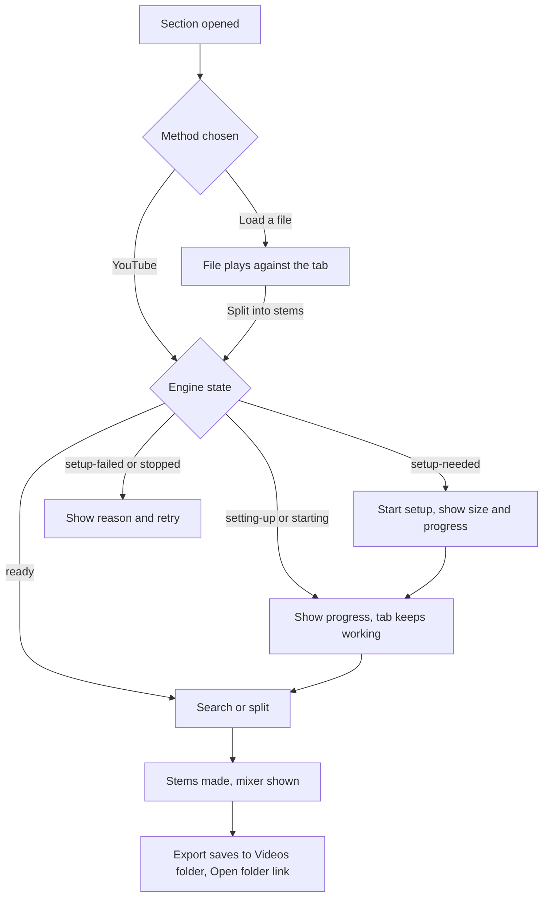

# Backing Track Setup - Plan

## Goal Capsule

- **Objective:** A player can go from an open tab to practicing along with a real backing track, with the song's stems mixed to taste and a practice video saved, in one guided place under the tab.
- **Means:** One "Backing track" practice tool that regroups the existing recording and stem controls, with setup that starts itself and an export that saves itself on desktop (KTD1, KTD4, KTD3).
- **Product authority:** The user, in the brainstorm dialogue. Entries marked session-settled are not reopened by planning.
- **Open blockers:** None.
- **Tail ownership:** The implementer finishes and ships, then rebuilds the desktop package for a by-hand check (see Verification Contract).

Product Contract preservation: unchanged.

---

## Product Contract

### Summary

Add a "Backing track" section under the tabs. The player chooses how to get the song's audio: a YouTube search whose results are ranked by how closely their length matches the tab, or loading a file by hand. Once audio is loaded, a stem mixer lets the player mute or adjust parts. Exporting saves the practice video automatically with the mix playing behind the tab.

### Problem Frame

Getting a recording into the app is spread over several places: finding a song, opening another file, loading a recording, the Stems tab and the YouTube search. The stem engine needs a one-time download of FFmpeg and the separation models before stems or YouTube work. Until that is done the YouTube search is hidden, and nothing in the page points to the Set up button. On the desktop build a player can look for the search box and never find it.

### Key Decisions

- **One-time setup starts on first need.** (session-settled: user-directed — chosen over starting at first launch and over a manual-only Set up button: it costs nothing until the player wants stems or YouTube, and nothing blocks in the meantime.) Governs R5, R6.
- **Export auto-saves to a Tab Highway folder in Videos.** (session-settled: user-directed — chosen over a changeable folder and over a save dialog every time: one click, no interruption.) Governs R10, R11.
- **YouTube results are ranked by length match, not filtered.** Every result stays reachable; the closest match comes first. Governs R3.
- **Stem mute and Play along stay separate.** Muting a stem silences the recording's part. Play along silences the synth's part. Neither changes the other. Governs R8.
- **The YouTube option stays behind its existing build flag.** The notice about using only audio the player has the right to use stays. Governs R2.

### Requirements

**Choosing a backing track**

- R1. Under the tabs, a "Backing track" section offers two ways to get audio: search YouTube, or load a file by hand. The player picks one.
- R2. YouTube search appears in the section only in desktop builds that have the YouTube option switched on, and keeps its notice about audio rights.
- R3. YouTube results show their length, are ordered by closeness to the tab's length, and any result can be chosen.
- R4. Loading a file by hand works without the one-time setup and is available on the website as well as the desktop app.

**One-time setup**

- R5. The first time the player chooses YouTube or stems, the section starts the FFmpeg and model download itself, and shows what is being downloaded, its size, and progress.
- R6. While setup runs, the tab, playback and manual loading keep working. A failed or stopped setup shows what happened and a way to retry.
- R7. The section says plainly what state the stem engine is in (not set up, setting up, ready, stopped), instead of hiding controls with no explanation.

**Stems and mixing**

- R8. Once audio is loaded and split, the player can mute, unmute and adjust each stem. A muted stem is silent during playback. Play along's behavior is unchanged.
- R9. The mix the player sets up is what plays in the app and what exports.

**Export**

- R10. With a backing track loaded, exporting saves the practice video without a save dialog, with the player's mix playing behind the tab.
- R11. Videos save to a Tab Highway folder under the player's Videos folder, named by song and date, and a link opens that folder afterwards.

### Key Flows

- F1. First YouTube backing track
  - **Trigger:** The player opens the Backing track section on a desktop build that has never run setup and chooses YouTube.
  - **Steps:** Setup starts and shows size and progress; the player keeps using the tab; when setup finishes the search box is ready; the player searches and picks the result closest to the tab's length; stems are made; the mixer appears.
  - **Outcome:** The player practices along with a mixed backing track.
  - **Covered by:** R1, R3, R5, R6, R7, R8
- F2. Manual backing track
  - **Trigger:** The player chooses to load a file.
  - **Steps:** The file loads and plays against the tab; if the player asks for stems on desktop, setup starts as in F1.
  - **Outcome:** A backing track plays with no download needed.
  - **Covered by:** R1, R4, R5
- F3. Export
  - **Trigger:** The player exports with a backing track loaded.
  - **Steps:** One click; the video saves to the Tab Highway folder; a link opens the folder.
  - **Outcome:** A practice video with the player's mix behind the tab.
  - **Covered by:** R9, R10, R11

### Acceptance Examples

- AE1. **Covers R5, R6.** Given setup has never run on a desktop build, when the player picks YouTube, setup starts without another click, and the tab keeps playing while it downloads.
- AE2. **Covers R3.** Given a 7 minute tab, when results come back, a 7 minute result is listed above a 4 minute one and a 12 minute one, and all three can be picked.
- AE3. **Covers R8.** Given the guitar stem is muted, when playback runs, the guitar stem is silent and the synth's Play along switch is unaffected.
- AE4. **Covers R10, R11.** Given a backing track is loaded and the guitar stem is muted, when the player exports, the video saves with no dialog, the guitar stem is absent from its audio, and an Open folder link is shown.
- AE5. **Covers R4.** Given the website, the Backing track section offers loading a file and does not offer YouTube.

### Scope Boundaries

**Deferred for later**

- YouTube search on the website. It stays desktop-only.
- Remembering mixer settings per song.

**Outside this plan**

- Changes to how the stem engine separates audio.
- Changes to the build flag mechanism itself, or to what the YouTube option is allowed to import.

#### Deferred to Follow-Up Work

- Making the YouTube flag part of `scripts/package-windows.ps1` instead of an environment variable set at build time. Today a rebuild without `VITE_ENABLE_YOUTUBE=true` hides the search again.

### Dependencies / Assumptions

- The desktop shell reports the stem engine's setup state, and `setup-needed` is the state that setup can start from. Confirmed in `src-tauri/src/main.rs` (`engine_status`, `engine_setup`) and `src/app/engine-state.ts`.
- YouTube search results carry their length. Confirmed: `SearchItem.duration` in `src/stems/engine-client.ts`, which may be null.
- The engine's search accepts up to 15 results per request. Confirmed against the pinned engine's `MAX_LIMIT`.
- Export today saves through a browser download from `src/app/ExportDialog.tsx`, which gives the shell no way to choose the folder. Resolved by KTD3.

### Sources / Research

- `src/app/StemPanel.tsx`: setup note, YouTube search, separate control and the stem mixer, all in one component.
- `src/app/practice-tools.ts` and `src/app/PracticeTools.tsx`: the chip row. Every panel stays mounted so a running separation survives a tab switch.
- `src/app/feature-flags.ts`, `src/app/engine-state.ts`, `src/app/stem-controls.ts`: the YouTube flag, the engine states, and the search row and mixer helpers.
- `src/app/ExportDialog.tsx`: export and download.
- `src-tauri/src/main.rs`: the shell's commands and its atomic write helper.
- `docs/desktop-packaging.md`: first-launch setup and the package layout.

---

## Planning Contract

### Key Technical Decisions

- KTD1. **One "Backing track" chip replaces the separate Recording and Stems chips.** (session-settled: user-approved — chosen over adding a third chip beside them: the player asked for one place, and two chips for one job is the confusion being fixed.) Its panel stacks the method choice, the existing recording loader, and the existing stem panel, which stays mounted. Governs R1, R4.
- KTD2. **Search asks for the engine's maximum of 15 results and the page sorts them by closeness to the tab's length.** (session-settled: user-approved — chosen over keeping eight results: a good length match is unlikely to be among eight.) Results with no length go last, and results over the import limit stay listed but disabled, as today. Governs R3.
- KTD3. **On desktop, every export saves through the shell to the Videos folder, not only exports with a backing track loaded.** (session-settled: user-approved — chosen over saving automatically only when a backing track is loaded: a rule that depends on state would surprise.) The website keeps the browser download. Governs R10, R11.
- KTD4. **Setup starts only from a player action.** Choosing YouTube or asking to split into stems starts it when the engine is in `setup-needed`. Opening the section, mounting the page or a failed setup never starts it. A failed setup shows its message and the existing retry. Governs R5, R6, R7.
- KTD5. **The shell chooses the folder and the final file name; the page supplies only a song name and the bytes.** The shell sanitizes the name, adds the date, allows only the known video and audio extensions, never overwrites an existing file, and writes in chunks so a large video is never sent in one message. Governs R10, R11.
- KTD6. **Setup state reaches the player as one plain sentence per state.** A single helper turns an engine view into the sentence shown in the section, so the page never shows controls with no explanation. Governs R7.

### High-Level Technical Design

The section's states, from the player's side. A choice moves the engine only from `setup-needed`.

### Assumptions

- The setup download sizes are not known to the page today. Showing them (R5) means putting the sizes the pinned FFmpeg build and models actually have into the setup message. The numbers are measured when the unit is built, not guessed here.

---

## Implementation Units

### U1. Rank search results by length

**Goal:** Search returns up to 15 results and the page orders them by closeness to the tab's length.

**Requirements:** R3. Covers AE2.

**Dependencies:** None.

**Files:**
- `src/stems/engine-client.ts` (modify: result limit)
- `src/app/stem-controls.ts` (modify: ranking helper)
- `tests/app/stem-controls.test.ts` (modify)
- `tests/stems/engine-client.test.ts` (modify)

**Approach:**
- Raise the requested limit to the engine's maximum of 15 (KTD2).
- Add one pure helper that takes the results and the tab's length in seconds and returns them ordered by absolute difference. Results with a null length sort after every result with a length, keeping their original order.
- The sort is stable, so equal differences keep the engine's relevance order.

**Patterns to follow:** The existing pure helpers and tests in `src/app/stem-controls.ts` and `tests/app/stem-controls.test.ts`.

**Test scenarios:**
- Covers AE2. A 7 minute tab with results of 4, 12 and 7 minutes lists the 7 minute one first and keeps all three.
- Two results the same distance from the tab keep the engine's order.
- A result with no length is listed after every result that has one.
- An over-length result stays in the list, still marked too long, and is ranked like the rest.
- An empty result list returns an empty list.
- The search request body asks for 15 results.

**Verification:** Results for a known tab length come back with the closest length first, and the request carries the new limit.

### U2. Setup that starts on first need, with a plain state line

**Goal:** The page decides when to start setup and says in one sentence what state the engine is in.

**Requirements:** R5, R6, R7. Covers AE1.

**Dependencies:** None.

**Files:**
- `src/app/engine-state.ts` (modify: start decision and state sentence)
- `src-tauri/src/main.rs` (modify: the `setup-needed` message names the downloads and their sizes)
- `tests/app/engine-state.test.ts` (modify)

**Approach:**
- Add a pure function that answers "should a player action start setup?": true only for the `setup-needed` state, false for every other state (KTD4).
- Add a pure function that turns an engine view into one plain sentence per state (KTD6), covering not set up, setting up with progress, starting, ready, restarting and stopped.
- Put the measured sizes of the FFmpeg download and the models into the shell's `setup-needed` message. Measure them when the unit is built.

**Patterns to follow:** The existing `describeEngine` and `setupBar` in `src/app/engine-state.ts` and its tests.

**Test scenarios:**
- Covers AE1. `setup-needed` answers yes; the page starts setup once for one player action.
- `setting-up`, `starting`, `ready`, `restarting` and `engine-error` all answer no.
- `setup-failed` answers no: a failure does not retry itself (KTD4).
- Each state produces a non-empty sentence, and the setting-up sentence includes the progress when it is known.
- The web view produces no sentence.

**Verification:** Opening the section on a fresh install shows the not-set-up sentence with sizes and starts nothing until the player chooses YouTube or stems.

### U3. The Backing track section

**Goal:** One chip holds the method choice, manual loading, YouTube search and the stem mixer, on desktop and the website.

**Requirements:** R1, R2, R4, R5, R6, R7, R8. Covers F1, F2, AE1, AE2, AE3, AE5.

**Dependencies:** U1, U2.

**Files:**
- `src/app/practice-tools.ts` (modify: one `backing` tool replaces `recording` and `stems`)
- `src/app/BackingTrack.tsx` (create)
- `src/app/StemPanel.tsx` (modify: take the method and the setup trigger; keep the mixer and separation logic)
- `src/app/App.tsx` (modify: tool panels and the tool list)
- `src/app/app.css` (modify)
- `tests/app/practice-tools.test.ts` (modify)
- `tests/app/backing-track.test.ts` (create)

**Approach:**
- Replace the two chips with one named "Backing track" (KTD1). The tool list keeps `sections` and `alignment` as they are, and the website's list has the backing chip but no stem controls.
- The new component shows the method choice first. "Load a file" shows the existing recording loader. "YouTube" shows only when the desktop shell is present and the build flag is on (R2), then starts setup if the engine is in `setup-needed` (KTD4), then shows the search once the engine is ready.
- The split control (today disabled whenever the engine is not ready, so it can never start setup) becomes the second trigger: asking to split a loaded file while the engine is in `setup-needed` starts setup (KTD4, F2). Its helper in `src/app/stem-controls.ts` and `tests/app/stem-controls.test.ts` change with it.
- Always show the engine's one-line state while it is not ready (R7), above the controls it gates.
- Pass the tab's length to the stem panel so the ranking from U1 applies, and keep the rights notice next to the search.
- The stem panel stays mounted when the chip is not open, so a separation keeps running; the section must not unmount it.
- The mixer already has mute, solo, volume and the guitar controls; leave its behavior unchanged, and keep it separate from Play along (R8).

**Patterns to follow:** `PracticeTools` keeping every panel mounted; `OffsetSlider` and `StemPanel` as the two existing halves; the `separateControl` pure-helper-plus-component split.

**Test scenarios:**
- Covers AE5. The tool list on the website contains the backing tool and no desktop-only stem controls.
- On desktop the tool list is `loop`, optionally `sections`, `backing`, optionally `alignment`, in that order.
- Covers AE1. With the engine in `setup-needed`, choosing YouTube requests setup exactly once; choosing it again while setting up does not.
- With the YouTube flag off, no YouTube method is offered even when the engine is ready.
- Covers F2. With a file loaded and the engine in `setup-needed`, the split control is enabled and asking to split starts setup once; in `setting-up` it stays disabled and shows the state line.
- Covers AE3. Muting the guitar stem leaves the Play along state unchanged.
- The state line shows for each non-ready engine state and is absent when ready.

**Verification:** In the rebuilt desktop app, the Backing track chip shows both methods, YouTube search appears after setup, and a separation keeps running while another chip is open. On the website, only loading a file is offered.

### U4. Shell: save an export to the Videos folder

**Goal:** The desktop shell can write an exported file into a Tab Highway folder under Videos and open that folder.

**Requirements:** R10, R11. Covers AE4.

**Dependencies:** None.

**Files:**
- `src-tauri/src/exports.rs` (create)
- `src-tauri/src/main.rs` (modify: register the commands)
- `src-tauri/Cargo.toml` (modify only if a path or open-folder dependency is needed)

**Approach:**
- Resolve the folder as the player's Videos folder plus "Tab Highway", creating it when missing. The shell, not the page, owns the path (KTD5).
- Provide a begin-save command that takes a song name and an extension, sanitizes the name, appends the local date and time, never overwrites (adds a numeric suffix on collision), checks the extension against the video and audio types the app produces, and returns an opaque save handle.
- Provide an append command that writes one chunk of raw bytes to the handle, and a finish command that closes it and returns the final file name and folder.
- Provide an open-folder command that opens only the fixed Tab Highway folder.
- Keep the pure pieces (name sanitizing, date suffix, collision suffix, extension check) in functions with their own Rust tests.

**Execution note:** Test the pure naming and collision functions first; the folder and window calls are checked by hand in the rebuilt app.

**Patterns to follow:** `write_atomic` and the command-plus-helper-module layout of `alignments.rs` and `profiles.rs`.

**Test scenarios:**
- A song name with path separators, colons or dots is reduced to safe characters and cannot leave the folder.
- An empty or all-invalid name falls back to a default name.
- The date and time suffix has a fixed, sortable format.
- When the target name exists, the next free numeric suffix is used and the existing file is untouched.
- An extension outside the allowed set is refused.
- An append to an unknown handle fails without writing.

**Verification:** Running the three commands in order produces a complete file in the Tab Highway folder under Videos with the sanitized, dated name, and the open-folder command shows that folder.

### U5. Page: save exports through the shell

**Goal:** The export dialog saves to the folder on desktop and shows where it went, with an Open folder link.

**Requirements:** R10, R11. Covers F3, AE4.

**Dependencies:** U4.

**Files:**
- `src/export/save-export.ts` (create)
- `src/app/desktop.ts` (modify: a raw-bytes call to the shell)
- `src/app/ExportDialog.tsx` (modify)
- `tests/export/save-export.test.ts` (create)

**Approach:**
- One function takes the finished blob, the song name and the extension. On desktop it begins a save, sends the blob in slices through the append command, finishes, and returns the saved name. On the website, or if the shell save fails, it falls back to the existing browser download (KTD3).
- The export dialog uses it for both the video and the audio file, replaces the "Your download should have started" line with the saved name, and adds an Open folder button on desktop. "Save again" still works.
- The dialog's options (preset, panels) stay; it is not a save dialog, so R10's "no save dialog" holds.
- A failed shell save shows the reason and still offers the browser download.

**Patterns to follow:** The `download` helper in `src/app/ExportDialog.tsx`, and `invokeShell` in `src/app/desktop.ts` for the shell boundary.

**Test scenarios:**
- Covers AE4. On desktop, a blob is sent as ordered slices that add up to its full size, then finished.
- A blob smaller than one slice is sent in one slice.
- On the website, no shell call is made and the browser download runs.
- If begin-save fails, the browser download runs and the failure is reported.
- If an append fails partway, the save is reported as failed and the browser download is offered.
- The audio file saves through the same path with its own extension.

**Verification:** In the rebuilt desktop app, exporting a short clip saves it with no dialog, shows the saved name, and Open folder opens the Tab Highway folder under Videos.

### U6. Export carries the player's mix

**Goal:** Confirm and cover that the exported audio follows the mixer, including a muted guitar stem.

**Requirements:** R8, R9. Covers AE3, AE4.

**Dependencies:** U3, U5.

**Files:**
- `src/export/stem-audio.ts` (read; modify only if a gap is found)
- `tests/export/stem-audio.test.ts` (modify)
- `tests/audio/mix-gains.test.ts` (modify only if a case is missing)

**Approach:**
- `getAudio` in `src/app/App.tsx` already renders the stem mix through the same gains the live mixer uses. This unit proves it with a test and fixes any gap, rather than adding behavior.

**Test scenarios:**
- Covers AE4. With the guitar stem muted, the rendered export audio contains none of the guitar stem.
- With a stem soloed, only that stem is in the export.
- A stem volume of 50 percent exports at half level.
- The export length is unchanged by the mix.

**Verification:** The export test fails if the export used a mix different from the live gains.

### U7. Docs and packaging notes

**Goal:** The desktop docs describe first-need setup, the Videos folder, and how the YouTube option is switched on.

**Requirements:** R2, R5, R11.

**Dependencies:** U2, U5.

**Files:**
- `docs/desktop-packaging.md` (modify)

**Approach:**
- Update the First launch section: setup starts when the player first chooses YouTube or stems, not from a button on the Stems tab.
- Add where exports go and how Open folder works.
- Note that the YouTube search appears only in a build made with `VITE_ENABLE_YOUTUBE=true`, and that the packaging script does not set it (see Deferred to Follow-Up Work).

**Test expectation:** none -- documentation only.

**Verification:** The packaging doc matches how the rebuilt app behaves.

---

## System-Wide Impact

- **Website:** The practice-tool row changes (one Backing track chip). Manual loading and export behave as before. The deployed site is built without the YouTube flag, so the search stays hidden there.
- **Desktop shell:** Four new shell commands for saving and opening a folder. The page may call only the shell's own commands, which is the existing boundary.
- **Saved data:** The new chip replaces two tool names. Nothing is persisted under the old names, so no migration is needed. Saved stems, alignments and profiles are untouched.

## Risks

- **Large exports.** A long video is hundreds of megabytes. Slices keep each message small, but the whole blob is still held in memory until saved, as it is today.
- **Download size is unknown until measured.** If the sizes shown in setup are wrong the player is misled. The unit measures them from the actual downloads.
- **YouTube downloading.** It can conflict with YouTube's terms of service. The option stays behind its build flag with the rights notice, and this plan does not change what it may import.

## Open Questions

### Deferred to Implementation

- The exact download sizes to show for FFmpeg and the models.
- The slice size for sending an export, and whether to ask the shell for the Videos folder through Tauri's path API or the platform's known-folder call.
- The exact wording of each engine-state sentence.

---

## Verification Contract

| Check | Command | Applies to |
|---|---|---|
| Types | `npm run typecheck` | U1, U2, U3, U5, U6 |
| Page tests | `npm test` | U1, U2, U3, U5, U6 |
| Page build | `npm run build` | all page units |
| Shell tests | `cargo test --manifest-path src-tauri/Cargo.toml` | U2 (message), U4 |
| Desktop package | `$env:VITE_ENABLE_YOUTUBE='true'; scripts/package-windows.ps1` | final by-hand check |

By-hand check in the rebuilt app (nothing automatic covers this): on a fresh `data/` folder, open the Backing track chip, choose YouTube and watch setup start, search a song and see the closest length first, split it, mute the guitar stem, export, and open the saved file and the folder. Stop the app before the rebuild, as the packaging script cannot replace a running `TabHighway.exe`.

## Definition of Done

- Every unit's test scenarios exist and pass, and the page checks and shell tests above pass.
- The Backing track chip replaces Recording and Stems on desktop and the website, and only manual loading is offered on the website (AE5).
- A first-time desktop player who chooses YouTube sees setup start by itself, with sizes and progress, and the tab keeps working (AE1).
- Results are listed closest to the tab's length first (AE2), and muting the guitar stem silences it in playback and in the export (AE3, AE4).
- Exporting on desktop saves to the Tab Highway folder under Videos with no dialog and offers Open folder (AE4).
- Abandoned attempts and unused code from approaches that did not pan out are removed from the diff.
